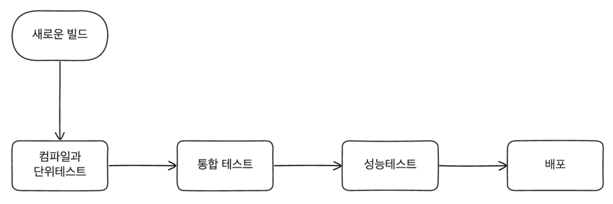
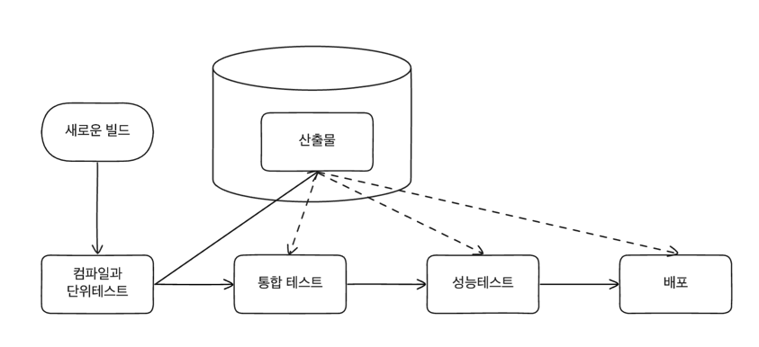

## 빌드 파이프라인의 지속적인 제공
- CI의 단계에서는 각각의 빌드 과정속에서 단계마다 다른 의미를 갖고 있고 각기 다른 가치를 가지고 있다.
- 빠르고 작은 범위의 테스트가 존재하고 느리고 넓은 범위의 테스트가 존재할 때 빠른 테스트가 실패했을 때 굳이 느린 테스트를 기다릴 필요가 없다.
- 이런 각각의 빌드의 문제를 해결하기 위해 존재하는 것이 빌드 파이프라인이다.

- 지속적 제공은 운영 환경에서 필요한 과정을 파이프 라인으로 만들어서 각 과정마다 지속적인 피드백을 받는다.
- 이러한 과정을 거친 산출물은 운영 환경에 동작할 것이라고 확신할 수 있게된다.
- CD의 개념을 수용한다는 것은 자동 또는 수동으로 하는 모든 프로세스를 모델링해야하고 각각의 소프트웨어의 버전이 관리되어야 한다.
- 모든 과정이 통과해야지만 배포되는 파이프라인도 있는 반면 특정 과정에 대해 조건만 만족하면 배포되는 파이프라인도 있다.

### 도구 
- 지속적인 제공을 위해서는 최상위에서 관리해주는 도구가 필요하다.
- CI 도구를 뜯어고쳐 확장하는 방법들도 있지만 대부분이 사용이 쉽지 않은 복잡한 시스템이 되는 경우가 많았다.
- CD를 완벽하게 지원해주는 도구들을 사용하면 운영 단계까지 이르는 모든 단계를 모델링하여 시각화되어 볼 수 있고 자동으로 검증하는 것이 가능하다.
- 때로는 수동으로 검증해야 되는 경우도 존재하지만 이런 과정 또한 모델링 되어 있어야 한다.

### 파이프 라인의 타협
- 우리는 문제가 생겼을 때 빠르게 개발자에게 피드백을 주길 원하며 문제를 빨리 전달할수록 더 빨리 해결할 수 있다는 것을 알고 있다.
- 우리는 운영 환경에 가까워질수록 소프트웨어가 동작한다는 것에 확신을 가지고 싶어하고 운영환경과 비슷한 환경에 배포하기를 희망한다.
- 운영환경과 매우 유사한 환경에서 모든 커밋을 롤아웃하고 싶어하지만 이것은 시간도 많이 소요되며 비용 또한 많이 든다.
- 그래서 우리는 빠른 피드백과 운영환경과 유사한 환경에서 테스트를 수행하는 것 사이에서 타협을 해야한다.
- 대체품으로 스모크 테스트(중요 기능에 대한 테스트)나 병렬 실행(병렬로 테스트 실행) 등을 통해 운영 환경에서 수행이 가능하다.

### 산출물 생성
- 산출물은 빌드 파이프라인 과정에서 한번만 생성되어야 한다. 하나의 빌드 파이프라인에 두개 이상의 산출물이 존재하게 되면 이론적으로 문제를 발생시킬 수 있다.
- 운영환경까지 배포해야되는 산출물이여야 한다. 운영환경까지 배포해야되는 산출물이 아니라면 빌드 파이프라인의 과정에서 생성되어서는 안된다.
- 산출물 생성은 파이프 라인 초기에 생성하여 넥서스나, 아티 팩토리, 컨테이너 레지스트리와 같은 저장소에 저장하여 관리하는 것이 좋다.

## 마이크로서비스의 소스코드와 빌드
### 거대한 빌드와 리포지토리
- 모든 코드를 저장하는 1개의 리포지토리와 모든 코드를 빌드하는 1개의 빌드가 있다.
- 고려할 리포지토리가 하나뿐이고 하나의 커밋에 대한 코드만 검증을 하기 때문에 단순하고 관리하기 쉽다.
- 일반적으로 피해야하는 방법이지만 프로젝트가 초기에 시작할 때는 이 방법이 적합할 수 있다.
- 단점
  - 하나의 기능 변경에도 다른 모든 서비스를 검증하고 빌드해야한다.
  - 필요 이상의 시간이 소모되면서 짧은 주기 시간을 가지는 것을 방해한다.
  - 어떤 산출물이 배포해야하고 어떤 산출물이 배포해야하지 않는지 알기 어렵다.
- 모노레포의 한 형태이지만 부분적으로 배포하는 것과 다르게 효용성이 떨어진다.

### 멀티레포 
- 각각의 서비스마다 리포지토리를 가지고 있고 각각의 서비스마다 빌드를 가지고 있다.
- 리포지토리 단위로 소유권을 가지고 있고 리포지토리로 소유권을 변경할 수 있다.
- 강력한 소유권 모델을 가져야하는 경우 적합한 방법이다.
- 단점
  - 한번에 여러 리포지토리의 변경이 필요한 경우 빌드를 관리하기 어렵다.
  - 리포지토리간 의존성을 관리하기 어렵다.
    - 두개의 서비스가 하나의 라이브러리에 의존하고 있다고 가정하자.
    - 라이브러리에 변경이 생기면 라이브러리가 빌드될 때까지 기다려야한다.
    - 라이브러리를 롤아웃하려면 라이브러리를 사용하는 모든 서비스를 배포해야한다.
    - 특정 버전의 라이브러리를 사용하고 있는지에 대해 확인이 어려워 라이브러리에 대한 사용을 중단하기 어렵다.
  - 여러 리포지터리에 작업
    - 두개의 커밋이 적용되지 않고 하나의 커밋이 적용되는 경우가 문제가 발생할 수 있다.
    - 서비스 간 횡단의 변경은 일반적이지 않기 때문에 예외여야 한다
    - 여러 리포지토리에서 작업하는 고통이 마이크로서비스의 경계를 강화하는데 도움이 된다
  - 적용 대상
    - 마이크로 서비스별 리포지토리는 대규모든 소규모든 잘 작동한다.
    - 경계 밖에서의 변경이 자주 일어난다면 잘못되고 있다는 신호이다.
    - 버전단위로 관리되는 산출물로 관리되면서 모노레포보다 관리가 어려울 수 있다.
