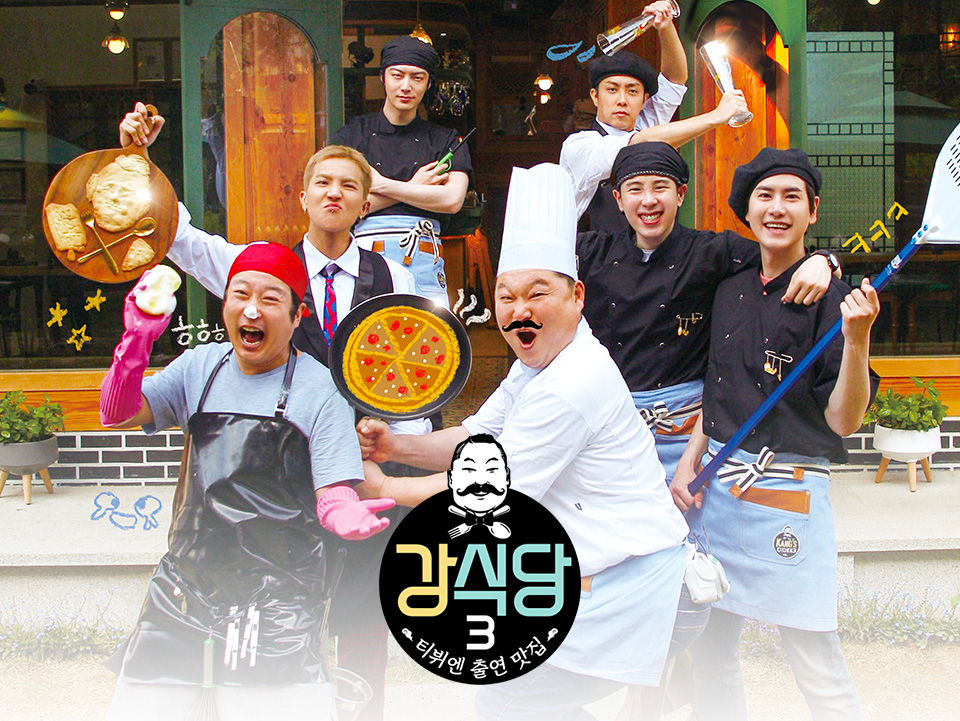

## **마이크로 서비스 아키텍처(MSA)가 대체 뭐길래?**

"마이크로 서비스 아키텍처를 구축해야 되요", "서버를 분리해야한다", "프로젝트 크기가 방대하여 개발이 오래 걸려요" 등 다양한 말로 같은 뜻을 개발자들은 말한다. "마이크로 서비스 아키텍처를 구축해야되요!" 라고 하지만 PO나 기획자에게는 쌓여있는 기획들이 있을 것이고 CS를 담당하고 있는 직원들에게는 운영하는데 필요한 기능들을 기다리고 있을 것이고 데이터 분석가들에게는 분석하는데에 필요한 이벤트나 로그들이 기다리고 있을 것이다. 

그래도 이유없는 주장은 없을 것이라는 생각에 일정을 물어보면 생각외로 긴 일정들을 요구하고 안정적으로 운영되고 있는 서비스의 버그나 장애가 발생할 수 있을 것이라고 이야기를 한다. 그런 이야기를 듣다보면 점점 마이크로 서비스의 필요성에 대해 의구심이 들게 되면서 왜 필요한지 물어보게 된다. 개발자들은 "좀 더 빠르게 개발할 수 있어요", "장애를 격리할 수 있어요", "커뮤니케이션 비용이 줄어요", "애자일하게 협업하기 쉬어집니다." 라고 들뜬 모습으로 이야기를 하는 것을 볼 수 있다. 

> MSA는 비지니스 도메인에 따라 독립적으로 분리하여 각각의 서비스로 분리되도록 모델링 된 서비스 아키텍처.

검색하여 찾아보게 되면 위와같은 내용들을 볼 수 있는데 대체 도통 무슨 소리를 하는건지 이해하기 어려운 사람들이 많을 것이다. 아래의 예시를 통해 MSA에 대해 쉽게 이해하고 어떤 특징이 있는지 알아볼 것이다.

## **MSA의 이해하기**

MSA가 무엇을 의미하는 것인지 설명하는 것은 위의 사진처럼 피자집에 비유하여 설명하겠다. 우리가 처음에 작은 피자집을 차렸다고 가정해보자. 처음에는 작은 크기로 음식점을 차리면서 내가 주문을 받을 것이며 피자를 굽고 서빙을 직접 할 것이다. 그렇게 피자집이 꾸준한 운영덕에 잘 성장했고 손님들이 점점 늘어가 더 큰 가게로 옮기고 직원들도 뽑았다. 그렇다면 우리는 직원들에게 어떤 임무를 주어야 할까? 이전처럼 한명이 모든 역활을 담당했던 것처럼 직원들에게 서빙, 요리, 반죽 역활을 다 맡겨야 할까? 그런 선택을 하게 된다면 며칠이 지나지도 않고 망하게 될 것이다.

한명은 주문을 담당하게 될 것이고 한명은 반죽을 담당하고 또 다른 한명은 화덕을 담당하게 하여 분업화함으로써 피자집 가게를 이전보다 효율적으로 운영되게 될 것이고 더 큰 피자집의 성장을 가져오게 될 것이다.

### **정보의 은닉성**

MSA의 가장 큰 특징 중 하나는 정보의 은닉인데 이것이 무엇을 의미하는 지는 피자집에 비유하여 설명하겠다. 새로운 주문과 서빙을 담당하는 직원을 뽑았을 때 도우를 반죽하고 숙성시키는 법을 가르키는 것에 대해 어떻게 생각하는가? 바로 드는 생각 중 하나는 쓸데없는 짓이라고 생각할 것이다. 바로 와서 알려줘야하는 것은 손님을 대하는 법과 메뉴의 특징, 주문을 받을 때 해야되는 일과 음식이 나왔을 때 해야되는 일을 가르쳐야 할 것이다. 그렇게 가르쳐야지만 원래 하는 일에 더 능숙해져 빠르게 일을 처리하고 전문성이 올라갈 것이다.

이제 커머스 서비스를 예시로 들어서 이해해보자. 상품을 주문하는 도메인과 상품을 배송하는 도메인이 분리되었다고 가정했을 때 주문 도메인을 담당하는 팀이 물건이 어떻게 적재되고 포장되어 배송되는지에 대한 시스템 구조를 알아야 할까? 아니다. 주문팀은 배송팀에게 이 상품이 주문 완료되었다고만 전달하면 될 뿐 그뒤의 과정은 배송팀에게 맡기면 된다. 그렇게 되면서 주문이라는 도메인에 좀 더 신경써서 어떻게 하면 더 빠르고 간단하게 주문을 할 수 있을지에 대해 집중할 수 있을 것이다. 

정보의 은닉성은 이처럼 다른 도메인의 영역에서 최소한의 부분만 노출함으로써 각 도메인을 담당하고 있는 팀원들의 전문성을 높일 수 있고 문제가 생겼을 때에도 그 영역안에서 격리되어 문제가 발생할 뿐 다른 영역까지 침범하여 문제를 일으키지 않는다.

### **독립적 배포성**

어벤져스2에 나온 헐크 버스터를 본 적이 있는가? 이 슈트는 다른 로봇과 달리 각각의 부품들이 로켓처럼 날아와 위의 영상처럼 하나 하나씩 조립되어 만들어진다. 이때 헐크와 싸우다가 팔한쪽이 박살났는데 그때 더 업그레이드 된 새부품이 날아와 싸우는 와중에 쉽게 교체가 되었고 그덕에 헐크와 싸울 때 큰 피해없이 대치할 수 있었다. 왜 갑자기 아이언맨 이야기를 꺼냈는지 뜬금없겠지만 아래의 로봇의 설명까지 듣게 되면 필자가 무슨 설명을 하려고 한 것인지 이해하게 될 것이다. 

위의 사진에 나온 거대한 로봇은 아이언맨처럼 파츠별로 분리되어 있지 않고 각각의 손 발 몸통들이 유기체처럼 연결되어 있다. 이 로봇도 마찬가지로 괴수와 싸울 때 팔 한쪽이 뜯겨나가는 장면이 있다. 하지만 이전 영화와 달리 팔을 교체하지 않고 한팔이 없는 상태로 불리하게 싸우게 되고 싸움이 끝나고 난 뒤 정비 구역에서 전체적으로 다시 수리하게 된다.

지금까지의 이야기로 비유를 하자면 퍼시픽림은 기존의 하나로 되어있는 모놀리식 서비스이고 아이언맨은 각각의 도메인으로 분리된 MSA라고 비유할 수 있을 것이다. 퍼시픽림의 나오는 로봇의 기계팔을 업그레이드 하려면 기계팔은 물론이고 기계팔을 연결하는 몸통까지 손을 봐야하고 기계 몸통의 균형을 잘못 건들였을 경우 연결된 다리와 다른 팔까지 영향이 갈 것이다. 이제 아이언맨의 기계팔을 업그레이드 한다고 생각해보자. 저 거대 로봇에 비하면 손쉽게 업그레이드 할 수 있을 것이고 다른 파츠는 건들일 필요도 없을 것이다. 

이처럼 하나로된 모놀리식 서비스는 하나의 기능 수정이 그 기능만 수정되는 것이 아니라 그 기능을 의존하고 있는 다른 기능까지 수정해야하고 그로인해 추가적인 개발 리소스가 드는 것은 물론이고 수정하지 않은 영역에 버그가 발생할 가능성이 있다. 하지만 서비스를 완전히 분리한 마이크로 서비스는 어떨까? 마이크로 서비스는 다른 기능이 버그가 발생할 가능성은 현저히 낮을 것이고 모놀리식 서비스와 달리 더 짧은 일정내에 개발을 마무리 할 수 있을 것이다.

## **아키텍처 그리고 조직**

컴퓨터 과학자이자 해커인 멜빈 콘웨이가 아래와 같은 말을 한 적있다.

> Any organization that designs a system (defined broadly) will produce a design whose structure is a copy of the organization's communication structure

소프트웨어의 구조는 해당 소프트웨어를 개발한 조직의 커뮤니케이션 구조를 닮게된다. 개발자들 사이에서는 상식처럼 여겨지는 유명한 말이다. 이게 대체 무슨 뜻인지 이해하기 어려울 것이다. 하지만 이런 개념은 다른 곳에도 적용될 수 있으니 피자집을 예시로 들어보자. 처음에는 피자집을 잘 성장시키기 위해서 고민했던 것은 어떻게 해야 맛있는 피자를 만들지 고민하고 어떻게 해야 손님들이 더 많이 모을 수 있을지 인테리어, SNS, 리뷰등을 고민했을 것이다.

하지만 수천개의 매장을 가진 프렌차이즈 피자집을 운영한다고 하면 어떤 것을 고민하고 이야기하게 될까? 가게의 위치 전략, 대형 이벤트, 광고 전략, 공급 단가 등을 고민하게 될 것이고 그에 따라 조직도 웨이터, 도우 조리사가 아니라 마케팅팀, 사업전략부, 회계팀 등을 구성하게 될 것이다. 서비스도 마찬가지로 웹, 서버, 데이터베이스의 영역으로만 분리되어 설계되었다면 웹 개발자, 서버 개발자, DBA 등으로 구성되어 그에 맞춰 조직문화가 고착화되기 마련이다. 이런 조직에게 갑자기 개인화된 상품 추천 알고리즘을 요구하고 상품 주문부터 결제까지 원터치로 진행되는 기능들을 요구한다면 높은 수준으로 유저들이 만족할 수 있는 기능을 개발할 수 있을까? 아마 많이 어려울 것이고 시행착오도 많이 발생할 것이다.

그렇다면 검색 시스템만 담당했던 조직에게 개인이 원하는 검색결과를 제공해주는 기능을 만들어 달라고 요구하면 어떤 결과가 나올까? 이전 조직과 달리 이 조직은 오랜 기간동안 쌓인 노하우와 전문성으로 높은 수준의 기능을 만들 수 있을 것이다. 그렇다면 상품을 보여주는 전시 서비스팀에게 유저들이 최근의 구매한 상품의 내역을 토대로 다른 상품을 추천해주는 알고리즘을 만들어달라고 한다면 이조직도 마찬가지로 유저 더 많이 조회하고 구매하기 위해서만 움직였던 팀이기에 상품 가격, 카테고리, 브랜드 등의 정보를 적절하게 융합하여 만들어 줄 것이다. 이처럼 우리는 의도하지 않았지만 우리도 모르게 시스템의 구조에 맞춰 움직이게 된다. 

낡고 큰 자동차로 앞서나가고 있을때에는 괜찮겠지만 같이 옆에 달리고 있던 자동차가 멈춰서 수리하고 난 뒤 더 빠르게 달려와서 추월하게 된다면 따라잡을 수 없게 될 것이다. 추월 당했을 때 깨닫고 부랴부랴 멈춰서 수리해보지만 그동안 옆에 달리고 있는 자동차는 멈추지 않기에 점점 더 격차가 벌어져 결국 경기를 포기하게 될 수도 있을 것이다.

### **마이크로 서비스의 크기**

지금까지의 설명을 듣고 비지니스는 더 잘게 쪼갤수록 더 빠르게 개발할 수 있고 고도화할 수 있으니 최대한 잘게 쪼개는 것이 무조건 좋을 것이라고 생각할 것이다. 만약 그렇게 생각중이라면 아래의 말을 한번 읽어보자

> "지난 10년간 가장 큰 아키텍처 실수는 풀 마이크로서비스로 전환한 것"

이말은 IT 시장의 가장 큰 오픈소스 서비스, 깃허브 CTO가 한 말이다. 깃허브 CTO는 충분한 자원을 가지고 있었음에도 불구하고 이런 말을 했을까? 그 이유는 바로 조직의 상황에 맞지 않는 마이크로 서비스를 구축함으로써 발생할 수 있는 어려움을 경험했기 때문이다. 아까 전에 봤던 아이언맨을 생각해보자. 슈트가 잘못하여 너무 빠르게 날아온다면 인체에 큰 피해를 주기 때문에 날아오는 속도를 조절했을 것이고 서로 조립되는 것에 있어서 조금의 오차가 균열을 일으켜 오작동을 일으킬 수 있으니 정말 복잡한 물리 법칙들의 계산들이 들어 갔을 것이다.

마이크로 서비스도 마찬가지로 조직이 준비되지 않고 운영하는데 사용되는 도구와 툴들이 익숙하지 않은 상황에서 일단 분리하고 본다면 예상치 못한 버그나 장애가 왔을 때 능숙하게 대응하기 어려울 것이고 각각의 분리된 도메인마다 한두명 정도의 인원이 배정되어 운영되다보면 그인원이 연차나 퇴사를 했을 때 남은 인원에게 부담이 덜어져 큰 어려움을 갖게 될 것이다. 그리고 조직간의 경계가 명확하지 않은 상황에 상품 추천 알림을 보내고 유저 이벤트를 트래킹 해야되는 기능을 개발해야할 때 추천팀, 알림팀, 데이터 옵스팀은 어디서 어디까지 영역을 분리해야 하고 협업해야하는지 몇주동안 이야기를 할 것이다.

과유불급이라는 사자성어처럼 지나친 마이크로 서비스는 오히려 조직의 피로도를 높이고 핵심 비지니스에 집중하는 것보다 분리된 영역을 관리하고 운영하는데 집중되어 제대로된 비지니스의 발전을 이루기 쉽지 않을 수 있으니 마이크로서비스의 전환은 분리되는 크기와 조직의 구조 부터 신중하게 진행되어야 한다.

[전 GitHub CTO, "지난 10년간 가장 큰 아키텍처 실수는 풀 마이크로서비스로 전환 | GeekNews](https://news.hada.io/topic?id=7839)

## **모놀리스을 유지해야하는 이유**

지금까지의 이야기를 들어보면 모놀리식의 메리트 보이지 않고 모놀리스를 할 필요가 없어 보인다. 하지만 관리해야되는 포인트가 한곳 뿐이라는 것은 소규모 크기의 서비스를 개발하고 운영하는데에 있어서 굉장히 큰 장점을 발휘한다. 

프레디의 피자가게라는 게임을 아는가? 모르는 사람들을 위해 간단하게 소개하자면 플레이어는 피자가게를 야간에 지키는 경비원인데 새벽마다 메트로닉 인형들이 공격하러 여러 입구로 들어오는 것을 cctv를 통해 미리 확인하고 입구를 먼저 닫아서 오지 못하게 하는 게임이다.

게임속에서 난이도가 높을수록 여러 인형들은 여러 통로를 자주 왔다갔다하면서 플레이어를 어지럽게 만들고 플레이어는 정신없이 cctv를 돌려보면서 계속 체크하게 된다. 하지만 통로가 하나뿐이고 확인해야되는 cctv가 하나뿐이라면 플레이하는 데에 있어서 엄청 쉬워지고 심지어 지루해질 수 있을 것이다. 이처럼 모놀리스는 단일적인 포인트만 관리해야된다는 장점을 가지고 있기 때문에 깃허브 CTO가 되도록이면 모놀리스를 오랫동안 가져가라고 이야기를 하는 것이다. 

### **모놀리스의 종류**

하지만 모놀리스는 오래가져가면 갈수록 이전에 봤던 거대한 로보트처럼 개발하고 유지보수하는데에 드는 리소스가 점점 방대해진다. 그래서 마이크로 서비스가 나오기 전에 이런 모놀리스를 극복하기 위한 시도들이 여러가지 있었고 그중에 가장 대표적인 모놀리스 아키텍처는 단일 모놀리스, 모듈형 모놀리스, 분산 모놀리스가 있다.

#### **단일 모놀리스**

우리가 가장 일반적으로 알고 있는 형태의 아키텍처이다. 서비스에 있는 모든 코드가 하나의 프로젝트에 개발되어 서버에 배포되는 형태이다. 이러한 구조는 소규모 조직과 작은 규모의 서비스를 개발할 때 유용하게 동작해왔고 이러한 아키텍처에 특화된 루비온레일즈라는 기술도 있을 정도이다. 하지만 이런 구조는 점점 서비스의 크기가 커지고 조직이 성장할수록 관리하기 점점 어려워졌고 모듈식 모놀리스로 눈을 돌리기 시작했다. 

#### **모듈식 모놀리스**

모듈식 모놀리스도 마찬가지로 하나의 서버에 배포되지만 단일 프로세스와 다른점은 코드가 각각 독립적으로 모듈형태로 분리되어 있다는 것이다. 이런 장점은 마치 우리가 쇼핑을 할 때 각각의 코너가 존재하고 코너 이름에 따른 상품들이 정렬되어 있는 형태라고 생각하면 된다. 이렇게 구축함으로써 생길 수 있는 장점은 우리가 길을 헤메지 않고 상품을 찾을 수 있는 것처럼 개발자들이 개발할 때 코드를 읽고 분석하는데 드는 시간이 단축되고 개발하는데 드는 비용 또한 단축된다.

하지만 완벽한 모듈형 모놀리스를 구축하기에는 어려움이 있다. 슈퍼를 운영하는 사람이 마트의 코너를 설계한다고 생각해보자 이전에는 식품옆에 건전지가 있었어도 큰문제가 되지 않았다. 하지만 이제는 각층과 동선에 따라 효율적인 상품 코너를 디자인하지 않으면 마트의 효율성이 떨어지기 때문에 고객들이 이동하기 편하고 원하는 상품을 찾기 쉽도록 설계해야한다. 이처럼 개발자들도 다른 개발자들이 이해하기 쉽고 관리하기 쉽도록 설계해야되기 때문에 생각보다 많은 시행착오가 발생한다.

#### **분산형 모놀리스**

서비스는 분리되어 있지만 하나의 형태로 배포해야되는 구조를 말한다. 마이크로 서비스 이전 구조의 아키텍처로 마이크로 서비스에서 배포의 독립성이 보장되지 않은 아키텍처라고 보면 된다.

#### **경합**

모놀리스 아키텍처는 아무리 잘 설계하더라도 서로의 혼선과 간섭이 발생할 수 밖에 없다. 그이유는 레스토랑에서 각각의 역활과 책임이 분명한데도 충돌이 일어나는 이유와 같다. 결국 같은 주방안에서 같은 도구를 활용하고 동선이 겹치기 때문에 계속 간섭하게되고 충돌하게 된다 이런 문제를 없애기 위해서는 역활에 따라 공간을 분리하는 수 밖에 없는 것처럼 모놀리스에 벗어나 서비스를 분리하는 방법밖에 없다.

## **마이크로 서비스의 메리트들**

### **여러 기술의 활용**

프로그래밍 언어의 종류들이 몇개나 알고 있는가? 백엔드에서 주로 사용되는 언어를 나열해보자면 Java, Javascript, c#, ruby, kotlin, python, go 등이 존재하고 있다. 마이크로 서비스 아키텍처는 하나만 활용가능한 모놀리스와 달리 비지니스의 특성에 맞는 적절한 기술들을 선택하여 구축할 수 있다. 

이장점은 하나의 칼로도 채도 썰 수 있고 고기등을 손질 할 수 있지만 채칼이나 손질용 칼을 쓰는 것보다 힘을 더 들여서 시간을 더 써야하는 것처럼 이미 존재하는 바퀴를 다시 개발하게 되면서 더 많은 개발 리소스를 필요로 할 때가 발생할 수 있다. 그리고 그에 특화되지 않은 기술을 선택함으로써 드는 위험성과 비용은 점점 더 늘어갈 것이다.

### **견고함**

제철소나 반도체와 같은 거대한 제조업 기업들은 하나의 공장에서 다 작업하지 않고 공장들을 전부 분리해놓는 것일까? 그건 바로 리스크에 대한 관리와 목적에 따라 견고하게 만들 수 있기 때문이다. 예를 들어 어떤 공장은 차갑게 실내를 유지해야되는 방면, 어떤 공장은 뜨겁고 습한 환경을 유지해야 되는 경우도 있다. 또 어떤 장소는 보호복을 무조건 입고 활동해야되고 다른 장소는 평상 작업복으로 활동해도 무리가 없다.

이처럼 각 공장의 특성에 맞게 환경을 만들어 견고하게 만드는 것처럼 서비스 또한 도메인 별로 서비스에 맞는 서버 환경을 구축하고 문제가 발생하더라도 해당 비지니스의 도메인을 담당하는 서비스만 문제가 발생함으로써 장애로 발생할 수 있는 위험성 또한 줄일 수 있다.

### **유연함**

"오늘도 개발자가 안된다고 했다." 라는 이야기를 들어본 적 있을 것이다. 왜 개발자들은 간단한 요구사항임에도 불구하고 왜 한사코 거절을 하는 것일까? 여러분은 몇년전에 붕어빵을 만들 수 있도록 붕어빵 틀을 만들어 달라고 요구사항을 말했을 것이다. 하지만 붕어빵 장사가 잘되면 와플이나 타코야끼, 토스트 등을 팔아 더 많은 상품을 판매하고 싶지만 이미 전체의 틀이 붕어빵을  만드는 데에 딱 맞춰져 있다보니 새로운 틀로 변경하기 어려운 것이다.

하지만 틀을 분해할 수 있도록 설계하여 필요한 상황에 맞는 틀을 끼울 수 있다면 어떤 주문이 들어와도 유연하게 바꿔서 만들어 줄 수 있을 것이다. 그리고 그맞는 틀에 맞춰 붕어빵 담당자, 와플 담당자, 타코야끼 담당자등 조직또한 유연하게 관리함으로써 역활을 분명히 할 수 있다는 장점이 있다.

## **정리하면서**

마이크로 서비스 아키텍처가 나오게 된 계기와 필요성에 대해 우리는 알게 되었고 그 단점과 리스크에 대해서도 충분히 이해했다. 이제는 개발자들과 마이크로 서비스 아키텍처에 대해 좀 더 맘편히 이야기 할 수 있을 것이다. 마이크로 서비스를 도입하는데 먼저 고려해야되는 것은 조직원들이 충분한 역량과 도메인에 대한 높은 이해도를 가지고 있지 않으면 위의 설명했던 이점보다 단점들이 우리의 발목을 계속 잡게될 수 있기 때문에 신중한 선택이 필요하다. 

그럼에도 불구하고 필자는 이러한 시도해야되는 이유들이 명확하다면 무리가 가지 않는 선에서 점진적으로 변화해야 된다고 생각한다.  처음에는 시행착오들이 있겠지만 이러한 시행착오들을 이겨낼수록 우리들은 자신감이 붙고 더욱더 단단해질 수 있는 계기가 될 것이라고 생각하기 때문이다.