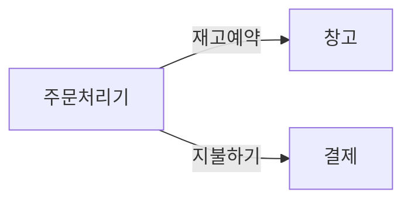
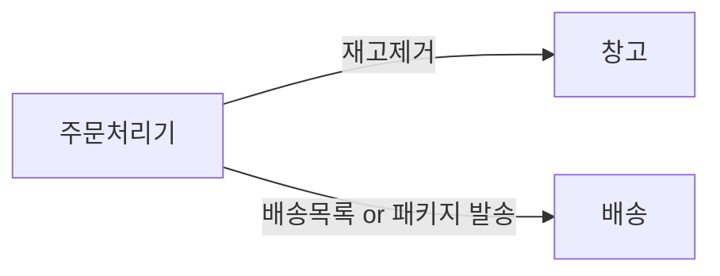
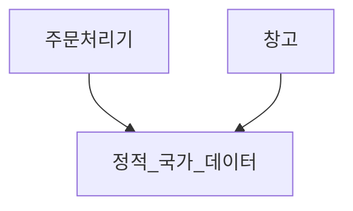
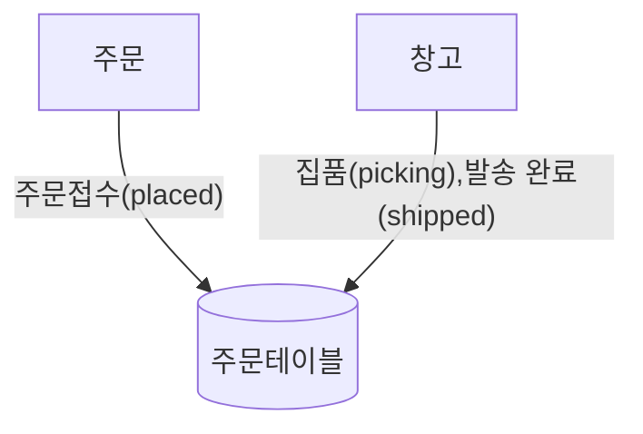

# 마이크로 서비스의 고충
---

## 1. 개발자 경험
- 서비스가 더 많아질수록 개발자는 개발환경을 구축하고 테스트하기 점점 더 어려워 질 것이다.
- JVM과 같이 특정 리소스 이상을 요구하는 기술 스택을 선택했다면 로컬환경에서 수십개의 서비스를 감당하기는 쉽지 않다.
- 극단적으로 클라우드에서 개발 진행 -> 사이드 이펙트 예측 불가, 비약적으로 증가하는 클라우드 비용(클라우드의 단점을 가리게 됨)
- 단순하게 시스템적으로 제한하여 제한된 환경에서 개발하는 것이 이상적, 다만 공동 소유권 모델(인증, 인가)이 많아질수록 어려워짐

## 2. 기술과다
- 마이크로 서비스 아키텍처로 인해 모놀리식의 복잡성을 낮추는데 도움을 받았지만 맹목적 기술의 숭배로 신기술을 도입하는 경우가 종종 있다.
- 각각의 기술 영역에서 성능 최적화, 안티 패턴, 모델링 등을 숙지하기에는 꽤 많은 시간이 필요하고 그로인해 비용이 추가적으로 발생한다.
- 잘못된 기술 사용은 기술부채를 가져오고 그로인해 시스템의 복잡성은 점점 커지게 된다.
- 마이크로 서비스의 전환처럼 새로운 기술이 도입 또한 복잡성을 점진적으로 증가 시켜야 한다.
    - 토이 프로젝트 or 사이드 프로젝트
    - 스터디

## 3. 비용
- 단기적으로는 스토리지, 네트워크, 컴퓨팅 서비스 등을 필요로 하기 때문에 비용은 증가한다.
- 새로운 환경에서 적응하는 것과 설계 또한 점진적으로 개선되므로 기능 개발이 더 늦어지거나 추가 인력을 필요로 하는 상황이 발생
- 비용을 절감하려는 상황에서 마이크로 서비스 전환은 옳지 못한 선택, 마이크로 서비스는 더 많은 가치를 만들고 다양한 수익을 창출하는 것에 특화되어 있다.

## 4. 리포팅
- 데이터 분석가나 PO가 리포트를 작성할 때 보통 데이터 베이스의 있는 데이터들을 가져와서 리포트를 작성한다. 하지만 분산된 데이터 베이스 환경에서는 추가적인 기술의 도입이 없다면 통합적인 리포팅이 어렵다.
- 데이터 웨어하우스, 데이터 레이크, 데이터 가상화, 마스터 데이터 관리, 데이터 통합 플랫폼, API

## 5. 모니터링과 문제해결
- 모놀리식 아키텍처는 단순한 모니터링과 엔드포인트가 단순하기 때문에 문제를 추적하기 쉽다.
- 마이크로 서비스 아키텍처는 적게는 수십개 많게는 수백개로 분산된 서버를 모니터링 해야하는 시스템을 구축해야 된다고 하면 고려해야 되는 것이 생각보다 엄청 많을 것이다.
- 모놀리식에서 몇개의 로드밸런싱되던 서버에서 수백개의 분산된 서버로 아키텍처를 변경한다면 고려해야되는 것은 무엇이 있을까?
    - 서비스간 통신
    - 중앙 집중화 관리 전략
    - 서비스별 스케일링 전략
    - 개발 및 배포 전략

## 6. 보안
- 네트워크 통신이 증가함에 따라 서비스간 통신 보안, API 보안 전략, 복잡한 종속성, 데이터 보안등 고려해야되는 포인트들이 점점 많아진다.
- 각각의 서비스마다 보안에 대한 설정이 각기 다르기 때문에 휴먼 에러를 유발할 수 있고 이런 문제는 큰 피해를 가져올 수 있다.

## 7. 테스팅
- 테스트해야되는 영역이 데이터 베이스나 캐시 디비와 같은 인프라 뿐만 아니라 서버끼리의 통신까지 고려해야 되기 때문의 테스트의 복잡성이 증가한다.
- 테스트에 문제가 발생했을 때 어떤 포인트에 문제가 발생했고 그 원인이 무엇인지 추적하기 쉽지 않다.
- E2E 테스트는 실제 유저의 사용과 비슷하게 진행하기 때문에 불안감을 감소시키고 확신을 증가시켰는데 마이크로 서비스는 테스트 해야되는 범위가 상당히 늘어나고 각 서버에서 발생할 수 있는 네트워크 지연, 타임 아웃, 서비스가 동작하지 않는 등의 케이스들을 모두 고려해야된다.
- 거짓된 경보가 계속 울리면서 신뢰를 잃는 것처럼 테스트 또한 거짓된 실패가 계속되면 테스트에 대한 비용은 증가하고 확신을 점점 줄어들게된다.
- 그런 문제를 해결하기 위한 계약 주도 테스트와 카나리아 릴리스와 같은 전략이 있다.

## 8. 지연 시간
- 기존에 하나의 시스템에서 처리되었던 모델들이 마이크로 서비스 아키텍처로 인해 여러 서비스에서 분할되어 처리하게 되었다. 그럼으로써 각 서비스를 거칠 때마다 직렬화와 역직렬화가 되면서 지연시간을 증가
- 지연 시간이 너무 느려지는 것도 사용자들의 사용성에 큰 해가 되기 때문에 점진적으로 마이크로 서비스를 전환해야되는 것에 큰 이유 중 하나가 된다.
- 예거와 같은 엔드포인트를 측정하는 도구를 통해 약간만 변경하고 조금씩 측정해보자, 연산이 빨라지고 i/o가 어느정도 늘어난다면 상관없다.

## 9. 데이터의 일관성
- 이전에는 모놀리식 데이터베이스에서 외래키를 설정하고 단일의 트랜잭션으로 데이터의 무결성과 일관성을 지키기에는 상대적으로 단순했다.
- 분산된 시스템으로 설계되면서 트랜잭션이 분산되고 외래키와 같이 데이터 무결성을 지켜주는 기능들을 사용하지 못하게 되면서 트랜잭션 롤백에 따른 부분도 더 많이 신경써야 한다.
- 6장이 기대 된다.

# 마이크로 서비스를 구축해야하는가?
- 마이크로 서비스를 구축하기 위해서는 도메인이 안정적이여야한다. 즉 시장에서 안정적으로 자리를 잡지 않은 상태에서 마이크로 서비스를 구축하면 안된다.
- 소규모 팀에서는 마이크로 서비스 아키텍처의 도입을 정당화하기 쉽지 않다. **마이크로 서비스 아키텍처의 도입으로 인해 생기는 제약과 문제점**을 충분히 이해한 상황에서 사용하도록 하자.
- 마이크로 서비스는 소규모의 조직 또는 소규모의 프로젝트를 관리하는데 사용하는 것은 적절하지 못하다. 마이크로 서비스 아키텍처로 인해 발생하는 비용으로 비지니스의 발전의 걸림돌이 될 가능성이 크기 때문이다.
- 대규모의 조직을 통해 운영되는 엔터프라이즈급 서비스는 제품의 기능 개발하는 것도 만만치 않고 알아야 하는 도메인들이 결합되어 있다보니 다른 영역의 도메인의 코드까지 계속 살펴봐야하는 문제가 발생한다.
- 엔터프라이즈급 서비스에서 담당하고 있는 도메인 영역에 있는 제품에만 집중하고 발전시킴으로써 높은 도메인 지식을 가질 수 있는 것은 물론이고 다른 도메인 영역에서 개별적으로 배포를 할 수 있다는 것은 더 빠르게 제품을 발전 시킬 수 있는 전략 중 하나입니다.

# 마이크로 서비스의 경계를 만드는 방법
---

마이크로 서비스의 아키텍처의 경계 분리는 기존에 없었던 새로운 개념이 아니라 모듈식 구조 분리의 다른 형태일 뿐이다. 모듈형 아키텍처가 궁금하다면 해당 링크 참조

- [실전! 멀티 모듈 프로젝트 구조와 설계 | 인프콘 2022](https://www.youtube.com/watch?v=ipDzLJK-7Kc)
- [멀티모듈 설계 이야기 with Spring, Gradle | 우아한형제들 기술블로그](https://techblog.woowahan.com/2637/)
- [우아한 멀티 모듈 세미나 정리](https://hyeon9mak.github.io/woowahan-multi-module/)

## 1. 정보 은닉

마이크로 서비스의 장점에서 나왔듯이 다른 경계에 있는 세부 정보들을 숨기려는 욕구를 나타낸다. 이런 특징으로 얻을 수 있는 장점은 아래와 같다.
- 향상된 개발 시간: 모듈을 독립적으로 분리함에 따라 병렬적으로 작업하기 수월하고 더 많은 개발자들이 협업하기 편하다.
- 이해도: 각각의 모듈에 목차처럼 구분되어 있고 그 목차에 맞는 글이 정리되어 있는 것처럼 코드가 정리되어 있기 때문에 하고 있는 작업을 좀 더 이해하기 쉽게 해준다.
- 유연성: 서로 독립적으로 변경할 수 있고 필요에 따라 모듈을 교체하면서 활용할 수 있다.
- 모듈간 연결은 적을수록 다른 모듈에 미치는 영향이 적고 모듈을 어떻게 사용하는 명확하게 이해함으로써 업스트림 호출자도 안전하게 변경할 수 있다.

## 2. 응집력
> 함께 머물고 함께 바뀌는 코드
- 하나의 기능을 변경하는데 다른 모듈이 변경되는 것을 원하지 않는 것처럼 하나의 서비스가 바뀌는데 다른 서비스가 바뀌는 것은 결코 이상적인 설계가 아니다.
- 두개의 서비스가 동시에 릴리스되야하는 것은 물론이고 문제가 발생했을 때 찾아야하는 범위도 두배가 되는 것이다.

## 3. 결합성
- 느슨한 결합성을 구축하여 다른 서비스가 변경되더라도 현재의 서비스는 변경되지 않는 것은 중요하다.
- 서로 단단한 결합은 다른 서비스를 변경하게 되고 이런 문제점은 커뮤니케이션 비용을 높이기 때문이다.
- 서로 너무 많은 정보를 공유하지 않고 필요한 정보만 공유하도록 하자

## 4. 결합성과 응집성의 관계
> 응집력이 강하고 결합성이 유연할수록 시스템은 안정된다.

- 안정성은 마이크로서비스를 구축하는데에 있어서 매우 중요한 개념이다. 병렬로 더 빠르게 작업하고 팀간 커뮤니케이션 비용을 줄이기 위해서는 말이다.
- 응집성은 경계내에서 같은 도메인 안에서의 관계를 말하고 결합성은 다른 도메인 경계에서의 관계를 말한다. 이런 설계를 하는 것에 있어서 완벽한 실버불릿은 없다. 가장 적합하다고 판단되는 설계를 선택하고 상황에 따라 변경하는 것이 중요하다. 세상은 고정되지 않고 항상 변화하기 때문

# 결합 유형

---
모든 결합은 나쁘다고 이야기할 수 없다. 그리고 시스템의 결합없이 설계를 하는 것은 불가능에 가깝기 때문에 결합을 줄이기 위한 방향으로 많이 발전을 해왔다. 이전에는 코드간의 결합성을 줄이기 위해 연구를 해왔지만 모듈형 아키텍처가 나오게 되면서 좀 더 큰 개념으로 적용할 수 있게 되었다.

## 2. 도메인 결합

- 위와 같은 방식으로 하나의 서비스에서 여러 하위 서비스에 의존하는 방식은 하나의 마이크로 서비스가 무거워져서 너무 많은 작업을 수행하는 경우가 발생한다.
- 도메인 결합은 느슨한 결합에 속하는 편이지만 많은 하위  마이크로 서비스와 통신해야되는 설계는 상위 마이크로 서비스에 너무 많은 비지니스 로직을 작성되게 하고 시간적 결합을 통해 강하게 결합되는 현상이 발생한다.

#### 시간적 결합이란?

> 동기식으로 호출하여 통신하는 형태를 의미한다. 이런 구조는 동시간대에 다른 마이크로 서비스에서 동시간에 어떤 작업을 해야하는 상황을 의미하고 업스트림 호출자가 무한정 대기하거나 작업을 진행할 수 없음을 의미한다. 이러한 설계는 시스템이 확장될수록 복잡해질 수 있고 마이크로서비스가 독립적으로 동작하는 것을 어렵게 만들 수 있다.

## 2. 통과 결합

- 다른 마이크로 서비스에서 필요한 데이터가 있어서 다른 마이크로 서비스에 요청하는 형태
- 그 앞단계에 다른 마이크로 서비스가 존재하면 해당 마이크로 서비스까지 호출한다는 것을 알고 잠재적으로 어떻게 동작하는지 알아야 될 수 있다.
- 하위에서 만약 배송 목록에서 통관 번호등이 추가되어 알아야 한다면 상위에 있는 마이크로서비스도 알아야하는 것이 가장 큰 문제점이 있다.

### 2.1 필요 도메인과 직접 결합

- 중간자를 통해 우회하는 방향이 옳은지 고려하여 직접 통신한다.
- 주문 처리기가 다른 도메인 서비스를 또 알아야한다. 하지만 이것만 알아야 한다면 느슨한 결합이기 때문에 괜찮은 선택일 수 있다.
- 하지만 재고량과 업데이트를 요청해야되는 복잡성을 주문 처리기가 가져가야한다.
- 재고 관리와 패키지 관리를 창고 서비스에 위임하려는 시도는 나쁘지 않지만 배송이라는 서비스가 주문처리기에서 배송목록을 원한다는 것을 알게되는 것이 맘에 안든다.

### 2.2 필요한 정보만 받기

- 첫번째 보여줬던 플로우와의 차이점은 주문 처리기에서 배송에 사용되는 모든 정보가 아니라 필요한 정보만 받도록 설계하는 것이다.
- 배송에 대한 변경의 이펙트가 주문 처리기 서비스에 미치지 않도록 줄일 수 있지만 특정 케이스에 한에서는 모든 서비스를 건들일 수 밖에 없는 상황이 존재한다.
- 예를 들어 세관에 신고해야되는 절차를 추가해야 될 때 배송 마이크로 서비스에 추가하고 버전을 손쉽게 올릴 수 있다. 하지만 세관에 신고하기위해 필수적으로 받아야 하는 정보가 있다면 세개의 마이크로서비스를 배포하여 롤아웃해야하는 상황이 올 수 있다.
- 주문을 전달할 때 데이터 구조를 알 수 없게 설계하는 것이 중요하다. 단순히 데이터 덩어리를 전달한다는 의미로 설계하고 구축해야된다.

## 공통 결합

- 둘 이상의 마이크로 서비스가 공통 데이터 집합을 사용하여 공유 데이터베이스를 같이 접근하거나 파일 서버를 접근할 때 해당한다.
- 공유 데이터는 여러 사용자가 마이크로서비스에서 사용하고 있다보니 변경했을 때 다른 마이크로 서비스까지 영향이 간다는 문제가 있다.

- 위와같이 정적인 조회용 공유 데이터 베이스는 상관이 없겠지만 아래와 같이 상태가 변경되는 경우는 정말 관리하기가 어려워진다.

- 위와 같은 구조로 사용했을 때 창고의 호환성을 깨트리고 주문의 상태관리를 관리하기 매우 어렵다.
- 이런 설계 구조는 잘못된 상태 전환으로 인해 문제를 발생시킬 가능성이 있기 때문에 아래와 같은 구조로 설계를 해야한다. 