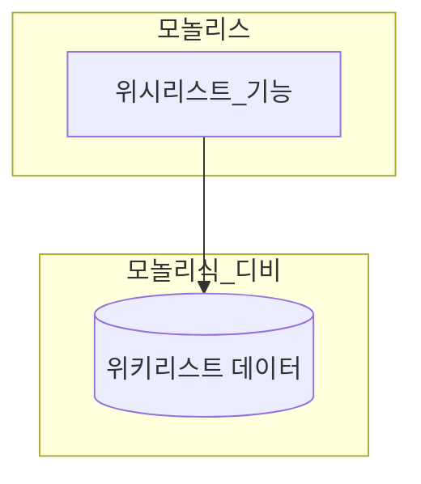
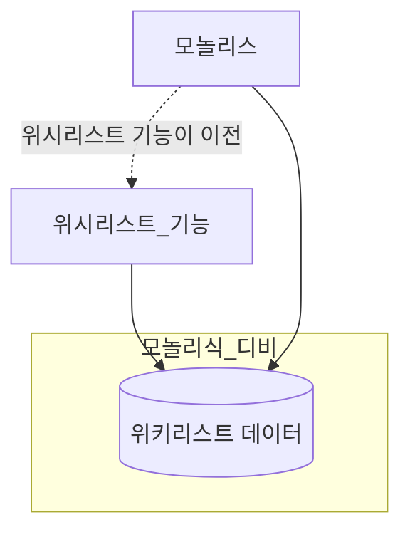
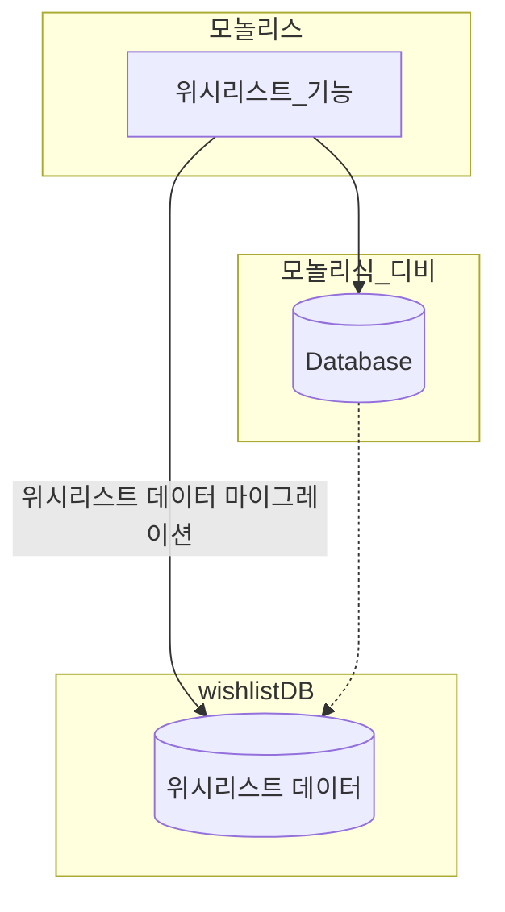
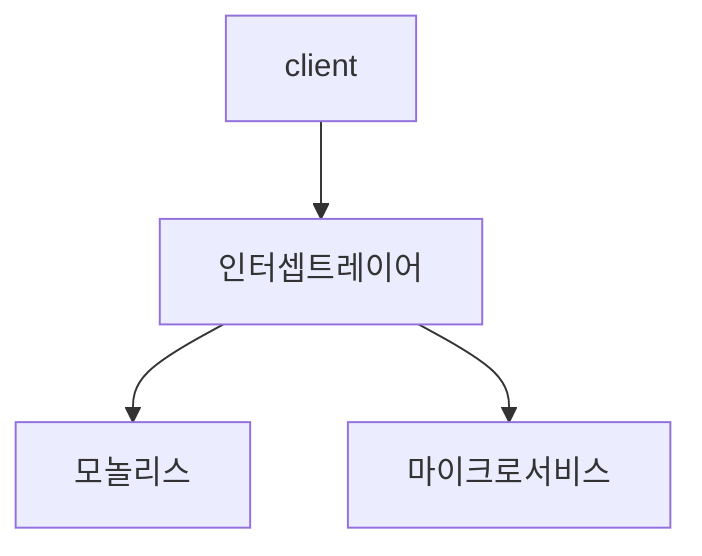
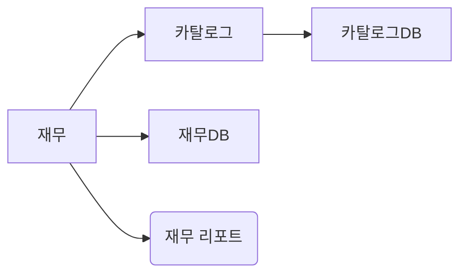

# 목표 가지기
- 마이크로 서비스는 현재 아키텍처에서 더 쉬운 방법을 찾을 수 없을 때 마이그레이션을 고려해야함
- 목표없는 마이그레이션은 복잡성을 옾이고 심각한 문제를 가져올 수 있음
- 오히려 모놀리식을 개선하는 방향이 답이 열려있을 수 있는데 목표가 아니라 해결방법에만 집중하다보면 기술 부채가 될 수 있다.
- 목표가 명확히 정해지고 마이크로 서비스를 해야한다면 쉬운 것부터 천천히 점진적으로 하나씩 시도하자

# 점진적 마이그레이션

- 건물을 철거할 때 한층씩 철거하는 방법과 전체를 한번에 철거하는 방법이 존재하는데 후자는 시간이 오래걸리지만 기존 건물에 사용된 자재를 재활용할 수 있고 사고 가능성도 상대적으로 낮아 안정적으로 철거를 할 수 있다. 하지만 전자는 전체를 무너트리면서 발생하는 사고를 예상하기 쉽지 않고 그안에 있는 자재들은 대부분이 폐기물이 되어 버려지게 된다.
- 작게 쪼개면 쪼갤수록 효과는 빠르게 확인할 수 있고 학습이 가능하다.
- 빅뱅 배포를 했을 때보다 더 빠르게 마이크로 서비스 아키텍처가 주는 이점을 쉽게 가져갈 수 있다.

# 모놀리식이 적인 경우는 드물다.
- 모놀리식은 본질적으로 아주 괜찮은 아키텍처이다.
- 현재 모놀리식 아키텍처가 가지지 못한 것보다 아키텍처의 변경으로 가져오는 이점을 생각해라
- 모놀리식과 마이크로가 공존하고 있는 아키텍처는 더럽지 않다. 시스템의 아키텍처의 진화는 끊임없이 발전하고 변화하며 완전한 아키텍처는 절대 존재하지 않는다.
- 모놀리식이 아예 제거되는 경우는 해당 기술의 시장이 소멸되어 가거나 종속된 인프라가 이미 지원이 종료되었거나 유지보수하는데 너무 비싼 금액이 있지 않으면 왠만해서는 버리지 않는다.

# 조급한 분해
- 도메인에 대한 이해가 명확하지 않은채로 경계를 나누고 독립적인 배포가 가능한 시스템을 만드는 것은 매우 위험하다.
- 잘못된 경계로 인해 독립적인 배포가 아니라 상호 의존적인 배포를 하게 되고 이런 문제는 모놀리식보다 더 큰 비용을 발생시킨다. 그래서 결국 마이크로 서비스로 병합하는 바용으로 발생하게 된다.
- 기존 코드 베이스를 보유하고 있는 것이 처음부터 마이크로 서비스로 진행하는 것보다 훨씬 쉽다.

# 무엇이 먼저 나눌까?
- 가장 문제가 되는 것은 시스템의 처리 능력을 떨어트리는 도메인부터 분리하게 될 것이다. 그것은 즉 계속되어 변경되어지고 개발되는 영역이 시스템의 성능을 계속 떨어트린다고 볼 수 있다.
- 주키퍼와 같은 정적 코드 분석 툴로 인해 코드 변경이 자주 일어나는 영역을 찾는 것을 추천한다.
- 너무 깊이 얽힌 도메인을 먼저 분리하는 것 보다 분리하기 쉽고 간단한 것들을 차례차례 분해하는 것을 추천한다.
- 결국 우선적인 기능은 추출하기 용이한 점과 추출하면서 발생하는 이점들을 무게를 저울재어 결정될 것이다.
- 작은 성공을 통해 학습하고 노하우를 얻으면서 발전해보는 것을 추천

# 계층별 분해
- 계층적으로 봤을 때에는 사용자 인터페이스, 백엔드 어플리케이션, 데이터 계층이 존재할 것이다.
- 사용자 인터페이스와 내부 아키텍처가 일대일 매핑을 가지는 관계는 드물다. 인터페이스의 분리는 별도의 단계라고 볼 수 있다.
- UI를 무시했다가 큰 피해를 입을 수 있다. 사용자의 인터랙션이 일어나는 곳은 결국 인터페이스기 때문에 백엔드나 데이터 아키텍처만 고려해서는 안된다.

# 예시

## 코드 우선

- 가장 일반적인 마이그레이션 형태로 첫번째 단계이다.
- 모놀리식 데이터에 데이터를 남겨두면 미래에 발생할 수 있는 기술부채들이 있지만 마이크로 서비스 아키텍처로 인한 이점을 챙길 수 있다.
- 어플리케이션 코드와 데이터에 대해 완전히 파악이 안된상태로 옮겼다가 추후에 불가능하다고 판단되어 작업이 중단될 수 있으니 관련된 데이터와 코드가 모두 분석되어 스케치하는 작업을 해야한다.

## 데이터 우선

- 데이터를 깔끔하게 분리가 불확실한 상황에서 유용하다.(코드가 아닌가?)
- 데이터 무결성과 트랜잭션 보장등은 사전에 처리해야함

# 유용한 분해 패턴

## 교살자 무화과 패턴

- 기존 시스템에 대한 호출을 인터셉트 레이어에서 가로챈다.
- 마이크로 서비스로 호출을 전달하거나 모놀리스로 호출을 전달할 수 있다. 혹은 둘 다
- 문제가 발생했을 때 적절하게 핸들링하면서 안정적으로 운영할 수 있다.

### 병렬 실행
- 모놀리식의 기능과 새로운 마이크로 서비스와의 요청을 나란히 실행하고 실행 결과를 비교합니다.

### 기능 토글
- 제품 기능에 대한 실행을 키고 끄는 메커니즘으로 구현한다.
- 전환하는 동안 기존의 기능을 그대로 두고 지속적으로 관찰하면서 간단하게 제어할 수 있다.

# 데이터 분해에 대한 우려
## 성능

- 위와 같은 상황에서 카탈로그 디비에서 상품에 대한 정보를 가져와야할 때 DB를 통해 가져오게 될 것이다.
- 이런 문제점은 당연히 모놀리식 디비를 활용했을 때 보다 더 긴 지연시간을 발생시킨다.
- 캐싱을 통해 지연시간을 줄일 수 있겠지만 빈번한 데이터의 변경이 일어날 경우 관리하기 매우 까다로워진다.

## 데이터 무결성
- 각각의 독립된 데이터베이스로 관리되기 때문에 외래키가 걸린 테이블의 데이터 무결성을 보장해주기 어렵다.
- 데이터 이스의 의존하지 않도록 비지니스 로직을 설계해야된다.
- 소프트 삭제와 같이 coping pattern을 사용하면 삭제하지 않고 활용 가능
- 이름과 같은 데이터가 서로 있는 경우에는 동기화 방법에 대한 전략도 구성해야된다.

## 트랜잭션
- 모놀리식 안에서 단일 트랜잭션으로 관리되던 엔티티들이 이제 분리되면서 ACID를 보장해주지 못하게 된다.
- 분산 트랜잭션에 대해 잘 설계하는 것도 쉽지 않고 기대했던 것 만큼 보장해주기 쉽지 않다.
- 마이크로 서비스에서 이런 새로운 문제가 발생하고 이런 메커니즘에 맞춰 설계를 하는 것에 익숙해져야한다.

## 도구
- 스키마의 변경에 따른 어려움도 있다. 각각의 독립된 데이터베이스로 분리되면서 쉽게 변경할 수 있도록 도와주는 도구가 한정되어 있다.
- 델타 스크립트를 통해 이뤄지며 멱등성을 지키는 방식으로 순서에 맞게 엄격하게 실행된다.
- DBDeploy, 플라이웨이, 리퀴베이스 등이 있다.

## 리포팅 디비
- 내부 데이터베이스에 대한 접근을 제한하고 숨기게 되면서 안정적인 환경을 구축하고 독립적으로 배포가 가능해진다.
- REST API로 데이터를 받기 너무 어렵거나 디비를 통해 직접 가져와야하는 데이터인 경우 문제가 발생한다.
- 외부로 접근이 가능한 리포팅 디비를 만들고 필요한 데이터를 내부 저장소가 지속적으로 푸시하면서 관리할 수 있다.
- 임시로 정의한 테이블을 접근하는 SQL을 활용하거나 대규모 조인이 필요한 경우 유용하게 사용이 가능하다.
- 정보 은닉이 실천되어야 한다. 리포팅 디비는 최소한의 정보만 노출하고 사용자 요구사항에 맞춰서 설계할 수 있도록 한다.
- 마이크로 서비스 엔드 포인트와 같은 역활을 한다. 내부적인 규율과 세부 정보가 바뀌어도 호환성은 지속적으로 유지되어야한다.