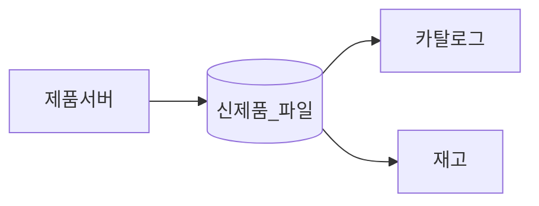
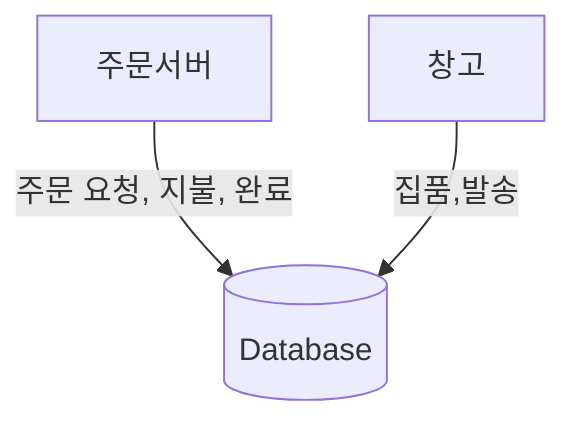
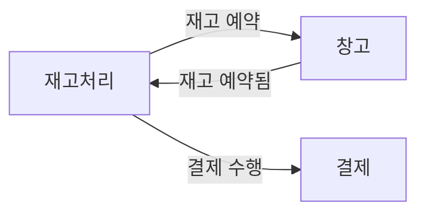
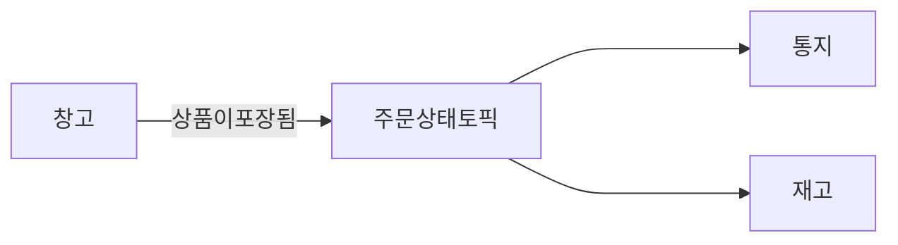

# 마이크로 서비스 통신 방식

### 프로세스 내부에서 프로세스 사이로
- 프로세스 내부의 호출과 프로세스 사이와의  호출은 큰 차이가 존재한다.
- 서드파티 소프트웨어를 쓰는 것처럼 한 객체가 다른 객체에 호출을 네트워크를 통해 한다고 생각하면 쉽다.

### 성능
- 패킷을 통해 송수신을 하기 때문에 내부 프로세스에서 호출하는 것보다 더 오버헤드가 생길 수 밖에 없다.
- 내부로 송수신할 때에는 포인터를 전달하여 해당 메모리 주소를 참조하기 때문에 1000번을 호출해도 무리가 없다. 하지만 네트워크는 다른 이야기다.
- 최소한의 정보만 전달하여 패킷의 크기를 줄이고 서로 송수신하고 직렬화하는 매커니즘을 최적화하여 데이터의 주소만 전달하는 등으로 최적화를 고려해야된다.
- 네트워크로 송수신을 하는 것을 숨기기 위해 지나친 추상화를 하는 경우가 있는데 이런 착오는 다른 개발자가 네트워크의 I/O를 고려하지 못하는 상황이 발생할 수 있으니 너무 지나친 추상화는 하지않는 것이 좋다!

### 인터페이스 변경
- 내부에서만 사용되는 인터페이스를 변경하는 것은 외부에 지장을 거의 주지 않기 때문에 언제든 수정하고 독립적으로 배포해도 상관없다.
- 외부에 노출되는 인터페이스를 배포할 때 하위 호환성을 깨트릴 경우 둘다 새로운 인터페이스를 동시에 배포하는 락스탭 배포 전략을 활용하는 등의 새로운 인터페이스를 배포할 방법을 찾아야 한다.

## 에러처리
- 프로세스 내부에서 발생하는 에러는 직관적이며 디버깅할 컨텍스트가 하나의 프로세스안에서 찾을 수 있기 때문에 찾기 쉽다.
- 마이크로 서비스에서의 에러 처리는 통제할 수 없는 영역이 다수있기 때문에 여러 부분을 고려하여야 한다.
    - 서버 충돌 실패: 서버가 중단될 때까지 모든 것은 정상, 충돌 발생시 재부팅을 시도
    - 누락 실패: 요청하는 네트워크는 되었지만 응답받는 네트워크는 실패
    - 타이밍 실패: 이벤트를 전달하고 너무 늦게 처리되거나 혹은 너무 빠르게 발생한 경우 문제가 생길 수 있다.
    - 응답 실패: 성공적으로 응답은 받았지만 데이터가 누락되거나 잘못된 응답 데이터를 전달해준 경우
    - 임의 실패: 비잔타움 실패, 더 큰 장애를 막기 위해 다수의 노드들이 특정 알고리즘으로 동의하면 암묵적으로 실패하기로 동의
- HTTP의 Status와 같이 의미가 명확하고 체계가 잘잡혀 있따면 클라이언트가 보상 작업을 수행하기 더 쉬워지기 때문에 더 견고한 시스템을 구축할 수 있음

### 프로세스간 통신을 위한 기술
- 자신에게 익숙한 기술이거나 컨퍼런스에서 봤던 신기술을 도입하고 싶을 때가 많다.
- 기술의 특성을 고려하지 못한 선택은 제약 조건이나 상반된 개념으로 인해 실제 해결하려는 문제와 일치하지 않을 수 있다.
- 문제 해결하는데 적합한 통신 방식을 이야기하고 해당 방식을 구현하는데 필요한 기술을 사용하는 것이 중요하다.

## 마이크로 서비스 통신 방식
- 동기식 블로킹: 다른 마이크로 서비스를 호출하고 응답을 기다림
- 비동기식 논블로킹: 호출을 보낸 후 수신여부 관계 없이 계속 처리 진행
- 요청 및 응답: 마이크로 서비스가 작업을 수행하고 그 결과를 응답 받음
- 이벤트 기반: 다른 마이크로 서비스가 소비할 수 있는 이벤트를 발행하고 다른 마이크로 서비스인지 모르게 한다.
- 공통 데이터: 통신 방식으로 자주 보기 어려운 데이터인 경우 공유 데이터 소스를 생성
- 통신 방식을 선택할 때 고려할 사항
    - 통신의 신뢰 필요성
    - 허용 가능한 지속 시간
    - 통신량
    - 요청과 응답 아니면 이벤트 기반에서 어떤 통신 방식이 활용이 가능한지 판단
- 네트워크 방식을 차용하는데 있어서 협업 스타일이 혼재되는 경우도 존재함

### 동기식 블로킹
- 일반적인 동기식 블로킹 호출은 다운스트림 프로세스의 응답을 기다리는 호출

### 장점
- 차례대로 프로세스를 처리하는데 효과적이며 대부분의 네트워크 방식은 동기식 블로킹을 차용한다.
- 가장 익숙하게 활용할 수 있는 방식이기 때문에 새로운 아키텍처를 선택할 때 합리적인 선택이 될 수 있다.

### 단점
- 양방향 통신이기 때문에 시간적인 결합이 발생할 수 밖에 없다.
- 업스트림 마이크로 서비스의 영향을 많이 받는다. 예를 들어 응답 지연, 네트워크 지연, 인스턴스 종료등 다양한 상황에 발생하는 문제들을 고려해야한다.
-  장애나 이슈가 발생했을 때 그로인해 발생하는 이펙트는 다른 마이크로 서비스에게 연쇄적으로 영향을 미치게 된다.

### 적용 대상
- 워낙 단순하고 많이 활용하고 있는 방식이다 보니 익숙한 기술의 사용하며 분산 시스템을 다룰 때 유리하다.
- 호출 체인이 많아질 때 마다 복잡하고 제어하기 어려워진다.

- 주문이 많이 들어올수록 사용하는 커넥션의 수가 많아지게 되고 주문과 체이닝 되고 있는 마이크로 서비스들의 커넥션풀은 응답들을 기다리게 된다. 그동안 다른 마이크로 서비스는 한정된 커넥션 풀로 인해 대기하게 되고 전체적인 네트워크 정체가 발생할 수 있다.

## 비동기식 논블로킹
- 비동기식 통신을 통해 논블로킹 통신을 하게되면 응답을 기다릴 필요없이 다른 처리를 계속 할 수 있게 된다.
- 공통 데이터를 통한 통신: 업스트림 마이크로 서비스는 일부 공통 데이터를 변경하고 다른 마이크로 서비스가 공통 데이터를 사용한다.
- 요청 및 응답: 작업 요청만 보내고 업스트림 마이크로 서비스가 응답을 수신받아 처리한다. 논블로킹 통신 방식을 차용했을 때에는 업스트림 마이크로 서비스의 작업 결과가 어떻게 되었든 처리되어야 한다.
- 이벤트 발행: 마이크로 서비스는 자기가 발행한 이벤트를 브로드캐스트한다. 다른 마이크로 서비스는 해당 이벤트를 수신하여 각자 정의된 작업등을 처리한다.

### 장점

- 시간적 결합을 제거하여 리소스를 효율적으로 활용할 수 있다.
- 요청에 대한 작업이 시간이 얼마나 걸리든 상관 없이 현재 작업을 잘 처리할 수 있다.
- 업스트림 마이크로 서비스에 문제가 발생하여도 그로인한 영향력을 줄일 수 있다.

### 단점
- 통신 방식이 적절하지 않는다면 채택하기 어렵다.
- 문제가 발생했을 때 디버깅하기 쉽지 않고 테스트하기도 쉽지 않다.

# 공통 데이터를 통한 통신

- 하나의 마이크로 서비스에서 다수의 마이크로 서비스가 공통적으로 데이터를 수집해야할 때 좋은 전략이다.
- 하나의 마이크로 서비스가 스토리지에 파일을 떨구고 나중에 다른 마이크로 서비스가 그 파일을 읽어 활용하는 방식이다.

## 구현

- 해당 패턴은 데이터에 대한 영구저장이 필요하기 때문에 파일 서버와 같은 시스템이 좋다.
- 다른 마이크로 서비스에서 주기적으로 파일 시스템을 스캔하고 새로운 파일이 들어오면 처리하는 방식을 선호한다.
- 이러한 구조는 새로운 데이터를 인식해야되는 메커니즘이 필요한데 대표적으로 폴링이 있다. 공유 데이터 스토리지에서 파일 서버 외에는 데이터 레이크,데이터  웨어하우스 구축이 있다.
- 데이터 웨어하우스는 구조화된 데이터 스토리지이기 때문에 화위호환이 불가능한 경우 데이터를 사용하는 생산자가 변경되어야 함
- 업스트림 마이크로 서비스가 공통 데이터 스토리지에 데이터를 저장하고 다른 다운 스트림 마이크로 서비스가 데이터를 읽어 작업을 수행한다.
- 데이터의 흐름이 단방향이기 때문에 정보의 흐름을 금방 파악하여 적절한 처리가 가능

## 장점
- 일반적으로 알려진 기술인 만큼 간단하게 구현 가능
- 파일 서버와 데이터 베이스 대상으로 사용하기 용이하다.
- 대중적으로 사용되는 스토리지나 파일을 사용하면 다양한 유형의 시스템을 상호 운영 가능
- 데이터 양 또한 문제가 되지 않기 때문에 많은 데이터를 처리하기 용이하다.

## 단점
- 폴링 기반 작업이나 메커니즘을 통해 새로운 정보를 받기 때문에 자주 읽어야 되는 케이스인 경우 유용하지 못할 수 있다.
- 짧은 지연 시간을 요구하거나 실시간으로 많은 양의 데이터를 처리하기 위해서는 카프카와 같은 기술을 사용하는 것이 유용하다.
- 공통으로 사용되는 스토리지에 문제가 생긴 경우 마이크로 서비스가 중단 될 수 있을 수 있다.
- 문제가 발생했을 때 실패하지 않도록 시스템을 구축 하는 것이 좋다.

## 적용대상
- 기존 대상 시스템에서 카프카나 gRPC와 같은 기술을 적용하기 어려운 경우에 사용하기 좋다.
- 한번의 작업에 수백만개의 데이터를 받거나 처리해야할 때 유용하다.

# 요청 및 응답 통신

- 다른 마이크로 서비스에 있는 데이터를 마이크로 서비스에게 요청하여 받는 형태

- 위와 같은 상황같이 서로 다른 마이크로 서비스가 의존하여 특정 순서에 의해 진행되어야하는 프로세스를 구현 해야되는 경우 유용하다.
- 명령보다는 요청이라는 단어를 사용하는 것을 선호한다. 명령은 무조건 수행해야되는 방면 요청은 언제든 상황에 따라 거절 될 수 있기 때문

## 구현: 동기 vs 비동기
### 동기
- 동기식 방식으로 구현하는 것은 매우 간단하다. 다운스트림 마이크로 서비스가 네트워크를 통해 업스트림 마이크로서비스와 송수신하는 커넥션을 생성하여 요청한다.
- 업스트림 마이크로 서비스가 어떻게 동작하는지 알 필요 없다는 장점이 있지만 커넥션이 끊기거나 인스턴스가 종료되어 문제가 발생할 수 있다.
### 비동기
- 중간에 메시지 큐와 같은 버퍼시스템을 두고 송수신 하는 방법
- 이러한 논블록킹 송수신을 할 때에는 암묵적으로 다른 마이크로 서비스가 어디로 요청하거나 응답해야되는지 알아야한다.
- 요청량이 많이 시스템이 들어오는 요청을 전부 처리하기 어려운 상황일 때 유용하다.
- 요청이 이미 했는데도 똑같은 요청이 들어오거나 제대로 처리되지 않는 등의 예외케이스를 고려해야한다. 이런 부분을 쉽게 해결하려면 데이터베이스에 저장되고 있는 row에 상태를 통해 다시 로드하는 방식을 채택하는 것이 좋다.
- 이처럼 버퍼를 두고 논블록킹하는 통신 방식은 무한정 대기할 가능성이 존재하기 때문에 타임아웃 처리가 필요하다.
### 적용 대상
- 요청의 처리가 한번에 진행되지 않고 요청 단계를 중간중간에 확인해야되는 경우에 유리하다.
- 제대로 처리되지 않았을 때 보상 조치와 같은 마이크로 서비스 환경을 만들어야할 때 유리 하다.
- 동기식과 비동기식의 구조를 이해하고 적절하게 활용하는 것이 중요

## 이벤트 기반 통신
- 기본적으로 비동기식으로 상호 작용하며 업스트림 마이크로 서비스에서 자기가 했던 일을 그저 진술(statement)하는 것이 전부다.
- 이벤트를 발행한 것만으로도 업스트림 마이크로 서비스의 역활은 다한 것이다.

- 위와 같은 구조를 보면 창고가 상품이 포장되었다는 이벤트를 발행하고 브로드캐스트 하고 있다.
- 이벤트의 수신자를 몰라도 되기 때문에 결합이 느슨하다.
- 책임의 역전 현상을 이해하기 어려울 수 있다. 예시로 통지와 같이 알림 시스템을 만들 때에는 어떤 이벤트에 고객의 알림이 가는지 업스트림 서비스가 알고 있어야한다.
- 하지만 이벤트 기반으로 상호작용을 해버린다면 연관이 없는 마이크로서비스까지는 알기 어렵기 때문에 결합이 크게 줄어든다.

### 구현
- 레빗엠큐와 같은 메시지 브로커를 활용하여 API를 통해 이벤트를 받고 이벤트를 구독 처리하여 소비자가 알림을 전달 받도록 구축할 수 있다.
- 메시지 큐에 너무 의존하면 메시지 큐가 많은 도메인 지식들을 가진 미들웨어가 될 수 있다. 미들웨어는 멍청하게 엔드 포인트는 똑똑하게 구축하여야한다.
- HTTP를 통해 구현할 수도 있는데 소비자가 받은 메시지를 추적하고 지속적으로 폴링 일정을 관리 해야 된다는 단점을 가지고 있다.
- 여러개의 워커에서 메시지를 두고 경쟁하는 갱쟁 소비자 패턴도 존재한는데 이런 패턴은 독립적으로 작용되는 이벤트를 많이 처리하는데 특화되어있다. 하지만 모든 워커가 접근하기 때문에 하나의 자원이 공유되지 않도록 해야한다.

### 아이디만 전달
- 이벤트에 아이디만 담고 전달하는 방법은 마이크로 서비스간의 느슨한 결합을 하는데 도움을 준다.
- 하지만 더 필요한 정보가 있을시 다시 이벤트를 발행해야되는 단점이 있다. 이로인에 다운 스트림마이크로 서비스는 업스트림 마이크로 서비스에 대해 도메인 지식을 알게 되었다.
- 적은 정보로 인해 더 잦은 이벤트가 발행되고 그로 인해 부하가 발생할 수 있다.

### 매우 자세한 이벤트
- 다운스트림에 필요한 정보들을 모두 이벤트에 담는 것이다.
- 이로인해 정보의 은닉성이 줄어들고 이벤트 자체의 용량도 커지게 된다.
- 한번 만들어진 이벤트는 계속 정보들이 추가되고 빼기는 어려운 상황이 된다.

### 적용대상
- 느슨한 결합을 추구해야되는 상황에 이벤트 기반 통신은 매우 매력적이다.
- 이벤트 기반으로 처리하지 않아도 되는 통신을 이벤트로 구축하게 되면 소프트웨어의 복잡도가 매우 증가하게 된다.
- 복잡도가 높아진다는 것은 문제가 발생했을 때 복잡도가 높아진다는 의미이기도 하다.
- 이벤트 기반 아키텍처를 구축할 때 각 프로세스의 경계를 추적할 수 있게 도와주는 장치가 필요하다.