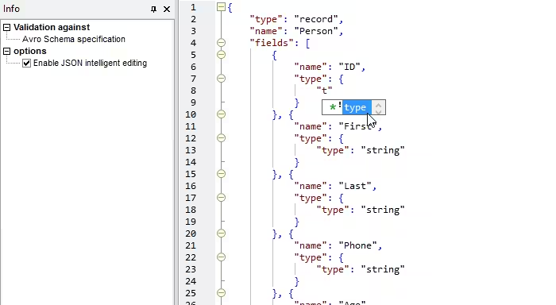
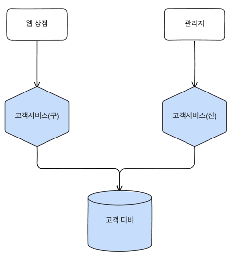

# 마이크로 서비스의 통신 구현 

## 1. 이상적인 통신 구현 전 신경써야하는 것들

### 하위 호환성
- 마이크로 서비스를 변경할 때에는 호환성이 깨지지 않도록 주의해야한다.
- 필드를 추가하는 등의 간단한 작업으로 클라이언트의 서비스가 지장이 가도록 하면 안된다.
- 운영하기 전에 다른 마이크로 서비스와의 호환성을 테스트해야한다.

### 명시적인 인터페이스
- 노출되는 마이크로 서비스의 기능이 소비자에게 명확하게 전달되지 않아 호환성을 깨지게 될 수 있다.
- 어떤 기능이 유지되고 어떤 기능이 변경되는지 개발자에게 명확하게 전달되어야 한다.
- 스키마를 명시적으로 정의하고 문서화하는 방법도 효과적이다.
- 어떤 기술을 사용하든 기능을 충분하게 설명하는 문서와 함께 제공해야한다.

### 기술 중립적인 API 사용
- 기술의 변화에 따라 우리가 사용하는 기술이 변화할 수 있기 때문에 기술 중립적인 API를 사용하는 것이 중요하다.
- 특정 기술 스택을 강요하는 API를 사용하게 될 경우 기술 스택이 변경될 때에는 모든 마이크로 서비스를 변경해야될 수도 있다.
- 특정 API에 종속되게 되어 상황에 맞는 기술스택을 선택하기 어려운 상황은 피해야한다.

### 단순한 서비스 설계
- 클라이언트가 마이크로 서비스를 사용하는데에 비용이 증가하게 된다면 아름다운 마이크로 서비스의 설계는 실패라고 말할 수 있다.
- 마이크로 서비스의 설계는 단순하고 사용하기 쉬워야한다. 
- 클라이언트는 기술을 사용하는데에 있어서 완전히 자유로워야한다.
- SDK를 제공해주는 방법들도 존재하지만 결힙과 비용이 증가하게 되는 것은 감수해야한다.

### 내부 구현 숨기기
- 이전에 설명했듯이 정보의 은닉은 중요하다. 
- 소비자가 내부 구현을 알고 있다는 것은 의존하고 있다는 것을 의미하며 이는 결합을 높이게 된다.
- 이는 변경비용을 증가시킴으로써 마이크로 서비스의 변경을 어렵게 만든다.
- 기술부채를 증가시키지 않도록 내부 구현의 상세 정보를 노출하는 기술은 피해야한다.

## 2. 기술 선택
다양한 기술을 선택할 수 있지만 대표적으로는 아래의 기술들을 뽑을 수 있을 것이다.
- 원격 프로시저 호출(RPC): 대표적으로 gRPC와 SOAP가 있으며 원격에 있는 프로세스에서 메서드를 호출하는 방식이다.
- REST: HTTP를 통해 데이터를 주고 받는 방식으로 가장 대중적으로 사용되는 방식이다.
- 그래프 QL: 페이스북에서 만든 쿼리 언어로 클라이언트가 필요한 데이터를 요청하는 방식이다.
- 메시지 브로커: 레빗엠큐나 카프카와 같은 큐와 토픽을 통해 메시지를 주고 받는 방식이다.

### 원격 프로시저 호출
- 로컬 호출을 통해 원격에 있는 프로세스에 있는 서비스를 실행하는 기술이다.
- 명시적인 스키마를 필요로 하며 보통 인터페이스 정의 언어(IDL)나 웹 서비스 설명 언어(WSDL)를 사용한다.
- 자바의 RMI, .NET의 WCF와 같은 기술은 다른 기술과 달리 강한 결합을 요구한다.
- 일반적으로 RPC 기술을 사용한다는 것은 직렬화 프로토콜을 사용한다는 것을 의미한다.
- 구현체마다 TCP나 UDP와 같은 프로토콜을 사용하는데에 있어서 제한이 있을 수 있다.
- 명시적인 스키마가 있는 RPC를 사용하면 클라dl언트 코드를 생성하기 쉽다. 하지만 이를 위해서는 호출하기 전 스키마를 액세스 할 수 있어야한다.
- 클라이언트 코드를 생성하여 평소처럼 사용한다는 것에 있어서 큰 장점으로 볼 수 있다.

#### 문제점
- 기술 결합 발생
  - 자바 RMI나 .NET WCF와 같은 기술은 특정 기술에 종속되어 있기 때문에 다른 기술로 변경하기 어렵다.
  - RPC는 종종 상호 운영성에 대한 제약이 있을 수 있다.
  - 어떤 면으로 보면 내구 기술의 구현을 노출하는 형태로 볼 수 있다.
- 오버헤드 발생
  - 메서드를 호출하는 것처럼 보이지만 네트워크를 통해 호출하기 때문에 오버헤드가 증가할 수 밖에 없다.
  - 페이로드를 직렬화하고 역직렬화하는 과정이 필요하기 때문에 추가적인 비용이 발생한다.
  - 지나친 추상화를 통해 개발자가 네트워크를 이해하지 못하고 사용하는 경우가 종종 있다.
  - 서버는 기본적으로 외부의 네트워크를 신뢰할 수 없다. 네트워크는 느리거나 실패할 수도 있고 패킷이 변경될 수 있기 때문이다.
- 깨지기 쉽다. 
  - 고객이라는 정보를 가져올 때 이름, 주소, 전화번호, 메일을 가져오는 것을 예로 들어보자.
  - 메일이라는 정보가 사용되지 않는 상황이여서 필드를 삭제한다고 가정해보자.
  - 이렇다면 서버에서 필드를 제거하면서 클라이언트에 있는 역직렬화 코드가 깨지게 된다. 
  - 해당 변경사항을 운영에 배포하려면 서버와 클라이언트를 동시에 변경해야된다.(락스탭 릴리즈)
  - 이는 확장만 가능한 객체들을 만들게 되는 것을 의미하며 더이상 사용되지 않더라도 삭제할 수 없게 된다.
#### 주의점
- RMI와 같은 RPC는 기술스택에 종속되게 만들며 SOAP와 같이 사용하기에는 무거운 기술들도 존재한다.
- 네트워크가 완전히 숨겨질정도로 추상화를 하지 않는 것이 좋고 클라이언트와 서버가 같이 배포되지 않고 인터페이스를 개선할 수 있도록 하는 것이 좋다.
- 현재까지는 gRPC가 가장 좋은 선택지로 보인다. 서버₩와 클라이언트가 양방향 스트리밍을 지원하며 HTTP/2를 사용하기 때문에 성능이 좋다.

## REST
- HTTP를 통해 데이터를 주고 받는 방식으로 가장 대중적으로 사용되는 방식이다.
- REST에서는 리소스의 개념을 통해 데이터를 수정하거나 특정한 프로세스를 처리하는 등의 작업을 수행한다.
### REST와 HTTP
- HTTP Method를 통해 리소스를 행동에 대해 정의한다.
- 거대한 생태계를 이루고 있기 때문에 수많은 모니터링, 보안, 로깅, 캐싱, 로드밸런싱과 같은 기능을 사용할 수 있다.
- HTTP를 잘 사용한다면 그 혜택들을 받을 수 있겠지만 잘못 사용한다면 안전하지도 않을뿐더러 확장하기도 어려워진다.
- RPC도 HTTP를 사용하지만 HTTP 명세를 따르지 않기 때문에 REST와는 다르다고 볼 수 있다.

### 애플리케이션 상태 엔진으로서의 하이퍼미디어
- 하이퍼미이어를 사용한 어플리케이션 상태 엔진
- 클라이언트는 서버가 어디에 존재하고 어떻게 동작하는지 알 필요가 없다.
- 클라이언트는 필요한 것을 찾기 위해 하이퍼미디어를 사용하면 된다.
- 네이버에서 검색해서 쇼핑을 하고 싶다면 하이퍼링크를 통해 쇼핑몰 사이트로 이동하면 된다.
- 이러한 방식은 하나의 서비스처럼 보이지만 하이퍼링크를 통해 다른 서비스로 이동하게 되면서 개념적으로 완전히 분리함은 물론이고 성능이 저하되지 않는다.

### 문제점
- 클라이언트와 서버간의 결합성이 생기는 문제가 발생한다. 
- 일반적으로는 Json과 같은 문자 포맷을 TCP 연결을 통해 데이터를 주고 받는데 이는 성능의 저하를 가져올 수 있다.
- HATEOAS는 클라이언트가 원하는 엔드포인트를 찾기 위해 여러번의 왕복 호출이 발생할 수 있어 성능이 저하될 수 있다.
- 하지만 HTTP 기반 REST는 가장 널리 알려져 있는 방식이기 때문에 다양한 기술들을 지원받아 사용할 수 있기 때문에 합리적인 선택지로 볼 수 있다.

### 적용 대상
- 동기식으로 다양한 서비스를 호출해야되는 경우에는 REST가 적합하다.
- REST 기반 비동기 API를 구축할 수 있지만 다른 대안들을 비교해봤을 때 그다지 좋은 선택지는 아니다.
- HATEOAS는 현재 시스템의 모델이 적합하지 않는다면 사용하기 어렵다.

## 그래프 QL
- 그래프 QL은 클라이언트가 동일한 정보를 검색할 때 여러번 요청할 필요가 없이 한번의 요청으로 모든 정보를 가져올 수 있다.
- 그런 부분에 있어 클라이언트 측에서 성능이 상당히 향상되었따.
- 필요한 정보만 가져오는 단일 쿼리를 사용하기 때문에 불필요한 호출을 줄이고 데이터 양을 줄일 수 있다.

### 문제점
- 클라이언트의 요청에 따라 서버에서 데이터를 가져오는 방식이기 때문에 서버에 부하가 발생할 수 있다.
- 그래프 QL 자체에서 문제가 있는 쿼리를 작성하는 것에 대해 추적하기 어렵다.
- 데이터를 동적으로 가져오기 때문에 캐싱을 통한 성능 향상이 어렵다.
- 데이터로 작업하는 것처럼 느껴져 데이터베이스의 래퍼처럼 사용될 수 있다.

### 적용 대상
- 외부 API를 여러번 호출해야되는 경우에는 그래프 QL이 적합할 수 있다.
- 집계 및 필터링이 주요 메커니즘이므로 하위 시스템에서 데이터를 가져오는 것이 적합할 수 있다.
- 그래프 QL의 대안으로 BFF 구조를 사용할 수 있다.

## 메시지 브로커
- 미들웨어처럼 프로세스 사이에 중개자로 강력한 기능들을 비동기 통신을 구현하는 선택지로 인기가 많다.
- 메시지 브로커는 요청과 응답 뿐만 아니라 이벤트 등의 다양한 메시지를 전달할 수 있다.
### 토픽과 큐
- 발신자는 큐에 메시지를 넣고 소비자는 해당 큐에서 메시지를 읽는다.
- 큐는 하나의 소비자에게 전달되어 소비되며 하나의 그룹에게만 수신이 된다.
- 토픽은 큐와 달리 여러개의 소비자 그룹을 가질 수 있고 메시지를 브로드캐스트 할 수 있다.
- 토픽은 이벤트 기반 통신에 적합하고 큐는 요청과 응답 통신에 더 적합하다.

### 전달 보장
- 브로커를 사용하는 이유는 전달 보장이라는 약속을 가지고 메시지를 전송하기 때문이다.
- 다운 스트림 서비스에서 신경써야하는 작업의 수들이 줄어든다.
- 보통의 브로커는 고장나더라도 메시지가 손실되지 않도록 구축되어 있다.
- 브로커를 얼마나 신뢰할지 결정하여 적절한 아키텍처를 구축해야한다.
- 브로커들은 정확히 한번을 전송하는데 발전을 해왔으며 이런 부분은 소비자가 메시지를 처리하는데 신뢰성을 올려준다.

### 카프카
- 스트림 프로세싱 파이프라인을 구현함으로써 대용량의 데이터를 처리하거나 실시간으로 데이터를 처리하는데 매우 특화되어 있다.
- 카프카는 여러 소비자와 생산자를 허용하도록 만들어 졌다.
- 카프카의 메시지는 영속성을 가지고 있으며 수신하지 않으면 메시지가 손실되지 않는다. 
- 하지만 무작정 전송에 실패한 메시지를 저장하고 무기한 저장하면 자원의 낭비이기 때문에 KSQL과 같은 스크립트로 카프카의 상태나 메시지를 조횔 할 수 있다.

## 직렬화 포맷
### 텍스트 포맷

- Json이나 XML과 같은 표준 텍스트 포맷을 사용하면 클라이언트가 자원을 사용하는 방법에 있어서 유연하게 가져갈 수 있다.
- Json은 XML보다 훨씬 더 압축하기 쉽기 때문에 페이로드로 인해 많은 사람들이 채택했고 표준적으로 많이 사용하고 있다.
- 스키마를 기반으로 구조를 정의하는 아브로도 흥미로운 구조 중 하나이다.

### 바이너리 포맷
- 페이로드의 크기나 쓰기, 읽기의 효율을 고려하면서 gRPC와 같은 곳에 자주 사용됨
- 전송을 마이크로 단위로 줄일려면 다양한 포맷을 직접 사용해보면서 비교하는 것을 권장
- 데이터를 줄이거나 호출하지 않는 방법이 제일 이상적이다.

## 스키마
- XML은 XSD를 사용하며 JSON으로 작업한다면 JSON tmzlakfmf tkdydgksek.
- SOAP는 WSDL로 동작하고 gRPC는 버퍼 명세가 필요하다.
- 명시적 스키마를 사용하는 것은 필요한 양의 문서를 줄이는데 많은 도움이 된다.

### 구조적 계약 위반과 의미적 계약 위반
- 구조적 계약 위반은 소비자가 호환되지 않는 방식으로 엔드포인트가 변경되는 상황(필드 제거나 변경)
- 의미적 계약 위반은 구조는 동일하지만 소비자가 기대한 것과 다른 방식으로 동작할 때

### 스키마를 사용해야하는 이유
- 동적 언어는 컴파일의 안정성을 포기하고 많은 이점을 제공하지만 마이크로 서비스 입장에서는 그러한 이점 상쇄된다.
- 동적 언어에서도 명시적 스키마를 사용하지 않고 사용한다면 어떻게 테스트하고 구조적 계약을 준수하고 있다고 보장할 것인가?
- 마이크로 서비스에서 무엇을 노출할지와 노출하지 않는지 명시적으로 표현하는 것이 중요하다.

## 마이크로 서비스간 변경 처리
- 마이크로 서비스간 버전을 관리하는 체계와 중단 없이 계약을 변경하는 방법에서 가져야할 요소는 아래와 같다.
1. 확장 변경  
계약에서 새로운 것만 추가하고 제거하지 않는 것


2. 관대한 독자
```xml
<customer>
  <firstname>lee</firstname>
  <lastname>yongseon</lastname>
  <email>test@gmail.com</email>
  <phoneNumber>010-1234-1234</phoneNumber>
</customer>
```
소비자는 이름, 성, 이메일 필드만 필요하고 나머지는 필요없다. 하지만 소비자는 모든 필드를 직렬화하면서 문제를 일으킬 수 있는데
이는 나중에 휴대폰 번호가 변경되지 못하고 소비자가 중지되게 만든다.
```xml
<customer>
  <naming>
    <firstname>lee</firstname>
    <lastname>yongseon</lastname>
  </naming>
  <email>test@gmail.com</email>
</customer>
```
클라이언트에 최대한 유연하게 사용할 수 있도록 구조를 설계하여 변경사항은 무시할 수 있는 **관대한 독자**가 되도록 하자.
당신이 하는 일에는 엄격하고 남에게 하는 일은 관대해야한다.

5. 올바른 기술  
인터페이스 변경에 유연한 기술을 사용하여 클라이언트에 중단없이 사용할 수 있도록 하자.
아브로는 명시적인 스키마를 전달하고 페이로드를 전달하고 gRPC는 프로토콜 버퍼 자체에 필드 번호 개념을 가지고 있기 때문에 괜찮다.


4. 명시적 인터페이스
- 소비자를 중단시키지 않으려면 어떤 필드를 건드려야하는지 모든 개발자들이 이해할 수 있도록 명시적으로 스키마를 정리해야한다. 
- OpenAPI Specification을 통해 REST 엔드포인트를 명시적으로 사용할 수 있도록 되었다.
- 이벤트 또한 CNCF나 CloudEvents와 같이 명세하는 표준들이 생겨나고 있다.

5. 우발적 중단 일찍 발견하기
- 구조적 중단 같은 경우는 스키마의 변경을 비교하여 확인하는 도구들이 많이 나외있다.(프로토락, json-schema-diff-validator, open-api-diff 등)
- 스키마 비교 도구는 구조적 계약 위반을 알아채는데 큰 도움을 주지만 의미적 계약 위반을 도와주지는 못한다.
- 계약 테스트와 소비자 주도 계약을 통해 풀 수 있지만 나중에 좀 더 알아 보자


## 중단 변경 관리
하위 호환성을 유지하기 위해 최대한 노력했더라도 때로는 중단 변경이 필요한 순간이 오게된다. 그럴 때 대표적으로 선택되는 선택지들은 아래와 같다.
1. 락스텝 배포: 인터페이스를 노출하고 있는 마이크로 서비스와 소비자들을 모두 같이 배포
2. 호환되지 않는 마이크로서비스의 공존: 마이크로 서비스에서 기존 버전과 신규 버전을 나란히 실행
3. 기존 인터페이스 에뮬레이터: 새 인터페이스와 기존 인터페이스를 같이 노출하도록 개발


### 락스텝 배포 
락스텝 배포는 마이크로서비스의 특성 중 독립적인 배포와 대치되기도 한다.
만약 당신이 독립적인 배포의 특성을 띄고 싶다면 소비자에게 새 인터페이스로 변경하는 시간을 주어야한다.

### 호환되지 않는 마이크로서비스와의 공존

- 이전 인터페이스를 소비하는 소비자는 이전 서비스로 라우팅하고 새로운 인터페이스를 사용하는 소비자는 새로운 마이크로서비스에 라우팅하는 전략
- 소비자가 오래된 마이크로 서비스를 지속적으로 사용해야할 때 드물게 사용하는 전략이다.
- 내부적으로 수정해야하는 버기가 존재할 경우 서로 다른 서비스를 수정하여 같이 배포해야한다.
- 소비자가 단순하게 마이크로 서비스를 사용하는데 지장을 준다. 중간에 nginx가 존재하여 시스템 동작의 이해를 어렵게 만들고 서로 다르게 버전을 관리하면서 
하나의 엔티티의 모든 서비스에 존재하지만 서로 다른 서비스에 동작하게 되면서 복잡도를 높이게 된다!
- 카나리아 배포와 같은 단기간내에 공존해야되는 상황이 필요할 때에는 사용이 가능하지만 버전이 업그레이드하는데 시간이 오래걸릴수록 다른 전략을 찾는 것이 좋다.

### 기존 인터페이스 애뮬레이션
- MSA는 독립적으로 배포되길 원하며 변경으로 인해 발생하는 영향을 제한하는 것을 권장하고 있다.
- 하위호환성을 깨트리고 배포전략은 독립적으로 가져가고 싶다면 레거시 인터페이스와 신규 인터페이스를 같이 두면된다.
- 이런 방법은 중단없이 새로운 마이크로서비스를 배포할 수 있고 빠르게 배포할 수 있게된다.

- 위의 그림과 같이 기존의 인터페이스와 신규 인터페이스를 동시에 제공하다가 모든 소비자가 인터페이스가 변경이 되었다면 이전의 인터페이스는 제거가 된다. 
- 버저닝을 통해서 인터페이스를 관리했지만 기존의 인터페이스와 신규 인터페이스를 모두 동작하다는 테스트가 필요했기에 추가적인 부담은 증가하게된다.
- 두개의 인터페이스를 동시에 제공하는 것은 부담이되었기에 V1에 필요한 인터페이스를 V2에 분기를 나뉘어 제공하고 V3에서 레거시 코드베이스를 완전히 제거하면서
비교적 손쉽게 제거할 수 있었음(확장/축소 패턴)
- RPC는 좀 더 까다로울 수 있지만 `v1.createUser`, `v2.createUser`와 같은 방식을 사용하여 처리했지만 동일한 타입에 대해 처리할 때에는 어려움이 큼

### 어떤 방식을 선호하는가?
- 락스텝 배포
  - 단일팀이 관리하며 일회성으로 배포가 되어야할 때
  - 락스텝이 잦으면 분산형 모놀리식 아키텍처가 된다.
- 인터페이스의 공존
  - 짧은 시간 동안 다른 인터페이스를 제공해야할때
  - 현실적으로는 몇주이상 소요가능성이 있음
  - 블루 그린 배포나 카나리아에 유리한 전략


