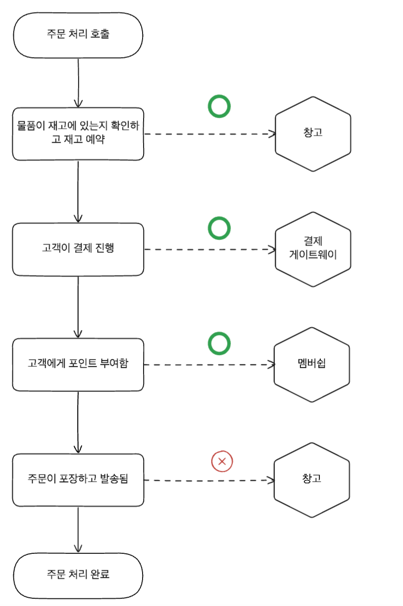

# 워크플로

## 데이터베이스 트랜잭션
- 우리는 여러 개의 작업들이 하나의 작업처럼 처리되거나 실패되었을 때 되돌아가길 원한다. 
- 데이터베이스의 트랜잭션은 하나 이상의 상태변경이 성공적으로 수행되었는지 확인한다.
- 트랜잭션은 여러개의 상태 변화들을 하나의 작업으로 처리하기 때문에 한번에 여러개의 테이블이 수정될 수 있다.

### ACID
- 원자성(Atomicity): 트랜잭션은 성공적으로 완료되거나 실패해야 한다. 중간 상태는 없다.
- 일관성(Consistency): 데이터베이스가 변경되면 데이터베이스는 일관된 상태로 유지되어야 한다. 
- 격리성(Isolation): 트랜잭션은 다른 트랜잭션에 영향을 받지 않아야 한다.
- 내구성(Durability): 트랜잭션이 성공적으로 완료되면 그 결과는 영구적으로 저장되어야 한다.
- 모든 데이터베이스가 ACID를 지원하지는 않지만, 대부분의 데이터베이스는 ACID를 지원한다.

### 원자성이 부족한가
- 마이크로서비스의 트랜잭션은 ACID를 사용할 수는 있지만 원자성을 보장하기 어렵다.
- 데이터베이스가 분리가 되면서 트랜잭션은 두개 이상의 트랜잭션으로 분리될 수 있으며 이로 인해 원자성이 보장되지 않을 수 있다.

- 위의 그림에서 모놀리식에서는 중간에 결제 기록이 실패했을 때에는 주문에서 상태를 바꿨던 것을 되돌릴 수 있지만 마이크로서비스의 환경에서는 불가능하다.
- 그래서 문제가 발생했을 때 롤백을 해야하고 이는 따로 롤백하는 로직을 구현하여야한다는 것을 의미한다. 
- 이러한 원자성 결여는 이 속성에 의존하고 있는 서비스를 마이그레이션 하는 경우 문제가 발생할 수 있다.
- 대체적으로 분산 트랜잭션은 올바른 방향이 아니기 때문에 이러한 문제를 해결하기 위해 다른 방법을 찾아야 한다.

## 2단계 커밋
- 2단계 커밋 알고리즘은 분산 시스템에서 트랜잭션을 처리하는 방법 중 하나로 자주 거론된다.
- 2PC는 투표 단계와 커밋 단계로 나뉘어진다. 
- 투표단계
1. 중앙 관리자가 트랜잭션에 참여하는 모든 노드에 커밋이 가능한지 물어본다.
2. 상태 변경에 대한 요청이 일부 내부 정책을 위반하거나 다른 노드와 충돌이 발생하면 참여 노드는 커밋을 거부한다. (그런 경우 모든 연산을 중지) 
3. 작업에 필요한 노드는 해당 row에 대한 잠금을 획득한다.
-  커밋 단계
1. 중앙 관리자는 참여한 노드에게 순차적으로 커밋을 요청한다.
2. 요청을 받은 노드에서 순차적으로 커밋이 완료가 되면 잠금을 해제한다.
3. 중간에 하나라도 커밋이 실패했을시 참여 노드들에게 롤백메시지를 전달한다.

### 단점
- 2단계 커밋은 참여하는 노드가 많을수록 더 높은 지연시간이 발생하게 된다.
- 중간에 작업 소요 시간이 길수록 자원을 오래 잠궈두게 되어 지연시간을 길게 만든다.
- 여러 참가자 노드들의 잠금을 잘 제어하여 교착상태를 피하는 것은 쉽지 않다.
- 이런 이유들로 인해 수명이 짧은 작업에만 사용하는 것이 좋다.

## 분산 트랜잭션 하지않기 
- 데이터를 분리하지 않는 방향으로 설계하여 원자적이고 일관된 트랜잭션으로 사용.
- 단일 서비스에서 해당 상태를 관리하는 형태로 만들어서 다음에 이 문제로 해결한다.
- 분산 트랜잭션을 사용하는 것은 보통 좋진 않지만 구글은 스패너라는 인프라를 활용하여 여러 환경에서 데이터 일관서을 보장해주는 시스템을 만들었다.

## 사가 패턴 
- 사가패턴은 2PC와 다르게 자원을 잠굴 필요없이 트랜잭션을 분리할 수 있도록 설계 되었다.
- 사가패턴은 LLT(장기 트랜잭션)을 잘 처리하는 방법 중 하나로 잘 설명하고 있다.
- 긴 생명주기를 가진 트랜잭션이 진행되는 동안 다른 프로세스에서 간섭하면 심각한 문제를 일으킬 수 있으며 이 문제를 해결하기위해 락을 걸면 상당히 긴 시간동안 락을 걸어두어야 한다.
- 사가패턴은 이러한 문제를 해결하기 위해 트랜잭션을 여러개의 작은 트랜잭션으로 분리하여 처리한다.

- 위의 그림에서 주문 처리 프로세스는 사가로 표현되며 주문을 처리하는 과정을 여러개의 작은 트랜잭션으로 나누어 처리한다.

### 사가 실패 모드
- 사가에서 실패 처리 방법을 항상 고려해야하고 대표적인 방법은 다음과 같다.
- 역방향 복구는 실패 작업과 관련된 모든 작업을 롤백하는 방법이다.
- 정방향 복구는 실패한 작업을 다시 시도하는 방법이다. 이는 우리가 재시도하기 위한 충분한 정보를 가지고 있음을 말한다.
- 사가 실패 모드에서는 기술적인 실패(타임아웃)와 비즈니스 실패(재고 부족)을 구분하여 처리해야한다. 

#### 사가롤백
- ACID 트랜잭션을 사용할 때 문제가 발생하면 롤백을 사용하여 이전 상태로 되돌릴 수 있다.
- 사가에서의 롤백은 이미 커밋이 완료가 되었기 때문에 롤백을 사용할 수 없다.

- 위의 그림에서와 같이 이미 커밋이 된 중간단계에서 문제가 생겼을 때 전체 프로세스를 롤백하는 것은 불가능하다.
- 롤백을 사용할 수 없기 때문에 각 단계에서 보상 트랜잭션을 사용하여야 이전 상태로 되돌릴 수 있다.

- 의미적으로 트랜잭션이 동작하지 않도록 덮어씌움으로써 이전 상태로 되돌릴 수 있다.
- 사가에서 롤백을 했다고 하더라도 이미 적용한 트랜잭션과 중간에서 전송된 알림등을 취소할 수 없기 때문에 이런 부분을 고려하여 보상트랜잭션을 설계해야한다.
- 롤백과 관련된 정보는 중요하기 때문에 시스템에 저장해두어야한다.
- 위의 그림에서 멤버쉽 포인트를 주는 단계를 배송하고나서 주게되면 보상트랜잭션이 동작할 때 처리해야하는 작업이 줄어들고 과정이 간단해진다.
#### 역방향 실패와 정방향 실패의 혼합
- 롤백이 필요한 상황이 있고 정방향으로 다시 시도해야하는 상황이 있을 수 있다.
- 예를들어 택배하는 차량에 공간이 부족해 배송이 지연되었을 때 주문을 실패하는 것보단 다시 시도해야하는 상황이 발생할 수 있다.

### 사가 패턴 구현
- 사가패턴의 종류는 크게 오케스트레이션 사가와 코레오그래피 사가로 나뉜다.
#### 오케스트레이션 사가
- 오케스트레이션 사가는 중앙에서 전체 프로세스를 제어하고 각 단계를 호출하는 방식이다.

- 오케스트레이터를 통해 각 단계가 진행되기 때문에 사가에서 발생하는 문제를 쉽게 해결할 수 있다.
- 오케스트레이터를 통해 작업을 처리하는데 필요한 서비스를 알고 있고 각 단계의 결과에 따라 다음 단계를 선택할 수 있다.
- 주문 처리 서버와 같이 중간에서 처리하는 각 프로세스를 명시적으로 모델링해두면 전체적인 흐름을 이해하는데 도움이 된다.
- 이러한 방식은 도메인간 높은 결합도를 필요로 하기 때문에 오케스트레이터는 높은 결합도를 가질 수 밖에 없다.
- 다른 마이크로서비스에 있어야하는 로직이 오케스트레이터에 존재하게 되면서 자신의 행동을 거의 하지 않고 중계자 역활의 서비스가 되어버릴 수 있다.
- 특정 단계는 다른 서비스가 오케스트레이터를 대신하여 처리하게 되면 중앙 집중화를 낮출 수 있다.(반품)

#### 코레오그래피 사가

- 코레오그래피 사가는 각 서비스간 의존도를 낮추기 위해 이벤트를 통해 서비스간 통신을 하게 된다.
- 예를 들어 주문 서비스에서 주문이 완료되면 이벤트를 발생시켜 배송 서비스에게 알려주고 배송 서비스는 이벤트를 받아서 배송을 시작한다.
- 결제 완료 이벤트를 받아서 배송과 멤버쉽 서비스에게 알려주는 방식으로 서비스간 의존도를 낮추고 서비스간의 통신을 줄일 수 있다.
- 안정적인 메시지 브로드캐스트와 이벤트 전달을 관리하기 위해 메시지 브로커를 사용한다.
- 코레오그래피 사가는 상대 서비스를 모르는 상태로 이벤트에 맞춰 동작하기 때문에 도메인 결합도를 크게 낮출 수 있다는 장점이 있다.
- 하지만 이런 방식은 중간에 문제가 발생했을 때 어떻게 처리할지에 대한 문제가 발생할 수 있다.
- 상관관계 ID를 사용하여 서비스 중 하나가 실패했을 때 어떤 단계에서 문제가 발생했는지 알 수 있도록 해야한다.
#### 혼합 사용
- 일부는 오케스트레이터를 사용하고 일부는 코레오그래피를 사용하는 방식으로 사용할 수 있다.
- 주문 처리 서비스는 오케스트레이터를 사용하고 배송 서비스는 코레오그래피를 사용하는 방식으로 사용할 수 있다.
- 두개의 패턴을 사용할게 되었을 때 사가가 어떤 상태인지 이미 어떤 활동까지 완료되었는지 알 수 있어야한다.
- 실패모드를 고려하여 어떻게 처리할지에 대한 방법을 고려해야한다.

### 어떤 것을 사용해야할까? 
- 코레오그래피는 보통 낮선 개념이기 때문에 아직 널리적으로 많이 사용되지는 않는다.
- 사가의 진행 상황을 관리하는 것과 관련된 복잡성을 줄이는 것이 느슨한 아키텍처보다 더 나은 이점을 가지고 있다.
- 한팀이 전체 사가를 구현할 때에는 오케스트레이터를 사용하는 것이 더 쉽다.
- 여러팀이 관여할 때에는 코레오그래피를 사용하는 것이 더 나은 선택일 수 있다.
- 이벤트 기반을 선호하느냐와 아키텍처의 복잡성을 어떻게 관리할지에 따라 선택하면 된다.

#### 사가와 분산 트랜잭션 비교
- 대다수의 분산 트랜잭션의 시스템에서는 단일 노드가 장애가 나면 트랜잭션은 중단된다.
- 이러한 시스템은 크기가 커질수록 장애가 발생할 확률이 높아지기 때문에 이러한 문제를 해결하기 위해 사가 패턴을 사용한다.
- 모든 엔진이 작동해야지만 동작하는 비행기가 아닌 하나의 엔진이 작동해도 동작하는 비행기를 만들어야한다.
- 이런 비행기는 엔진을 추가할 때 가용성을 높일 수 있다.