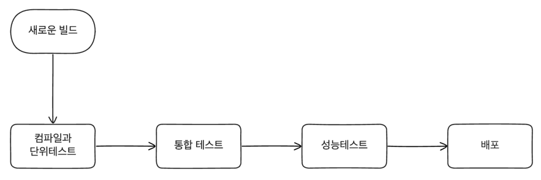
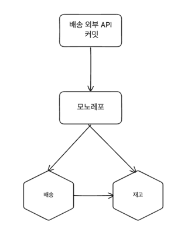

# 빌드
## 지속적 통합이란
- CI의 핵심 목표는 지속적인 통홥을 통해 모든 사람이 조화롭게 협업할 수 있게 하는 것이다.
- 하루에도 수십번씩 코드를 컴파일하고 테스트를 통과하는 과정을 자동화하여 개발자들이 더 빠르게 피드백을 받을 수 있게 한다.
- 그외에도 CI는 테스트의 과정과 배포의 버전 관리등 다양한 과정을 자동화하여 개발자들이 더 효율적으로 개발할 수 있게 도와준다.
- 이러한 장점은 마이크로서비스에서 다양한 서비스들을 통합하는 과정에서 더욱 중요하게 작용했다.

### CI의 정석 
- CI는 우리가 코드를 쉽게 변경할 수 있도록 해주는 핵심적인 도구이며 CI가 없다면 매우 고통스러운 마이크로서비스 운영이 될 것이다.
- CI의 도구를 채택하는 것과 CI를 수용했다는 것은 다르다. 
- 메인라인이 하루에 한번씩 체크인 되어야한다
  - 다른 사람의 변경사항의 변경사항이 자주 확인되지 않는다면 지속적인 통합은 점점 더 어려워진다.
  - 가능한 자주 아니면 적어도 한번 이상 단일 메인 브랜치에 통합해야한다.
- 변경 사항을 검증하는 테스트가 있어야한다.
  - 여러가지 툴을 통해 통합이 되었다는 것은 알 수 있지만 어떤 문제 때문에 기존의 기능이 깨져서 시스템의 문제가 생겼는지 알 수 없다.
  - 코드가 예상하는대로 동작한다는 보장을 하지 않으면 진정한 의미의 CI가 아니다.
- 빌드가 깨졌을 때 수정하는 것이 팀의 최우선은 아니다.
  - 빌드가 깨졌을 때 빌드를 다시 고칠 때까지 중지하는 것은 바람직하지 못하다.
  - 빌드를 고치는 동안 더많은 변경 사항이 발생할 것이고 결과적으로는 더 많은 노력을 들여야한다.

### 브랜치 모델
- 대표적으로 기능(feature) 브랜치 모델이 존재하는데 외적으로 봤을 때 작업중인 기능단위로 관리가 되면서 유용해보인다.
- 기능 브랜치의 문제는 변경사항에 대해서는 통합이 이뤄지지 않고 머지를 통해서만 이뤄지기 때문에 호흡을 길게 가져가게 된다.
- 이런 단점을 보완한 것이 트렁크 기반의 브랜치 모델이다.
  - 트렁크 기반의 브랜치 모델은 모든 커밋이 메인 브랜치나 트렁크 브랜치 통합되어야한다.
  - 작은단위로 커밋을 하고 패치를 통해 빠르게 통합을 하게 된다.
  - 큰 패치 폭탄은 유지보수하는 개발자가 변경사항을 검토하는데 어려움을 만들 수 있고 머지하기가 어렵고 느려진다.

## 빌드 파이프라인의 지속적인 제공
- CI의 단계에서는 각각의 빌드 과정속에서 단계마다 다른 의미를 갖고 있고 각기 다른 가치를 가지고 있다.
- 빠르고 작은 범위의 테스트가 존재하고 느리고 넓은 범위의 테스트가 존재할 때 빠른 테스트가 실패했을 때 굳이 느린 테스트를 기다릴 필요가 없다.
- 이런 각각의 빌드의 문제를 해결하기 위해 존재하는 것이 빌드 파이프라인이다.
  
- 지속적 제공은 운영 환경에서 필요한 과정을 파이프 라인으로 만들어서 각 과정마다 지속적인 피드백을 받는다.
- 이러한 과정을 거친 산출물은 운영 환경에 동작할 것이라고 확신할 수 있게된다.
- CD의 개념을 수용한다는 것은 자동 또는 수동으로 하는 모든 프로세스를 모델링해야하고 각각의 소프트웨어의 버전이 관리되어야 한다.
- 모든 과정이 통과해야지만 배포되는 파이프라인도 있는 반면 특정 과정에 대해 조건만 만족하면 배포되는 파이프라인도 있다.

### 도구
- 지속적인 제공을 위해서는 최상위에서 관리해주는 도구가 필요하다.
- CI 도구를 뜯어고쳐 확장하는 방법들도 있지만 대부분이 사용이 쉽지 않은 복잡한 시스템이 되는 경우가 많았다.
- CD를 완벽하게 지원해주는 도구들을 사용하면 운영 단계까지 이르는 모든 단계를 모델링하여 시각화되어 볼 수 있고 자동으로 검증하는 것이 가능하다.
- 때로는 수동으로 검증해야 되는 경우도 존재하지만 이런 과정 또한 모델링 되어 있어야 한다.

### 파이프 라인의 타협
- 우리는 문제가 생겼을 때 빠르게 개발자에게 피드백을 주길 원하며 문제를 빨리 전달할수록 더 빨리 해결할 수 있다는 것을 알고 있다.
- 우리는 운영 환경에 가까워질수록 소프트웨어가 동작한다는 것에 확신을 가지고 싶어하고 운영환경과 비슷한 환경에 배포하기를 희망한다.
- 운영환경과 매우 유사한 환경에서 모든 커밋을 롤아웃하고 싶어하지만 이것은 시간도 많이 소요되며 비용 또한 많이 든다.
- 그래서 우리는 빠른 피드백과 운영환경과 유사한 환경에서 테스트를 수행하는 것 사이에서 타협을 해야한다.
- 대체품으로 스모크 테스트(중요 기능에 대한 테스트)나 병렬 실행(병렬로 테스트 실행) 등을 통해 운영 환경에서 수행이 가능하다.

### 산출물 생성
- 산출물은 빌드 파이프라인 과정에서 한번만 생성되어야 한다. 하나의 빌드 파이프라인에 두개 이상의 산출물이 존재하게 되면 이론적으로 문제를 발생시킬 수 있다.
- 운영환경까지 배포해야되는 산출물이여야 한다. 운영환경까지 배포해야되는 산출물이 아니라면 빌드 파이프라인의 과정에서 생성되어서는 안된다.
- 산출물 생성은 파이프 라인 초기에 생성하여 넥서스나, 아티 팩토리, 컨테이너 레지스트리와 같은 저장소에 저장하여 관리하는 것이 좋다.
  

## 마이크로서비스의 소스코드와 빌드
### 거대한 빌드와 리포지토리

- 모든 코드를 저장하는 1개의 리포지토리와 모든 코드를 빌드하는 1개의 빌드가 있다.
- 고려할 리포지토리가 하나뿐이고 하나의 커밋에 대한 코드만 검증을 하기 때문에 단순하고 관리하기 쉽다.
- 일반적으로 피해야하는 방법이지만 프로젝트가 초기에 시작할 때는 이 방법이 적합할 수 있다.
- 단점
  - 하나의 기능 변경에도 다른 모든 서비스를 검증하고 빌드해야한다.
  - 필요 이상의 시간이 소모되면서 짧은 주기 시간을 가지는 것을 방해한다.
  - 어떤 산출물이 배포해야하고 어떤 산출물이 배포해야하지 않는지 알기 어렵다.
- 모노레포의 한 형태이지만 부분적으로 배포하는 것과 다르게 효용성이 떨어진다.


### 멀티레포

- 각각의 서비스마다 리포지토리를 가지고 있고 각각의 서비스마다 빌드를 가지고 있다.
- 리포지토리 단위로 소유권을 가지고 있고 리포지토리로 소유권을 변경할 수 있다.
- 강력한 소유권 모델을 가져야하는 경우 적합한 방법이다.
- 단점
  - 한번에 여러 리포지토리의 변경이 필요한 경우 빌드를 관리하기 어렵다.
  - 리포지토리간 의존성을 관리하기 어렵다.
    - 두개의 서비스가 하나의 라이브러리에 의존하고 있다고 가정하자.
    - 라이브러리에 변경이 생기면 라이브러리가 빌드될 때까지 기다려야한다.
    - 라이브러리를 롤아웃하려면 라이브러리를 사용하는 모든 서비스를 배포해야한다.
    - 특정 버전의 라이브러리를 사용하고 있는지에 대해 확인이 어려워 라이브러리에 대한 사용을 중단하기 어렵다.
  - 여러 리포지터리에 작업
    - 두개의 커밋이 적용되지 않고 하나의 커밋이 적용되는 경우가 문제가 발생할 수 있다.
    - 서비스 간 횡단의 변경은 일반적이지 않기 때문에 예외여야 한다
    - 여러 리포지토리에서 작업하는 고통이 마이크로서비스의 경계를 강화하는데 도움이 된다
  - 적용 대상
    - 마이크로 서비스별 리포지토리는 대규모든 소규모든 잘 작동한다.
    - 경계 밖에서의 변경이 자주 일어난다면 잘못되고 있다는 신호이다.
    - 버전단위로 관리되는 산출물로 관리되면서 모노레포보다 관리가 어려울 수 있다.

### 모노레포 

- 여러 마이크로 서비스에 대한 소스코드가 하나의 리포지토리에 저장되어 있고 하나의 빌드가 존재한다.
- 모노레포의 개념은 하나의 팀뿐만 아니라 여러 팀이 관여하는 프로젝트에도 활용이 가능하다.
- 모노레포는 소스 코드를 원자적인 단위로 관리할 수 있고 한 프로젝트에서 다음 프로젝트로 세밀하게 재사용이 가능하다.
- 다른 사람의 코드를 가시성을 높여ㅡ는 장점 뿐반 아니라 하나의 커밋이 여러 다른 서비스에 영향을 미치는 변경을 수행할 수 있다.
> 원자적 커밋이 원자적 롤아웃을 보장해주는 것은 아나다. 한번의 여러 개의 서비스를 변경하는 것은 독립적 배포 가능성을 위반한다는 것을 의미한다는 것을 기억해야한다.

#### 빌드 매핑
- 사용자가 직접 정의한 빌드 매핑을 통해 빌드를 관리할 수 있다.
- 두개의 폴더와 두개 이상의 빌드를 트리거하는 폴더가 존재할 수 있다.
- 공통으로 사용되는 폴더를 둘 수 있고 해당 폴더가 업데이트 되면 전체 마이크로 서비스가 빌드 될 수도 있다.
- 이런 의존성이 많아질수록 빌드 매핑이 복잡해지고 빌드가 느려질 수 있다.
- 베이즐과 같은 그래프 기반 빌드도구를 사용하지 않는다면 점점 관리하기 어려워질 수 있다.
- 빌드 매핑이 복잡해지겠지만 프로젝트간 재사용할 수 있는 코드를 패키징화하여 관리해야한다.


#### 소유권 정의
- 크게 공동 소유권과 강력한 소유권으로 나뉠 수 있다.
- 강력한 소유권
  - 특정 그룹의 사람들이 특정 서비스에 대한 소유권을 가지고 있고 그 서비스에 대한 변경사항을 관리한다.
  - 외부의 개발자가 변경이 필요하면 반드시 해당 서비스의 소유자와 협의를 해야한다.
- 약한 소유권
  - 외부에 있는 개발자가 변경사항을 수행할 수 있지만 변경사항을 수행하기 전에 해당 서비스의 소유자권의 허가를 받아야한다. 
- 공동 소유권
  - 개발자가 적은 경우 또는 팀이 작은 경우에 적합하다.
  - 모든 개발자가 모든 서비스에 대한 변경사항을 수행할 수 있다.
  - 사람이 많아지고 팀이 커지면서 분명한 책임 경계를 만들어야한다.
- 소스 코드 제어보다 소유권을 제어하지 못할 때 종종 문제가 발생한다.
- 갓허브에서 소유권을 관리하는 예시
```shell
# 있는 파일을 모두 소유
/build/logs/ @doctcat

# 특정 디렉터리에 있는 모든 파일을 소유
apps/ @doctcat
```

#### 도구
- 구글은 수십억 줄이되는 코드를 모노레포로 관리하기 위해 상당한 시간을 투자했다.
- 마이크로소프트의 윈도우도 270GB의 대량의 리소스 파일로 관리를 했었다. 하지만 결국 개발자는 거대한 시스템의 일부만 작업하기 때문에 VFS를 사용하여 필요한 파일만 가져오는 방식을 사용했다.
- 많은 사람들이 거대한 모노레포를 단순화하여 관리하기 위해 노력하고 있다.

#### 모노의 범위는
- 구글은 모든 소스코드를 하나의 레포로 관리하고 있지는 않지만 대부분의 코드를 하나의 레포로 관리하고 있는 것은 사실이다.
- 구글은 계열사나 다른 회사의 조직이 이 레포를 사용하려면 모노레포의 범위를 단일 시스템이나 소수의 시스템으로 제한하고 있다.
- 공동 소유권을 가지고 있는 수많은 팀에서 서비스간 경계를 명확히 관리하기 위해 아래와 같은 전략을 활용하고 있다.


### 어떤 방식을 채택할 것인가
- 모노레포는 원자적 커밋을 통해 여러개의 마이크로 서비스를 관리하게 되면서 많은 팀이 초반에 모노레포를 채택하게 된다.
- 하지만 시간이 갈수록 모노레포의 소유권을 관리하기가 어려워지며 멀티 레포로 전환함에 있어서 어려움을 겪게 된다.
- 모노레포에서 강력한 소유권을 가지고 책임간 경계를 명확히 가지려면 구글이나 마이크로소프트와 같이 많은 리소스를 투자할 수 있어야 하며 지속적인 관리가 필요하다.
- 모노레포를 관리하기 위한 도구들이 존재하고 있지만 성장속도와 사용율은 여전히 높지 않다.
- 상대적으로 초기에 비용이 많이 발생하겠지만 책임과 소유권을 명확히 할 수 있는 멀티레포를 선호한다(필자 피셜)