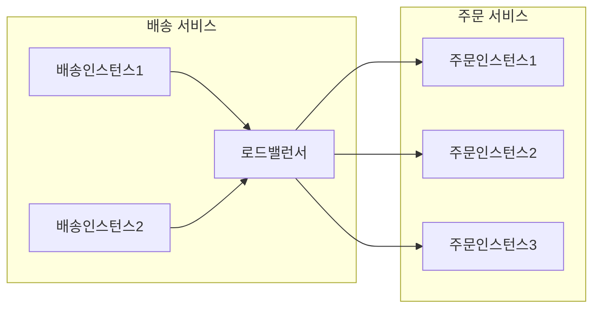
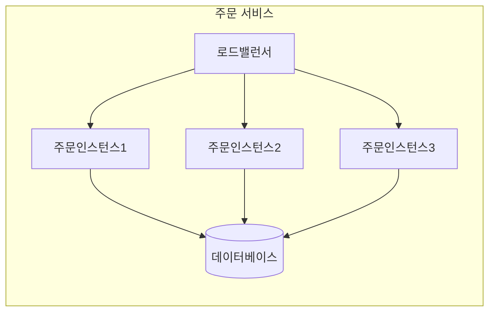
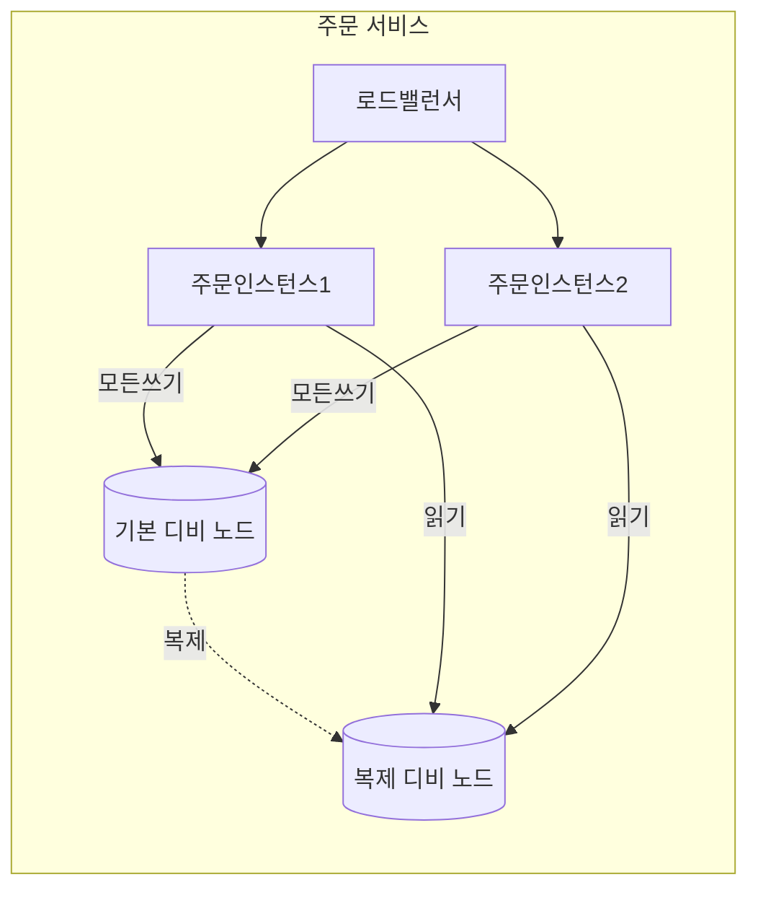

# 배포 

## 물리적인 배포

- 배송서비스와 주문서비스가 서로 통신하는 것을 논리적으로 표현할 때 위와같이 간단하게 표현이 가능하다.
- 아키텍처의 관점으로 봤을 때에는 위의 그림처럼 간단하게 표현이 가능하지만 물리적으로 봤을 때에는 좀 더 복잡한 구조를 이루고 있다.

### 다수의 인스턴스

- 마이크로 서비스에서 배포를 구현하게 된다면 위와 같이 각 서비스에서 1개 이상의 인스턴스를 가지고 있을 것이다.
- 위와 같은 서비스 구조는 하나의 인스턴스가 다운이 되더라도 다른 인스턴스가 서비스를 제공할 수 있기 때문에 서비스의 가용성을 높일 수 있다.
- 로드밸런스를 하는 방식에 따라 다르겠지만 위와같은 방식으로도 충분히 HTTP 요청일 잘 핸들링할 수 있을 것이다.
- 위의 구조를 하나의 데이터 센터로 운영했을시에 데이터 센터 전체에 장애가 생겼을 때에는 서비스가 중단될 수 있을 것이다. 
- 모든 사항을 고려할 수는 없겠지만 SLA를 제공하지 않는 것을 고려하여 여러 데이터 센터에 서비스를 배포하는 것이 좋을 것이다.

### 데이터베이스

- 이전에 데이터 베이스를 공유하지 말라는 말은 다른 마이크로 서비스간 데이터베이스를 공유하지 말라는 것이다.
- 각 인스턴스마다는 어느정도 데이터베이스를 공유한다고 해도 큰 문제가 없을 것이다. 
- 우리가 피해야 하는 것은 서로 다른 마이크로 서비스의 비지니스 로직으로 인해 데이터베이스에 정보가 변경되고 논리적으로 다른 컨텍스트에서 사용되는 것을 피해야 한다.
- 같은 논리안에서 사용되는 데이터베이스를 공유하는 것은 논리적으로 하나의 서비스에서 작업을 수행하는 것과 같다.

#### 데이터 배포 및 확장 
- 데이터베이스는 대체적으로 여러 이유로 다양한 환경에서 여러개의 노드 형태로 배포된다.

- 모든 읽기 작업은 복제 노드에서 처리하며 읽기 노드를 추가하며 확장할 수 있다.
- 관계형 디비의 동작 구조상 Read와 Write를 같은 노드에서 처리하게 되면 Write가 많아지게 되면 Read가 느려지는 현상이 발생할 수 있다. 
- 온프레미스의 환경에서 위의 구조를 마이크로 서비스로 구현한다면 아래와 같을 것이다.
```mermaid
flowchart TD
    
```