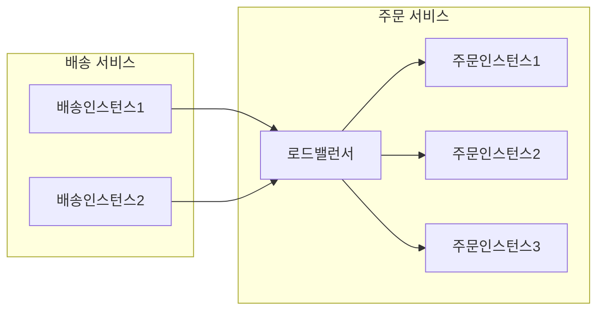
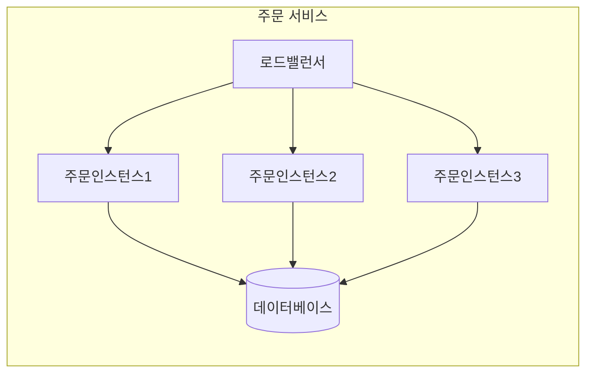
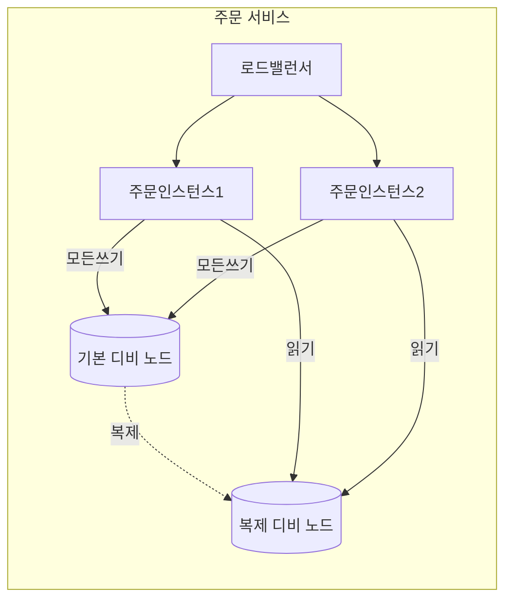
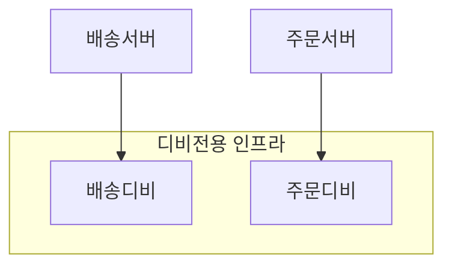
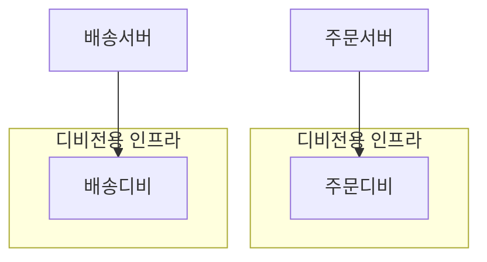
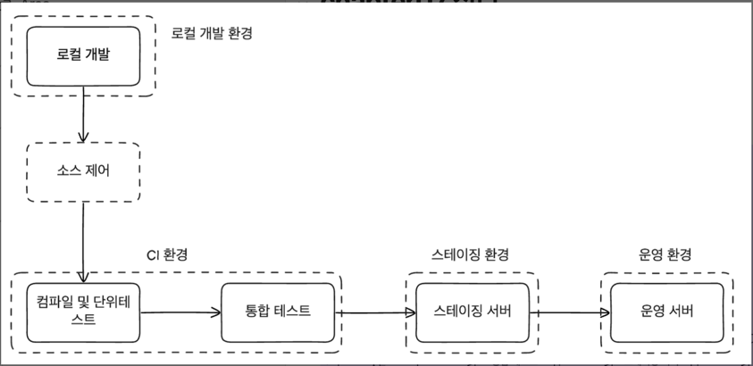
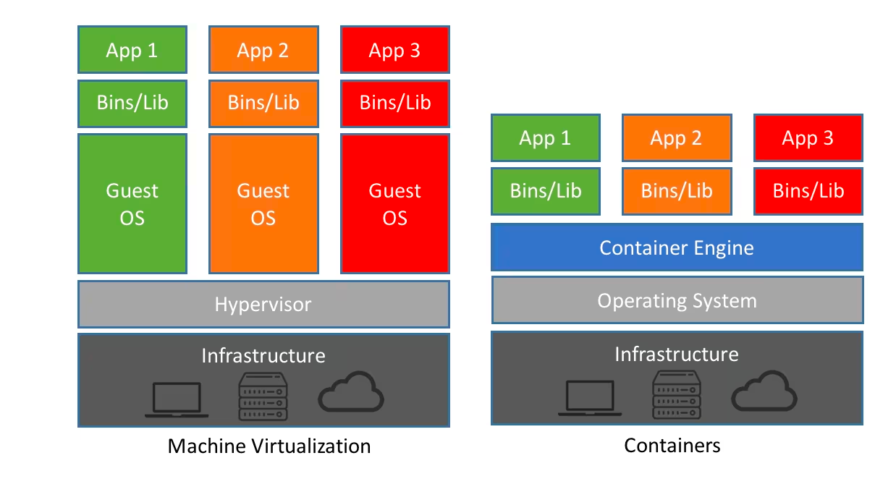
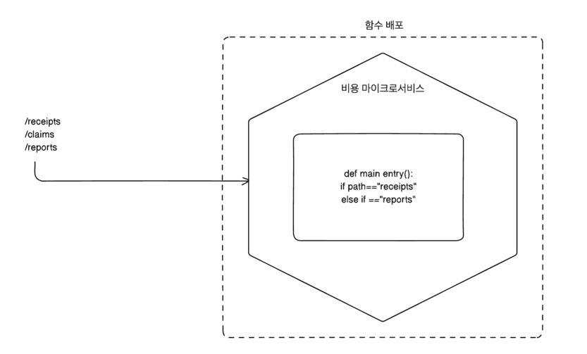
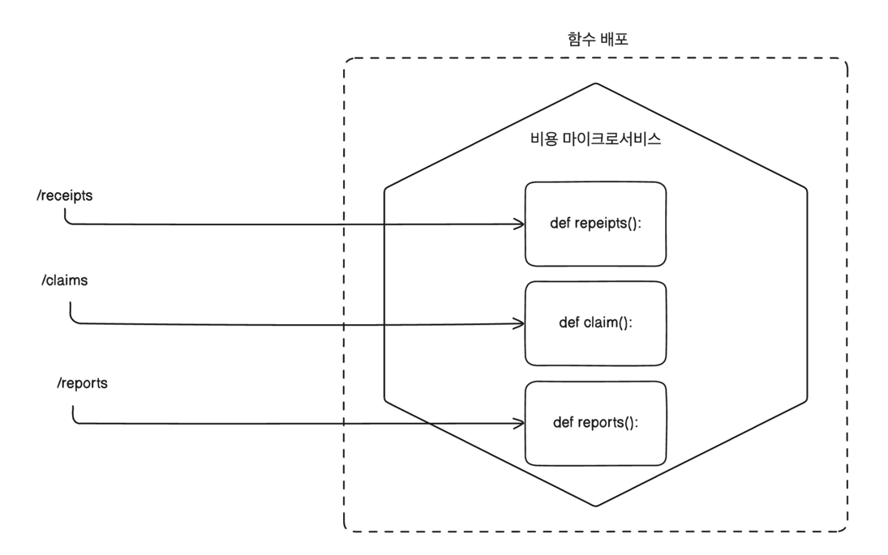

# 배포 

## 물리적인 배포

- 배송서비스와 주문서비스가 서로 통신하는 것을 논리적으로 표현할 때 위와같이 간단하게 표현이 가능하다.
- 아키텍처의 관점으로 봤을 때에는 위의 그림처럼 간단하게 표현이 가능하지만 물리적으로 봤을 때에는 좀 더 복잡한 구조를 이루고 있다.

### 다수의 인스턴스

- 마이크로 서비스에서 배포를 구현하게 된다면 위와 같이 각 서비스에서 1개 이상의 인스턴스를 가지고 있을 것이다.
- 위와 같은 서비스 구조는 하나의 인스턴스가 다운이 되더라도 다른 인스턴스가 서비스를 제공할 수 있기 때문에 서비스의 가용성을 높일 수 있다.
- 로드밸런스를 하는 방식에 따라 다르겠지만 위와같은 방식으로도 충분히 HTTP 요청일 잘 핸들링할 수 있을 것이다.
- 위의 구조를 하나의 데이터 센터로 운영했을시에 데이터 센터 전체에 장애가 생겼을 때에는 서비스가 중단될 수 있을 것이다. 
- 모든 사항을 고려할 수는 없겠지만 SLA를 제공하지 않는 것을 고려하여 여러 데이터 센터에 서비스를 배포하는 것이 좋을 것이다.

### 데이터베이스

- 이전에 데이터 베이스를 공유하지 말라는 말은 다른 마이크로 서비스간 데이터베이스를 공유하지 말라는 것이다.
- 각 인스턴스마다는 어느정도 데이터베이스를 공유한다고 해도 큰 문제가 없을 것이다. 
- 우리가 피해야 하는 것은 서로 다른 마이크로 서비스의 비지니스 로직으로 인해 데이터베이스에 정보가 변경되고 논리적으로 다른 컨텍스트에서 사용되는 것을 피해야 한다.
- 같은 논리안에서 사용되는 데이터베이스를 공유하는 것은 논리적으로 하나의 서비스에서 작업을 수행하는 것과 같다.

#### 데이터 배포 및 확장 
- 데이터베이스는 대체적으로 여러 이유로 다양한 환경에서 여러개의 노드 형태로 배포된다.

- 모든 읽기 작업은 복제 노드에서 처리하며 읽기 노드를 추가하며 확장할 수 있다.
- 관계형 디비의 동작 구조상 Read와 Write를 같은 노드에서 처리하게 되면 Write가 많아지게 되면 Read가 느려지는 현상이 발생할 수 있다. 
- 온프레미스의 환경에서 위의 구조를 마이크로 서비스로 구현한다면 아래와 같을 것이다.

- 두 데이터베이스는 서로 간섭할 수 없지만 인프라 영역에서 문제가 발생하면 치명적인 문제가 발생할 수 있다.
- 하드웨어를 프로비저닝하고 가상화된 인프라에서 데이터베이스를 관리하는 것은 어려운 일이다.
- 공유 클라우드를 사용하면 데이터베이스를 쉽게 확장하고 관리할 수 있고 관리하는 비용을 줄일 수 있다.

# 8.1.3 환경

- 소프트웨어를 배포는 사용자에 따라 환경이 달라질 수 있다. 모든 마이크로서비스가 다 필요할 때도 있고 때로는 일부의 서비스만 배포될 수도 있다.
- 위의 그림과 같은 환경을 그대로 복사하여 구축한다면 정말 이상적인 배포 프로세스가 될 것이다.
- 실제 환경에서는 실질적인 문제로 인해 위와 같은 프로세스를 구축하거나 운영환경을 복사한 환경을 구축하기 어려울 때도 있다.
- 위와 같은 환경을 구축하지 못하더라도 우리는 빠른 피드백을 받고 운영환경에 문제를 발견하는 것이 아니라 이전 단계에서 빠르게 알아내어 버그나 장애를 줄이길 희망한다.
- 하나의 논리적인 마이크로 서비스는 여러 환경에 배포될 수 있으며 요구사항에 따라 배포되는 인스턴스 수도 달라진다.

## 마이크로 서비스 배포의 원칙
- 마이크로 서비스를 배포하는데에는 핵십 원칙을 정하는 것이 중요하면 이러한 원칙은 어떤 선택을 고르던지 좋은 도움이 된다.
- 격리 실행: 마이크로서비스 인스턴스가 자체 켬퓨팅을 가진 격리된 방식으로 실행한다. 다른 마이크로서비스에 인스턴스에 영향을 미치면 안된다.
- 자동화 집중: 고수준의 자동화를 할 수 있도록 도와주는 기술에 집중하고 이걸 문화로 만들어라
- 코드형 인프라 스트럭처: 자동화를 용이하고 쉽게 관리할 수 있도록 코드를 통해 제어할 수 있는 인프라스트럭처를 구성하라
- 무중단 배포: 독립적으로 다운 타임 없이 새 버전의 마이크로 서비스를 배포해야한다.
- 기대 상태 관리: 장애가 트래픽이 증대할 것을 고려해 새로운 인스턴스를 시작할 수 있는 상태를 만들어라

### 격리 실행

**장점**
- 단일 호스트에서의 마이크로 서비스 운영은 관리하는 관점으로 본다면 간편하다.
- 호스트의 관리에 대한 워크로드는 적은 편이다.

**단점**
- 모니터링이 어렵다. 각 마이크로 서비스의 CPU 사용률을 모니터링해야하는지 호스트의 CPU 사용률을 해야하는지 알기 어렵다.
- 한 서비스에 상당한 부하가 발생하면 전체 서비스의 리소스 자원또한 줄어든다.
- 하나의 마이크로서비스의 로드가 불완전할 때 그여파가 다른 마이크로 서비스에서도 영향을 미친다.
- 하나의 호스트에서 서로 독립적인 배포를 하기위해 과정 또한 복잡하게 만들 것이다.
- 배포를 하기 위해 다른팀과의 조율이 필요하게 되거 이는 팀의 자율성을 저해한다.
- 독립적 배포 가능성이 크게 약화된다
#### 분리할 때 장점
- CPU나 메모리에 대한 모니터링이 훨씬 간편해진다.
- 이전에는 컨테이너 기술이 존재하지 않아 재정적인 부담을 가져가야 했다.
- 계획되지 않은 시스템을 구축하기란 쉽지 않았었지만 지금은 컨테이너로 격리된 환경속에서 더 쉽고 효율적이며 프로비저닝도 훨씬 빨랐다.
- AWS의 람다나 Azure의 Functions과 같이 격리된 환경에서 동작하도록 도와주는 서비스가 많이 나오고 상용화되었다.

### 자동화 집중
- 많은 마이크로서비스가 추가될수록 더 많은 프로세스와 모니터링 등 관리해야되는 포인트가 많아진다.
- 단순한 자동화에서 더 나아가 코드형 인프라스트럭처를 통해 자동화를 할 수 있는 기술스택과 도구를 선택해야하낟.
- 자동화는 마이크로서비스의 복잡성을 억제하도록 도와주기 때문에 중요하다.

#### 자동화의 능력에 대한 두가지 사례 연구
- 호주회사의 REA는 초기에 마이크서븟를 프로비저닝하고 모니터링하는 것에 3개월의 시간을 초기에 투자했다.
- 추후에는 240개 이상의 마이크로서비스를 운영하며 개발자당 3개의 마이크로서비스를 운영할 수 있었다.
- 마이크로서비스 사용이 성숙한 조직에서는 드문 일이 아니다.

### 코드형 인프라스트럭처
- 코드형 인프라스트럭처는 인프라스트럭처를 기계가 읽을 수 있는 코드로 관리하는 것을 말한다.
- 코드를 통해 인프라스트럭처를 관리하면 구성 정보를 관리하고 테스트하는데 자유롭게 반복할 수 있다.
- 퍼핏, 셰프, 테라폼, AWS 클라우드포메이션, Azure 리소스 매니저 등이 있다.
- 인프라스트럭처에 대한 코드를 버전으로 관리하면 누가 변경했는지 투명하게 알 수 있고 변경사항을 롤백할 수 있다.
- 사례로 똑같은 환경을 구현해야할 때 코드형 인프라스트럭처를 활용하지 않아 3개월이 지나도 구현하지 못한 사례가 있다.

### 무중단 배포
- 무중단 배포를 하지못할때에는 업스트림 소비자에게 잠재적 중단을 조율하고 배포를 진행해야했었다.
- 업무시간에도 릴리즈를 할 수 있게되면서 릴리즈와 관련된 사람들의 삶의 질도 향상되었고 문제 발생시 많은 동료들에게 도움을 받을 수 있게 되었다.
- 미들웨어를 통해 비동기식 통신을 활용하고 있다면 업스트림 소비자가 알아채지 못하게 배포하는데 도움이 된다.
- 쿠버네티스와 같은 플랫폼을 활용하여 롤링 업그레이드와 같은 기능을 활용하면 마이크로서비스의 종료 없이 배포를 할 수 있다.
- 모놀리식이더라도 수명이 긴 커넥션이 많으면 마이크로서비스로 분리하더라도 무중단 배포를 하기 어려우니 미리 고려해야한다.

### 기대 상태 관리
- 기대 상태 관리는 애플리케이션을 위한 인프라스트럭처의 요구사항들을 자동으로 관리하는 것을 말한다.
- 예시로 인스턴스가 죽었을 때 기대 상태와 일치하지 않는 것으로 간주하고 새로운 인스턴스를 시작하도록 하는 것이 있다.
- 플랫폼 스스로 원하는 상태를 유지하여 관리하게 되면서 개발과 우녕을 담당하는 사람이 어떻게 진행되는지 볼 필요 없다.
- 애저와 AWS의 자동 확장 그룹과 같은 서비스를 활용하면 기대 상태 관리를 쉽게 할 수 있다.
- 노마드는 배포나 워크로드를 컨테이너 기반으로 관리하는데 중점으로 둔 쿠버네티스와 달리 자바, VM, 하둡 등 다양한 워크로드를 관리할 수 있다.
- 플랫폼같은 서비스를 이용할 경우 기대 상태를 관리하는데에 있어 비용이 발생할 수 있으니 항상 주의해야한다.

#### 전제 조건
- 완전한 자동화 배포는 올바른 상태 관리를 하는데에 있어서 전제조건이다.
- 빠르게 인스턴스가 교체되길 원하며 새 프로비저닝이 오래걸린다면 부하를 처리할 수 있는 충분한 인스턴스를 미리 준비해야한다.
- 새로운 기술을 익히는데 생기는 오버헤드를 겪기전에 쿠버네티스와 같은 플랫폼을 활용해 기대 상태 관리를 할 수 있도록 하자.

#### 깃옵스
- 깃옵스는 인프라의 원하는 기대 상태롤 코드로 정의하고 소스 제어에 저장할 수 있는 도구이다.
- 기대상태가 변경되면 깃옵스는 변경사항을 인프라스트럭처에 적용하고 변경사항을 추적하고 문제를 해결할 수 있도록 도와준다.
- 깃옵스의 다른 중앙 집중식 도구와의 차이점은 쿠버네티스의 내부 기능을 활용해 어플리케이션을 배포하고 관리할 수 있다는 것이다.
- 플러스와 같은 도구를 활용하면 좀 더 쉽게 깃옵스를 활용할 수 있다.

## 배포 방법
- 물리 머신: 마이크로 서비스 인스턴스를 물리적인 서버에 배포하는 방법
- 가상 머신: 마이크로 서비스 인스턴스를 가상 머신에 배포하는 방법
- 컨테이너: 마이크로 서비스 인스턴스를 가상화된 컨테이너에 배포하는 방법
- 애플리케이션 컨테이너: 다른 애플리케이션 인스턴스들을 관리하는 애플리케이션 컨테이너에 배포하는 방법
- Pass 서비스: 고도화된 추상화 플랫폼을 활용하여 배포하는 방법, AWS의 빈스톡, 애저의 애플리케이션 서비스, 구글의 앱 엔진 등이 있다.
- Fass: AWS 람다나 애저의 함수와 같은 하부 플랫폼에서 실행되는 함수를 배포하는 방법

### 물리머신
- 물리 머신에 하나의 마이크로 서비스 인스턴스를 배포하는 방법
- 하드웨어의 리소스가 남게 되는 경우가 많아 리소스를 효율적으로 사용하지 못할 수 있다.
- 가상화의 발전으로 물리 머신에 배포하는 방법은 많이 사용되지 않는다.
- 하나의 물리 머신에 여러 마이크로 서비스를 배포하는 방법은 격리된 실행 환경 법칙을 위반할 수 있다.
- 단일 물리머신에서 격리된 실행환경을 만들기 위해서는 더 높은 추상화 수준을 가져올 수 있는 가상 머신을 활용해야한다.
- 매우 구체적인 요구사항이 있을 때에만 사용하는 것이 좋다.

### 가상 머신
- 물리 머신을 더 작은 단위로 나누어 여러 가상 머신을 만들어 배포하는 방법
- VM웨어나 AWS의 EC2와 같은 가상 머신은 인프라의 사용도를 높이고 호스트의 관리를 쉽게 할 수 있다는 큰 장점이 존재한다.
- 보통의 서버처럼 CPU, 메모리, 디스크, 네트워크를 가상화하여 사용할 수 있기 때문에 격리된 실행환경에서 물리 머신과 비슷한 환경을 제공할 수 있다.
- 하드웨어가 고장나면 모든 가상 머신이 문제는 계속 존재하게 된다.

#### 가상화 비용

- 점점 더 많은 가상 머신을 넣을수록 컴퓨팅 리소스 효율성이 떨어지게 된다.(수확 체감)
- 하이퍼바이저의 역활
  - 하이퍼바이저는 가상 머신을 관리하고 호스트의 리소스를 가상 머신에 할당하는 역활을 한다.
  - CPU, 메모리와 같은 자원을 가상 머신에 할당한다.
- 하이퍼바이저가 자원을 관리하기 위해 별도의 컴퓨팅 리소스를 사용하게 되는데 이는 가상 머신을 더 많이 사용할수록 더 많은 리소스를 사용하게 된다.

#### 마이크로서비스의 적합성
- 격리 측면에서 훌륭히지만 비묭이 높아지는 문제가 있다.
- 가상 플랫폼 환경에서 지원해주는 API를 통해 더 쉬운 자동화를 할 수 있고 기대상태 관리 또한 쉽게 할 수 있다.
- 전통적인 방식으로 가상 머신을 활용하여 자동화하는 것에서는 플랫폼 운영 팀을 통해 자동화되기 때문에 제한 사항이 많다.
- 보통 컨테이너를 통해 마이크로서비스를 운영하지만 더 엄격한 격리가 필요하거나 컨테이너로 관리할 수 있는 상황이 아니라면 VM이 적합하다.

### 컨테이너

- 컨테이너의 배경
  - 컨테이너가 나오게 된 배경은 리눅스의 다중 사용자 운영체제에서 시작하게 되었다.
  - 여러 명의 사용자가 각기 다른 프로세스의 권한을 가지고 있는지 확인하기 위해 모두가 커널을 통해 실행하도록 하여 허용된 사용자만 실행할 수 있도록 제한을 두었다.
  - 컨테이너 또한 이와 같은 방식으로 커널을 공유하면서 격리된 실행환경을 제공하게 된다.
- 컨테이너의 장점
  - 하이퍼 바이저를 사용하지 않기 때문에 가상 머신보다 더 가볍고 빠르게 실행할 수 있다.
  - 프로비저닝 시간이 빠르고 컴퓨팅 리소스를 vm보다 더 효율적으로 사용할 수 있다.
  - 가상화된 환경에서 어러 컨테이너의 실행 환경을 제공할 수 있기 때문에 플랫폼 생태계를 활용할 수 있다는 장점이 있고 유연하고 빠른 배포가 가능하다.
- 컨테이너의 단점
  - 수많은 마이크로서비스의 컨테이너가 외부 세계와 라우팅 할 수 있는 방법이 필요하고 이는 복잡한 네트워크 구조를 만들 수 있다.
  - 가상 머신 수준으로 컴퓨팅 리소스 격리를 제공하지 못하기 때문에 정확한 컴퓨팅 자원 관리가 어렵다.
  - 물리적으로 분리하여 관리할 수 있는 컨테이너 오케스트레이션 시스템들이 나왔지만 어떤 취약점이나 문제가 나올지 모르기 때문에 컨테이너에 운영하기 위해 적합한 소프트웨어를 선택하는 것이 중요하다.
  
#### 윈도우 컨테이너
- 윈도 컨테이너의 크기는 다른 컨테이너에 비해 너무 무거웠고 이미지를 실행할 때에도 리소스가 많이 필요했다.
- 윈도우 나노 서버와 같은 OS를 만들어 크기를 줄였음에도 핵심 코어가 무거워 여전히 무겁다.
- 윈도우 컨테이너에서는 하이퍼바이저 실행이 가능해서 VM 실행이 가능해 더 많은 컨테이너 실행이 가능하다.
- 프로세스 수준보다 더 강력한 격리가 필요하다면 윈도우 컨테이너는 더욱 유용한 방법이 될 수 있다.

#### 도커
- 컨테이너를 프로비저닝하고 일부 네트워크를 설정하며 도커 애플리케이션도 저장할 수 있는 레지스트리(이미지) 개념이 존재한다.
- 도커 이미지를 생성하고 저장하여 인스턴스를 관리할 수 있게되면서 컨테이너를 쉽게 배포할 수 있게 되었다.
- 도커 데스크톱을 통해 로컬에서도 운영과 같은 마이크로 서비스 환경을 구축할 수 있게 되었다.
- 여러 머신에서 동작할 수 있도록 하는 도커 스웜과 같은 기능이 나왔지만 쿠버네티스가 나오면서 도커 스웜은 비주류가 되었다.

#### 마이크로서비스의 적합성
- 컨테이너는 마이크로 서비스의 매우 적합한 기술이며 도커는 실용적으로 활용할 수 있는 컨테이너의 개념을 만들었다.
- 컨테이너는 감당할 수 있는 비용이면서 기대 상태 관리를 도와주는 쿠버네티스와 같은 기술도 나왔다.

### 어플리케이션 컨테이너 

- 톰캣과 같이 여러 애플리케이션이 단일 애플리케이션 컨테이너에 배포되는 방법
- 그룹화하여 클러스티링과 모니터링 도구와 같은 기능을 제공한다.
- 단점
  - 기술 선택을 제한한다.
  - 통합 모니터링에 대한 제한이 있다.
  - 시작 시간이 느리기 때문에 빠른 피드백을 받기 어렵다.
  - 동일한 프로세스를 여러 어플리케이션이 공유하기 때문에 리소스 사용과 스레드 관리에 대한 문제가 발생할 수 있다.
- 리소스 부족에 따른 최적화된 시도 방법 중 하나지만 부족한 격리 수준으로 인해 잘 채택하지 않는다.

### Pass 서비스
- 자바의 war나 루비의 gem과 같은 특정 기술의 산출물을 가져와서 프로비저닝하는 방식
- 에플리케이션 인스턴스를 실행하는 과정이 추상화 되어 있기 때문에 모니터링, 디비 인스턴스 구축등 직접 수행하기에는 어려운 작업을 쉽게 할 수 있다.
- 제대로 동작하지 않을 때 개발자가 접근할 수 있는 부분이 제한적이기 때문에 문제가 발생했을 때 해결하기 어려울 수 있다.
- 생각보다 플랫폼의 성장이 느리고 플랫폼 자체에서 제공하는 기능이 부족할 수 있다.

### Faas
- 쿠버네티스의 근접한 서비스로 개발자가 더 이상 서버에 대해 생각할 필요가 없고 인프라의 자원에 대해 좀 더 관리 해야하는 책임을 갖는다.
- 서버리스는 요청이 들어왔을 때 함수를 실행하고 응답을 반환하는 방식으로 동작한다. 
- 사용하지 않는 코드의 비용은 들지 않으며 사용한 만큼만 비용을 지불하게 된다.
- 암묵적으로 고가용성의 서비스를 제공하기 때문에 운영 부담을 줄일 수 있다.

#### 제한 사항
- Faas는 제공업체가 지원해주는 언어와 런타임만 사용할 수 있다.
- 하부 런타임에 대한 제어가 부족하기 때문에 각기능에 대한 메모리 제한만 설정할 수 있다.
- 함수가 사용하는 자원을 미세조정 해야할 때 제한적이다.
- 함수가 실행되는 시간이 제한되어 있기 때문에 긴 실행 시간이 필요한 작업에는 적합하지 않다.
- 무상태를 유지하게 되면서 함수를 서로 연결하는 방법이 제한적이다.(다운스트림 함수들이 어떤 함수를 호출했는지 관리하기 어렵다.)
> 웹 어셈블리
> - 웹 어셈블리는 임의의 코드가 웹 브라우저에서 실행할 수 있는 함수를 만들어주는 기술이다.
> - ios, 안드로이드와 같은 클라이언트에서 더 나아가 CDN과 같은 서비스에서도 호환이 되도록 실행할 수 있다.
> - 서버측 어플리케이션으로 배포가 될 수 있는 잠재력을 가지고 있지만 아직은 초기 단계이다.

#### 문제점
- 일부 런타임에서는 콜드 스타트와 같은 시간이 필요한데 서버리스는 이러한 문제를 해결하기 어렵다.
- 내부적으로 최적화를 하는 구조이기 때문에 개발자가 직접 최적화를 할 수 없다.
- 인프라 스트럭처가 동적 확장에 대해 감당할 수 없으면  
- 시스템의 일부만 동적 확장이 가능하고 다른 부분은 그렇지 않는 경우 시스템의 불일치로 인해 문제가 발생할 수 있다.

#### 마이크로 서비스 매핑

**1. 마이크로서비스당 함수 매핑**
- 함수의 단일 포인트를 가지고 내부의 분기 로직을 통해 다른 함수를 호출하는 방식
- 특정 서비스를 기준으로 함수를 만들고 배포된다.

**2. 애그리거트당 함수 매핑**
- 도메인 기반으로 이미 설계하고 있다면 애그리거트를 기준으로 함수를 만들고 배포하는 것도 좋은 선택이다.
- 단일 애그리거트에 대한 로직이 단일 함수로 구성되어 있기 때문에 수명주기를 관리하기 쉽다.
- 해당 모델은 더이상 단일 함수로 되어있지 않기 때문에 단일 배포가 어렵다.
- 주의 사항
  - 외부 인터페이스가 변경되지 않을수록 애그리거트가 변경 되거나 새로운 애그리거트가 추가되어도 외부에서 호출하는 함수를 변경할 필요가 없다.
  - 같은 팀에서 마이크로 서비스를 관리하고 있다면 동일한 데이터베이스를 활용하는 것도 좋다.
  - 요구사항이 복잡함에 따라 애그리거트 단위로 데이터베이스를 분리가 될 수 있다. 하지만 이러한 형태는 물리적으로 서로 다른 마이크로서비스이지만 외부에서는 논리적으로 하나의 마이크로서비스로 인식할 수 있다.
  - 사가의 영역을 고려하여 단일 배포할 수 있는 영역을 만들어야한다. 

#### 향후 전망
- 향후에는 대부분이 하부 런타임이 추상화된 서버리스 환경에서 개발을 할 것이다.
- Faas가 발전함에 따라 더 많은 케이스들을 처리할 수 있도록 할 것이며 더 많은 이점을 제공할 것이다.
- 쿠버네티스를 사용하는 경우에도 이 복잡함을 해결하기 위해 노력하고 있으며 일부는 Faas를 채택하는 경우도 존재한다.
- 람다의 비용이 높아지면서 EC2 인스턴스를 사용하는 경우도 존재한다.