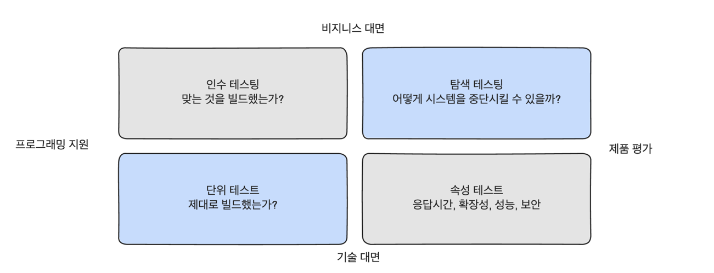
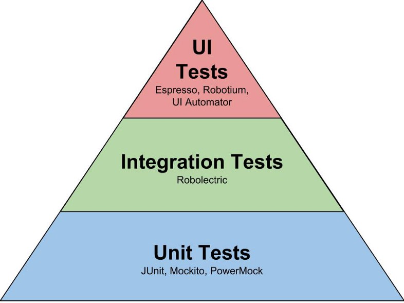
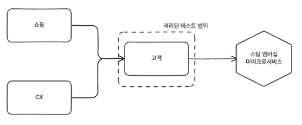
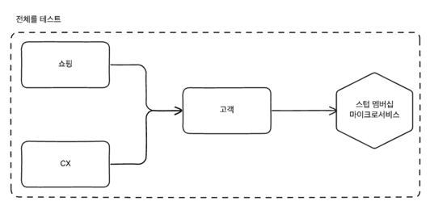
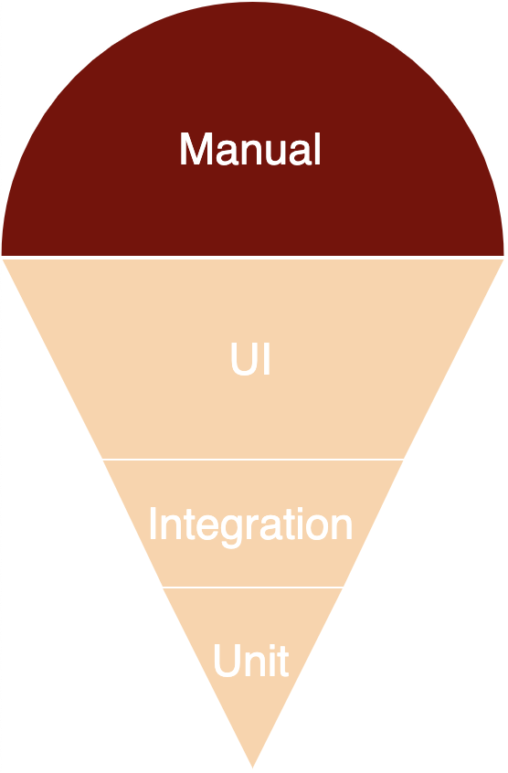
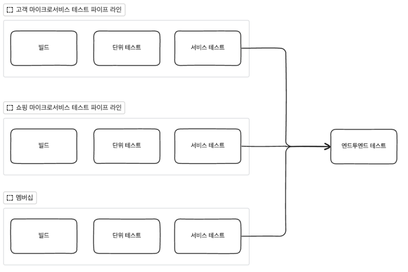
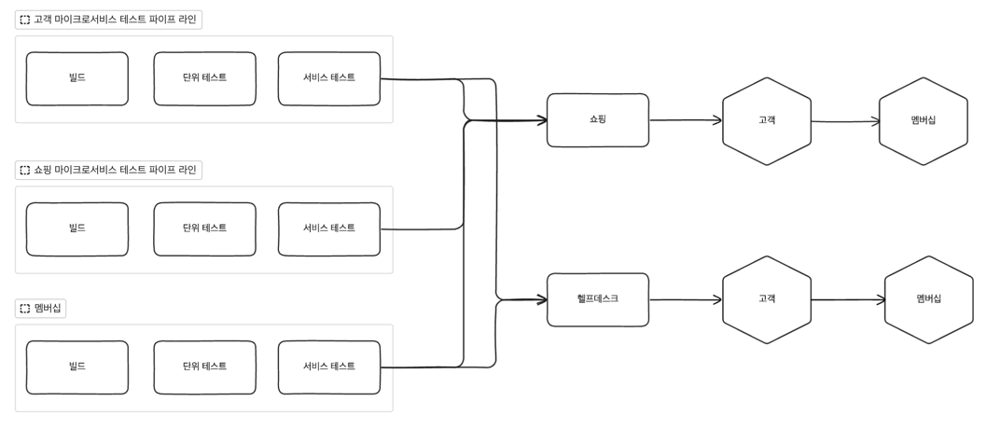
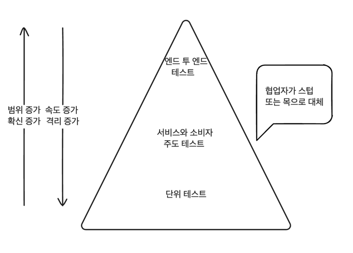

# 테스트
- 마이크로 서비스에서의 자동화된 테스트는 다른 차원의 복잡성이 추가된다.
- 실행 가능한 테스트의 유형을 이해하는 것은 빠르게 배포해야된다는 주장과 안전하게 배포해야된다는 주장 사이의 균형을 맞추는데 도움이 된다.

## 테스트 유형

- 단위 테스트와 성능 테스트는 개발자가 시스템을 구축하는데 도움을 주는 테스트이다.
- 비기술 이해관계자가 이해할 수 있는 테스트는 인수테스트와 같은 엔드투엔드 테스트나 탐색 테스트 분면에 해당하는 수동 테스트가 그러하다.
- 시스템을 테스트하는 방법은 다양하다. 이러한 테스트는 시스템의 다양한 측면을 검증하고 시스템이 예상대로 동작하는지 확인한다.
- 요즘은 자동화된 반복 테스트를 하기위해 대규모의 수동 테스트를 하고 있으며 마이크로서비스를 전환하기 전에 이러한 테스트를 자동화하는 것이 중요하다.
- 때로는 컴퓨터가 발견하지 못하는 문제를 발견하기 위해 수동 테스트도 필요하다. 어떤 영역을 자동화 할지 결정하는 것은 중요하다.

## 테스트 범위

- 자동화 테스트의 원시 모델은 단위 테스트, 서비스 테스트, UI 테스트로 나눴다.
- 피라미드가 위로 올라갈수록 테스트 해야되는 범위가 많아지고 작동한다는 확신도 커진다.
- 테스트하는데 시간이 오래걸리면 빠른 피드백을 받기도 어렵고 어떤 부분이 잘못되었는지 알기도 어렵다.
- 단위 테스트는 개별적으로 격리가 잘 되어있기 때문에 고장을 찾기 쉽다. 하지만 각각의 격리된 테스트로는 시스템 전체가 잘 작동하는지 확인하기 어렵다.
- 각각의 레이어가 사람마다 다른 의미를 갖고 사용하는 경우가 존재한다.

### 단위 테스트 
- 단위 테스트는 보통 단일 함수나 메소드를 테스트한다.
- 단위 테스트는 마이크로서비스와의 통신 또는 데이터베이스와의 통신도 제한된다.
- 개발자에게 도움이 되고 개발자에게 빠른 피드백을 전달해주게 되면서 기술 중심의 테스트라고 볼 수 있다.
- 단위 테스트의 빠른 피드백과 격리성으로 인해 안전한 리팩토링을 할 수 있다.

### 서비스 테스트

- 서비스 테스트는 UI를 건너뛰고 마이크로서비스를 직접 테스트한다.
- 서비스 테스트는 개별적인 마이크로서비스의 기능을 테스트 하는 것이다.
- 서비스가 예상대로 동작한다는 확신을 얻기 위해서는 하나의 마이크로서비스로 격리 시켜야 한다.
- 스텁 마이크로서비스나 데이터베이스도 같이 통신해야 된다면 어느정도 시간이 걸릴 수 있다.
- 단위 테스트 보다 더 넓은 범위를 테스트 하기 때문에 문제가 발생한 부분을 감지하기 쉽지는 않지만 UI 테스트보다는 취성이 낮다

### 엔드투엔드 테스트

- 시스템 전체를 테스트하는 것이다.
- 엔드투테스트는 사용자의 관점에서 시스템이 예상대로 동작하는지 확인하면서 확신을 얻게 된다.
- 하지만 테스트 범위가 넓어지면서 테스트를 실행하는데 시간이 오래걸리고 어떤 부분이 잘못되었는지 알기 어렵다.

### 절충안

- 범위가 커질수록 피드백이 느려지며 테스트를 실행하는데 시간이 오래걸린다. 반대로는 피드백이 빠르지만 시스템 전체가 잘 작동하는지 확신을 얻기 어렵다.
- 시간이 오래걸리는 테스트를 줄이기 위해서는 단위 테스트로 대체가 가능하다. 만약 운영단계에 문제가 발생했다면 우리가 테스트한 것이 잘못되었다는 것을 의미한다.
- 피라미드가 아래로 내려갈수록 많은 테스트를 요구하게 된다.
- 단위 테스트의 개수보다 서비스 테스트나 UI 테스트가 더 많은 아이스크림 콘과 같은 형태는 피해야 한다.

## 서비스 테스트의 구현
- 서비스 테스트는 전체 마이크로서비스에서 일부분만 테스트하는 것이다.
- 서비스 테스트 집합은 다운스트림 서비스와의 통신을 쳐내고 다른 서비스와의 통신을 스텁으로 대체한다.

### 목 또는 스텁
- 요청에 대해 미리 정의된 응답을 반환하는 것이다.
- 목을 사용할 때에는 호출이 발생했는지 확인하고 하지 않았다면 테스트를 실패하게 한다.
- 목은 예상되는 부작용이 발생하는지 확인하는데 매우 유용할 수 있다.
- 스텁과 목 사이에 균형을 잡는 것은 까다롭다. 목을 사용하면 테스트가 더 취약해지고 스텁을 사용하면 테스트가 더 견고해진다.
> 목과 스텁의 차이
> 목은 상호 작용을 모방하고 실제로 호출되었는지 검사까지 진행해야 합니다.
> 스텁은 내부로 들어오는 상호작용을 모방만하고 실제로 호출되었는지는 검사하지 않습니다.

### 영리한 스텁 서비스
- 스텁 서버는 두개의 명령어를 받는다
  - 특정 프로토콜을 기반의 서버가 지정된 포트로 응답할 수 있도록 사칭자를 생성한다.
  - 사칭자가 어떤 요청을 받았을 때 어떤 응답을 반환할지 정의한다.
  - 목으로 사용하게 되면 기대치 설정도 가능하다.
- 생성된 스텁 서버는 복수의 사칭자를 생성하여 다운 스트림 서비스와의 통신을 대체한다.
- 이런 스텁 서버는 대규모 성능 테스트를 위한 기존의 목 인프라를 대체할 수 있다.

## 엔드투엔드 테스트의 구현
- 다수의 마이크로서비스를 활용하여 시스템 전체를 테스트하는 것이다.
- 핵심은 시스템의 품질을 전체적인 피드백을 제공하기 위해 인터페이스를 거쳐 시스템을 테스트하는 것이다.
- 여러 마이크로서비스를 함께 배포한 다음 테스트를 실행하기 때문에 테스트를 실행하는데 시간이 오래걸릴 수 있다. 대신 시스템 전체가 잘 작동하는지 확신을 얻을 수 있다.

- 간단하게는 위의 그림과 같이 구현이 가능하다. 하지만 다른 마이크로 서비스에 대한 의존성이 존재한다면 이러한 방식은 적합하지 않다.
  - 다른 마이크로서비스의 버전이 맞지 않아 테스트가 실패할 수 있다.
  - 다른 마이크로서비스가 다운되어 있을 수 있다.
  - 다른 마이크로 서비스가 엔드투엔드 테스트를 실행하고 있어 중복된 테스트가 실행될 수 있다.
- 해결점은 여러 파이프라인을 엔드투엔드 테스트 단계로 팬인하여 처리하는 것이다.

### 불안정하고 깨지기 쉬운 테스트
- 범위가 넓을수록 구성요소가 많아지고 테스트가 불안정해진다.
- 실패하는 테스트가 있더라도 나중에 다시 실행하면 성공할 수 있다면 이는 테스트의 신뢰성을 떨어트린다.
- 다수의 프로세스에서 실행되는 테스트는 타임아웃이나 경합 조건으로 인해 실패할 수 있다.
- 비정상의 정상화 즉 잘못된 것에 너무 익숙해져 문제가 아닌 것으로 간주할 수 있다.
- 불안정한 테스트가 있다면 찾아내야하고 제거해야한다. 제거하기 어렵다면 테스트 그룹에 들어가지 않도록 해야한다.
- 더 작은 범위의 테스트로 대체하거나 다른 테스트를 추가하여 문제를 해결할 수 있다.

### 누가 엔드투엔드 테스트를 작성하는가?

- 모든 팀이 모든 마이크로서비스에 대한 엔드투엔드 테스트를 작성하는 것은 현실적이지 않다.
- 이러한 구조는 아이스크림 콘과 같이 안티 패턴의 피라미드를 만들게 된다.
- 가장 이상적인 방법은 특정 엔드투엔드 테스트는 특정 팀의 책임으로 하는 것이다.

- 쇼핑에 대한 변경과 헬프 데스크에 대한 변경은 이제 각각의 그룹에 트리거 되어 테스트를 실행하게 된다.
- 하지만 고객이나 멤버십이 변경되면 두개의 그룹이 모두 테스트가 실행되어 둘 중 하나의 테스트가 실패하게 된다.
- 이러한 구조는 근본적으로 다른 팀이 중단 시킬 수 있게 되면서 문제가 발생한다.
- 이런 문제를 해결하기 위해 테스트 전담팀을 만드는 경우도 있지만 이는 소프트웨어를 직접 개발하는 팀이 테스트와 멀어지게 만든다.
- 테스트 팀이 테스트를 작성하는 것을 기다리게 되고 테스트를 실행하고 수정하는 것에 멀어지게 되면서 심각한 피해가 발생한다.
- 엔드투엔드테스트를 명확하게 그룹을 지정할 수 있으면 그렇게 하는 것이 좋다.
- 공동 소유권을 가진 테스트 집합을 만들어 테스트를 실행하고 수정하는 방법도 있다.

### 엔드투엔드 테스트는 얼마나 오래걸릴까?
- 통합테스트는 오래 걸린다. 그렇기 때문에 좀 더 효율적이게 빠르게 피드백을 받을 수 있는 방법을 찾아야한다.
- 셀레니움 그리드와 같은 도구를 활용하여 테스트를 병렬로 실행하면 테스트 시간을 줄일 수 있다.
- 테스트를 제거하는 것도 방법이다. 테스트를 제거하면 테스트를 실행하는데 걸리는 시간을 줄일 수 있다.
- 테스트를 제거하면서 비난이 있을 수 있다. 하지만 사람들은 안정적인 테스트가 더 많이 동작하길 바라지만 오랜 시간이 걸리는 테스트는 싫어한다.

### 대규모 적체
- 오래 걸리는 테스트를 중단하고 수정하는 것은 시간이 걸리기 때문에 예상한 테스트 종료 시간보다 길어지게 된다.
- 고장난 테스트가 블로킹되는 동안 다른 팀의 변경이 누적되어 적체 하게 된다.
- 체크인을 막아 놓을 수도 있지만 이는 팀의 생산성을 떨어뜨릴 수 있다.
- 고장난 빌드에 체크인을 하게 되는 것은 결국 더 오래 고장난 상태가 유지되게 된다.
- 테스트의 속도를 높이는 방법말고는 없다. 작은 변경이 릴리스하는 것을 느려지게 만드는 것은 득보다는 실이 더 많다.

### 메타버전
- 우리는 엔드투엔드 테스트를 통해 릴리즈에 대한 확신을 가지게 되면서 배포를 하게 될 것이다.
- 이를 통해 우리는 전체 시스템의 버전으로 관리하고 싶은 유혹에 빠지게 된다.
- 이러한 개념은 마이크로서비스의 중요 요소인 독립적 배포 가능성을 위반하게 된다.
- 여러 마이크로서비스가 함께 배포되는 방식은 서로 다른 마이크로서비스끼리 결합하게 만들고 엉키게 된다.

### 독립적인 테스트 가능성 부족
- 엔드투엔드 테스트는 팀의 자율성을 감소시킨다.
- 다른 마이크로서비스와의 조율해야되는 경우가 늘어나게 된다.
- 독립적인 테스트 환경을 만들기 위해 자체적인 테스트 환경을 만들게 된다.

## 엔드투엔드 테스트는 피해야 할까?
- 엔드투엔드 테스트에는 단점들이 존재하지만 적은 수의 마이크로서비스를 테스트하는데 유용하며 관리하는데 용이하다.
- 구조적 계약 위반은 명시적 스키마를 사용하면 구조적 중단을 찾아낼 수 있지만 의미적 중단을 찾아내기 어렵다.
- 많은 비용을 필요로 하기 때문에 주요 변경사항에 대해서만 축소된 범위애서 테스트를 실행하는 것이 좋다.

### 계약 테스트와 소비자 주도 계약
- 계약 테스트는 외부 서비스를 사용하는 팀이 외부 서비스의 기대 행동을 정의한다.
- 외부에서 서비스의 작동 방식을 정의하면서 스텁이나 목과 같은 방법으로 외부 서비스를 대체할 수 있다.
- 소비자 마이크로서비스의 기대치만 충족하면 되기 때문에 격리된 하나의 생산자에서만 테스트를 실행하면 된다.
- 생산자 입장에서는 외부 종속성이 제외된 테스트를 실행하게 되면서 서비스 테스트와 동일한 범위를 가진 테스트를 실행하게 된다.
- 팀간 커뮤니케이션을 명확하게 하여 의사소통과 협업 라인을 활성화시킨다.

- 팩트라는 도구를 사용하여 계약 테스트를 작성하고 실행할 수 있다.
- DSL을 사용하여 기대 사항을 정의하고 서버를 실행하여 팩트 명세 파일을 만든다.
- 팩트 명세의 여러 버전을 저장하는 팩트 브로커를 통해 다른 버전의 소비자에 대해서도 테스트를 실행할 수 있다.
- 스프링 클라우드 컨트랙이라고 하는 프레임워크를 사용하여 계약 테스트를 작성하고 실행할 수 있다.
#### 대화의 중요
- CDC는 소비자와 생산자의 원활한 의사소통과 신뢰를 필요로 한다.
- 신뢰하지 못하는 CDC는 더 큰 범위의 제한된 테스트를 실행하게 될 수 있다.
- 엄청난 수의 외부 소비자를 가지고 있는 경우에는 외부 소비자를 중단 시키는 것은 옳지 않기 때문에 CDC를 사용하는 것이 좋다.

### 결론
- 엔드투엔드 테스트는 구성요소가 많이 포함될수록 단점이 많아진다.
- 다른 매커니즘을 통해 엔드투엔드 테스트가 불필요해지는 부분도 있다.
- 초기에는 엔드투엔드 테스트를 활용하고 점점 비용이 증가함에 따라 다른 방법으로 대체하는 전략도 있다.

## 개발자 경험
- 개발자가 로컬 환경에서 더 많은 마이크로 서비스를 띄울수록 개발하는데 어려움이 많아진다.
- 일부 기술 스택은 초기에 많은 리소스를 요구하는 경우도 있다.
- 가장 쉬운 방법은 클라우드 환경을 사용하는 것이다. 하지만 로컬 환경이 아닌 클라우드 자원을 사용하게 되면서 비용이 증가하고 피드백 시간이 늘어나게 된다.
- 다른 방법은 실제로 필요한 마이크로서비스만 띄우는 것이다. 다른 외부 서비스는 스텁을 사용하여 대체하면서 테스트를 실행할 수 있다.
- 로컬에 띄워져 있는 마이크로서비스는 오직 작업중인 마이크로서비스만 띄우는 것이 좋다.

## 운영 전 테스트에서 운영 중 테스트로
- 운영전 테스트로로는 원하는 대로 동작하는지에 대해 테스트를 실행하게 된다.
- 사용자는 운영 중에 다양한 방법으로 시스템을 운영하게 되고 이는 버그로 이어질 수 있다.
- 아무리 많은 테스트를 하고 모델을 개선하더라도 배포전 테스트로는 실패 가능성을 완전히 제거할 수 없다.
- 운영 중 테스트는 분산 시스템에서 발생하는 문제나 운영전에 발생하지 않는 문제를 찾아낼 수 있다.

### 운영 환경 테스트 유형
- 헬스 체크: 서비스가 정상적으로 동작하는지 확인하는 것이다.
- 스모크 테스트: 서비스가 기본적인 기능을 수행하는지 확인하는 것이다. 사용자에게 릴리스하기 전에 실행 중인 서비스에 대해 실행한다.
- 가짜 사용자의 행동을 시스템에 주입하여 시스템이 예상대로 동작하는지 확인하는 것이다.

### 운영 환경에서 안전한 테스트
- 테스트가 시스템의 불안정을 가져온다거나 운영 환경 데이터를 오염을 시키는 것을 방지해야 한다.
- 가짜 사용자의 행동으로 인해 실제로 주문이 들어가고 배송이 되는 것을 방지해야 한다.
- 운영 환경에서의 테스트는 적절한 관심과 주의를 기울여야 한다.

### MTBF와 MTTR
- 블루 그린 배포나 카나리아 릴리스와 같은 기술을 사용하여 운영 중에 테스트를 실행할 수 있다.
- 평균 무고장 시간(MTBF)와 평균 복구 시간(MTTR)의 개념을 사용하여 시스템의 안정성을 측정할 수 있다.
- 테스트를 통해 기능의 고장을 줄이는 것도 중요하지만 고장이 발생했을 때 빠르게 복구하는 것도 중요하다.
- 비지니스적 판단을 하는데 당장 배포하는 것이 중요하다면 테스트는 사치가 될 수 있다.

## 교차 기능 테스트
- 비기능적 요구 사항
  - 허용 가능한 지연 시간
  - 시스템이 지원해야하는 사용자 수
  - 장애인용 사용자를 위한 접근성
  - 보안 요구 사항
- 이러한 용어는 기능적으로 보이는 것이 착오를 일으키기 때문에 교차 기능 요구 사항이라는 용어로 대체하였다.
- 교차 기능 테스트는 각각의 상황이나 환경에 따라 목표와 서비스 수준 목표가 다르다.
- CFR도 테스트 피라미드를 잘 따라서 만들어야한다.

### 성능 테스트
- 성능 테스트는 일부 교차 기능을 검증하는 방법 중 하나이다.
- 모놀리식과 달리 더 많은 네트워크와 트랜잭션이 발생하기 때문에 성능 테스트가 더 중요해졌다.
- 시스템의 전이를 확인하는 테스트부터 시작하자.(전이 테스트?)
- 운영 환경의 데이터와 인프라를 구축해야 되기 때문에 성능 테스트는 비용이 많이 든다.
- 테스트의 결과로 거짓 음성(문제라고 발견했는데 문제가 아닌 경우)과 거짓 양성(문제가 있는데 문제가 아니라고 판단하는 경우)이 발생하는 것을 주의해야한다.
- 성능 테스트는 주기적으로 실행되어야한다. 주기가 길어질수록 원인을 찾기 어려워진다.
- 성능 테스트는 목표가 있어야 한다.
- 성능적으로 문제가 발생할 수 있는 부분을 변경했을 때 성능 테스트는 큰 도움이 된다.
- 시스템의 성능에 대한 이해와 운영환경과 동일한 도구를 사용하여 테스트를 실행하는 것이 중요하다.

### 견고성 테스트
- 시스템 자체적으로 견고성을 개선할 매커니즘을 구축하는 것이 일반적이다.
- 로드 밸런서 뒤에 여러 마이크로서비스를 배치하거나 회로 차단기를 사용하여 견고성을 개선할 수 있다.
- 인위적인 타임아웃을 발생시키거나 회로를 차단하는 기능을 추가하여 견고성을 개선할 수 있다.

## 요약
- 빠른 피드백을 위해 테스트를 최적화하고 타입을 적절히 분리하자.
- 둘 이상의 팀이 걸쳐있는 엔드투엔드 테스트보다 소비자 주도 계약을 사용하자.
- 소비자 주도 계약을 통해 대화의 초점을 맞추자.
- 테스트에 많은 노력을 들이는 것과 운영환경에서 빠르게 문제를 감지하는 것간의 절충점을 찾자.
- 운영환경에서 테스트를 실행해보자

