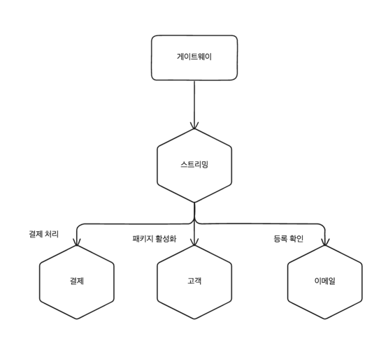
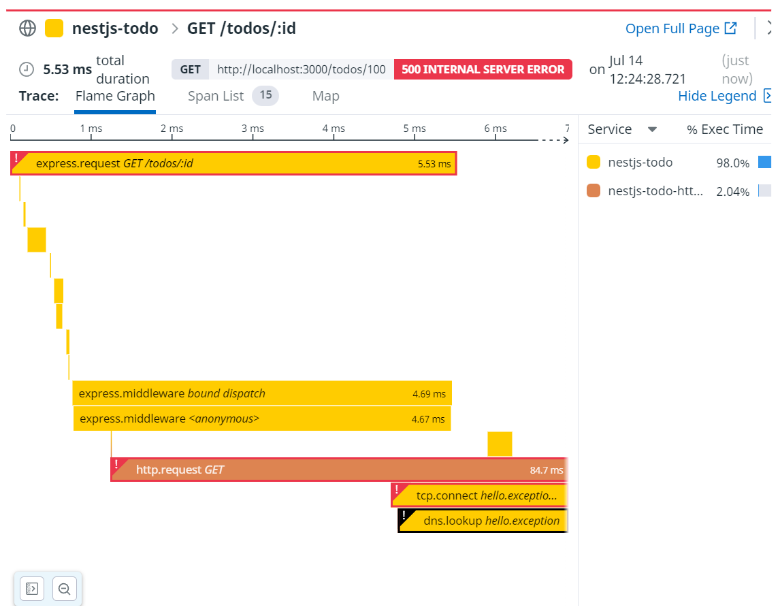

# 모니터링에서 관찰 가능성
- 모놀리식에서 마이크로서비스로 전환하면서 복잡도는 상승하게 된다.
- 모놀리식에서의 사용하던 도구와 기술들이 마이크로서비스에서는 적합하지 않을 수 있다.
- 운영환경에 실행하고 트래픽을 실제로 받기 전까지는 마이크로서비스 아키텍처로 인한 고통, 괴로움, 고민을 이해하지 못할 수 있다.

## 분열, 공황 그리고 혼란
- 마이크로서비스로 전환하면서 모든 장애들이 추리극처럼 보일 수 있다.
- 모니터링해야되는 서버가 많아지고 로그파일도 여러개가 된다. 
- 네트워크 지연으로 발생하는 문제도 여러가지가 생길 수 있다.
- 작은 것을 모니터링하고 큰 그림을 볼 수 있도록 집계를 제공해야된다.

## 단일 마이크로서비스, 단일 서버
- 단일 호스트에서 정보를 얻고자 한다면 CPU, 메모리등 모든 정보가 유용할 수 있다.
- 마이크로서비스 인스턴스에 자체에 출력되는 로그에 접근할 수 있어야한다.
- 잘못된 것을 해결할 방법도 제공해야한다.
- 응답시간을 모니터링, 상태 확인, 웹 서버 로그등을 모니터링 할 수 있어야한다.

## 단인 마이크로서비스, 다수 서버
- 여러 호스트의 매트릭을 수집하고 분석할 수 있는 도구가 필요하다.
- 여러 호스트에 명령을 실행하는 SSH 멀티플랙서와 같은 도구를 사용할 수 있다.
- 로드밸런서에서 응답시간을 수집하여 모니터링 할 수 있다.
- 비정상 노드가 있을 경우 자동으로 제거하고 새로운 노드를 추가할 수 있어야한다.

## 다수의 마이크로서비스, 다수의 서버
- 매트릭과 로그는 복잡한 분산 환경에서 문제를 찾는데 중요한 역활을 한다.
- 뿐만 아니라 수많은 양의 데이터를 어떻게 선별하고 어떻게 이해할 것인지도 중요하다.
- 정적인 모니터링에서 관찰 가능성과 운영 환경에서의 테스트를 통해 문제를 찾아야한다.

## 관찰가능성 대 모니터링
- 시스템의 관찰가능성은 외부 출력으로부터 시스템의 내부 상태를 이해하는 수준을 말한다.
- 소프트웨어에 대한 총제적인 이해가 필요하며, 소프트웨어를 개체로 보는 것이 아닌 시스템으로 보는 것이 중요하다.
- 시스템이 더 잘 관찰될수록 문제를 이해하기가 쉬워진다.
- 모니터링은 문제가 될 것을 미리 고려하고 경고를 주는 것이다.
- 분산환경에서는 절대 발생하지 않았어야하는 문제가 발생할 수 있기 때문에 관찰 가능성의 중요성이 더욱 커진다.

### 관찰 가능성의 주축
- 일부는 메트릭, 로깅, 분산 추적의 중점을 두었다.
- 뉴렐릭은 MELT(Metrics, Events, Logs, Traces)를 제안했다.
- 시간이 지나면서 이러한 이론은 핵심을 놓치게 되게될 가능성이 있다고 보았다.
- 모니터링 문제점
  - 시스템의 속성을 구현 세부 사항으로 축소하는 것은 퇴보로 이어질 수 있다.
  - 이러한 개념 사이에 구체적인 경계가 존재하지 않을 수 있다.
- 관찰 가능성
  - 시스템에 얻을 수 있는 이벤트들이 좋은 관찰 가능성을 제공한다.
  - CPU 수치, 결제 실패에 대한 정보, 로그인 시도에 대한 정보들을 예시로 들 수 있다.
  - 다양한 방식으로 정보를 수집하면서 툴체인에 맞춰서 생각에 갇히지 말자
  - 조사할 수 있는 이벤트 측면에서 필요한 정보를 출력하는 것에 집중하자.
- 다른 도구를 활용할 수 있게 될 수 있으며, 이러한 도구들은 시스템의 관찰 가능성을 높일 수 있다.

# 관찰 가능성의 구성요소
- 로그 집계: 여러 마이크로서비스에서 정보를 수집, 모니터링과 관찰가능성의 중요한 요소이다.
- 매트릭 집계: 마이크로서비스와 인프라스트럭처의 하드웨어와 가까운 부분을 파악하여 문제를 탐지하고 용량을 계획하는데 중요한 역활을 한다.
- 분산 추적: 마이크로서비스 간의 통신을 추적하고, 각 서비스의 응답시간과 흐름 등을 파악하는데 중요한 역활을 한다.
- 지금 괜찮은가?: 에러 예산, SLA, SLO 등을 통해 마이크로서비스가 소비자의 요구사항을 충족하는지 확인하는데 중요한 역활을 한다.
- 알림: 무엇을 알려야할지 결정하고, 어떻게 알려야할지 결정하는데 고민해야한다.
- 시멘틱 모니터링: 시스템의 상태와 새벽 3시에 우리를 깨우는 요소들을 다른 방식으로 접근
- 운영환경에서의 테스트

## 로그 집계
- 규모가 작은 마이크로서비스더라도 관리해야되는 인스턴스는 많기 때문에는 ssh 다중화를 통해 로그를 수집하는 것만으로는 부족하다.
- 분산된 시스템에서의 로그는 문제를 발견할 때 무엇이 문제인지 찾는데 중요한 역활을 하고 초기에 주의가 필요한 부분을 알려주는 역활을 한다.
- 예시로 마이크로서비스 인스턴스에 있는 데몬 프로세스가 로그를 수집하여 운영자가 쿼리를 실행할 수 있는 저장소에 저장한다.
- 로그 집계 도구를 항상 먼저 고려하고 마이크로서비스 아키텍처의 구현을 고려해야한다.
  - 로그집계는 매우 유용하다.
  - 로그 집계를 구현하는 것은 마이크로서비스 구현에 비햐면 어렵지 않다.

### 공통 포맷
- 로그를 집계하려면 로그를 대상으로 쿼리를 실행해 유용한 정보를 추출할 수 있어야한다.
- 날짜, 시간, 마이크로서비스 이름, 로그 레벨 등이 각 로그의 일관된 위치에 있어야한다.
- 로그 에이전트는 중간에 로그를 전달하기 전에 포맷을 변경할 수 있지만 연산이 많이 필요하기 때문에 문제를 일으킬 수 있기 때문이다. 마이크로서비스 자체에서 변경하도록 하자.
- 마이크로서비스 아키텍처 내에서 내부적으로 표준화할 포맷을 정하는 것이 중요하다.
- 아래와 같은 단순 텍스트 로그는 특정 ID나 값을 조회할 때 찾기 쉽지 않다. JSON 형태로 로그를 저장하여 집계할 수 있으면 편리할 것이다.
```text
15-02-2019 12:00:00.000 Order [INFO] Customer 2345 has placed order 1234
15-02-2019 12:00:00.001 Payment [INFO] Payment $100 for order 1234 has been processed
```

### 로그 문자열의 상관 관계

- 위에서 그림을 봤을 때 결제 마이크로서비스에 문제가 생겼을 때에는 아래와 같은 로그가 발생할 수 있다.
- 특정 아이디에 대해 검색하더라도 관련된 로그를 찾기 어렵다. 
- 이러한 문제를 해결하기 위해 첫번째 호출이 발생한 곳에서 고유 아이디를 생성하여 다운스트림 마이크로서비스에 로그에 추가하는 것이 좋다.
```text
15-02-2019 12:00:00.001 Payment [ERROR] Payment $100 for order 1234 has been declined
15-02-2019 12:00:00.001 Order [ERROR] Order 1234 has been cancelled
15-02-2019 12:00:00.001 User [INFO] SignUp user 1234
```
- 동일한 상관관계 아이디로 연결되면서 관련된 로그를 쉽게 찾을 수 있다.
```text
15-02-2019 12:00:00.001 Payment [ERROR] [abc123] Payment $100 for order 1234 has been declined
15-02-2019 12:00:00.001 Order [ERROR] [abc123] Order 1234 has been cancelled
```
- 시스템 전체에 이것을 적용하려면 표준화하고 강조하여 로그를 작성하는 것이 중요하다.
- 이벤트 폭풍이나 이상한 지엽적인 문제를 추적할 때 용이하고 비용이 많이 발생하는 트랜잭션을 추적할 때 유용하다.
- 나중에는 상관관계 아이디를 사용할 수 있도록 시스템을 변경하는 것이 어려울 수 있으니 초기에 고려하는 것이 중요하다.

### 타이밍 
- 로그의 적재된 순서가 호출된 순서라고 보장할 수 없다.
- 서로 다른 컴퓨터에서 실행되는 프로세스기 때문에 타임존이 같더라도 시간이 다를 수 있다.
- 시간 오차를 줄이는 NTP(Network Time Protocol)를 사용하여 오차를 줄일 수 있다.
- 오차를 줄일 뿐 근접하게 발생하는 호출이 있다면 전반적인 호출 순서의 완전한 타이밍 정보를 얻기 어렵다.
- 호출 순서에 대한 정확한 순서와 타이밍을 알기 위해 논리적 클럭 시스템의 개념을 적용한 이벤트의 순서를 추적할 수 있는 도구를 사용하는 방법이 존재한다.

### 구현
- 플루언트를 활용하여 로그를 수집하고 ELK 스택을 사용하여 로그를 집겨하는 방법이 있다.
- ELK 사용하는데 주의해야되는 주의 사항
  - 엘라스틱 서치는 일종의 디비로 사용하여 활용하는 경우가 존재한다. 데이터가 손실이 발생을 가정하고 사용해야한다.
  - 엘라스틱이라는 회사에서 바오픈 소스로 제공하게 되면서 일부 기능들은 유료로 제공하게 되었다.
- 그외에도 휴미오, 데이터독, 클라우드 와치등 다양한 로그 집계 도구들이 존재한다.

### 단점
- 로그는 실행 중인 시스템에서 신속하게 정보를 얻는 환상적이고 쉬운 방법이다.
- 어플리케이션의 가시성을 개선하는 것에 있어서 로그만큼 투자 대비 효과적인 방법은 없다.
- 호출이 발생한 순서를 이해하는 과정이나 레이턴시가 발생한 병목 지점을 추적하는 데 있어서 로그는 유용하지 않을 수 있다.
- 로그는 더 많은 호출이 발생함에 따라 더 많은 로그가 발생하게 되고, 이는 로그를 수집하고 저장하는데 많은 비용이 발생하게 된다.
- 대용량의 로그를 관리하는데 인덱스가 필요하게 되고 이는 추가적인 비용이 발생하게 된다.
- 로그에 중요하고 민감한 정보가 포함되어 있을 수 있기 때문에 로그 접근에 대한 액세스를 제한해야하거나 특정 정보 유형은 기록하지 않아야한다.

## 매트릭 집계
- CPU 사용 수치가 올라가거나 400 Error나 500 Error의 발생이 증가했을 때 문제인지 아닌지는 매트릭을 통해 확인할 수 있다.
- 마이크로서비스와 같이 복잡한 환경은 인스턴스를 매우 빈번히 프로비저닝을 하기 때문에 매트릭을 쉽게 수집할 수 있는 도구가 필요하다.
- Laas와 같은 공급 업체를 통해 컴퓨팅 리소스 자원을 공급받는 시대이기 때문에 더 똑똑하게 추적하고 관리할 수 있는 방법을 알수록 비용 절감과 반응 시간을 줄일 수 있다.
- 매트릭 정보는 손실될 수 있기 때문에 어떤 정보를 잃어도 되는지 사전에 예측해야한다.
- 매트릭은 추세나 간단한 장애 상황을 파악하는데 유용한 역활을 한다.

### 낮은 카디널리티 대 높은 카디널리티
- 카디널리티가 높은 데이터들을 저장하고 검색하게 되어있다. 이러한 데이터들은 시계열 데이터베이스에서 문제를 일으킬 수 있다.
- 쿼리하는데 활용하고 싶은 조건이 많아질수록 더 많은 시스템 정보를 저장하게 되고, 카디널리티가 증가하게 된다. 이와 같은 구조를 고려하지 시스템은 더 많은 문제를 일으킬 수 있다.
> 얻을 수 있는 모든 컨텍스트를 태그 하나에 전부 넣어야 한다. 하지만 디스크에 저장되는 방식으로 인해 쓰기 작업이 폭팔적으로 증가할 수 있다. 
> 매트릭을 저장하는 것은 매우 쉽지만 태그를 저장하는데에는 많은 비용이 발생할 수 있고 매트릭당 많은 태그를 저장하면 스토리지가 폭발적으로 증가할 수 있다.
- 프로메테우스와 같은 시스템은 매트릭을 저장하고 쿼리하는데 훌륭한 도구이지만 높은 카디널리티 데이터를 지원하는 것은 부족한 경우가 있다.
- 모놀리식에서는 낮은 카디널리티를 기반으로 시스템을 구축했지만 마이크로서비스에서는 높은 카디널리티를 기반으로 시스템을 구축해야하고 출력 품질을 개선해야한다.

### 구현 
- 이전에는 그라파이트도 좋은 선택지였지만 프로메테우스도 좋은 대안이 될 수 있다.
- 카디널리티가 낮은 데이터를 처리하도록 구축된 시스템은 카디널리티가 높은 데이터를 처리하도록 변경하기 어렵다.
- 허니코움이나 라이트스탭과 같이 카디널리티가 높은 데이터를 처리하는데 특화된 도구를 사용하는 것이 좋다.

## 분산 추적
- 시스템이 복잡해짐에 따라 시스템에 문제를 일으킬 수 있는 영향도를 파악하고 예상대로 동작하지 않는 부분을 파악하는 것이 중요해졌다.
- 서로 다른 데이터를 가져와 상호 연관된 호출을 함께 볼 수 있어야한다. 

### 작동 원리

- 스레드안의 로컬 활동은 span으로 캡처되고 고유 식별자를 사용해 연결된다.
- 하나의 트레이스로 추적되도록 중앙 수집기로 전송되어 저장된다.
- 스팬의 시작 및 종료 시간 스팬과 연관된 로그, 집계하기 위한 태그 등을 포함한다.
- 시스템의 호출은 어느정도 직접적인 영향을 받을 수 있기 때문에 일부 정보는 명시적으로 제외하도록 샘플링 해야한다.
- 허니코움과 같은 도구는 필요한 이벤트에 대해서 더 많이 샘플링하도록 설정할 수 있다.

### 분산 추적 구현
- 스팬 정보를 캡처해야한다. OpenTracing 이나 OpenTelemetry와 같은 표준을 사용하여 구현하면 라이브러리나 프레임워크 단에서 지원하고 있을 것이다.
- 스팬정보를 수집기로 보낼 방법이 필요하다. 로컬 전달 에이전트를 활용하면 중앙 수집기로 지속적으로 전달할 수 있다.
- 정보를 이해할 수 있는 수집기가 필요하다. 어떤 도구를 사용하더라도 표준화된 형식으로 정보를 수집하고 저장할 수 있어야한다.

## 잘하고 있는가?
- 시스템이 복잡해짐에 따라 한걸음 물러서서 다른 관점으로 새악해보는 것이 중요하다.
- 양호한 CPU 레벨은 무엇인지 또는 허용 가능한 응답시간을 만드는 요소는 무엇인지 결정하여 정상인지 알 수 있다.
- 많은 정보를 수집하는 것으로는 시스템이 정상인지 아닌지는 알 수 없다.

### 서비스 수준 계약 (SLA) 
- 시스템을 구축하는 사람과 사용하는 사람 사이의 계약이다.
- 허용 가능한 동작 수준과 그렇지 않은 경우에 대한 계약이다.
- AWS에서 SLA는 EC2 인스턴스가 90%의 가동 시간을 보장하려고 최선을 다하지만 그것이 보장되지 않는다면 비용을 청구하지 않는다.
- 90%의 가용성을 도달하지 못해 비용은 청구받지 않더라도 불만족스러울 순 있다.

### 서비스 수준 목표 (SLO)
- SLA 를 팀단위로 매핑하기는 어렵기 때문에 팀단위로 이야기 하려면 SLO를 사용하여 이야기하는 것이 좋다
- 조직 내 모든 SLO를 모두 달성하면 SLA를 달성할 수 있다고 볼 수 있다.
- 일부 팀은 SLA에 설명되지 않는 다른 목표를 정하기도 한다.

### 서비스 수준 지표 (SLI)
- SLO를 충족하는지는 SLI를 통해 확인할 수 있다.
- 소프트웨어가 수행하는 작업의 척도이다. 특정 프로세스에 대한 응답 시간, 등록 중인 고객, 또는 오류나 주문이 될 수 있다.

### 오류 예산 
- 시스템에 허용되는 오류의 양을 명확하게 하여 이 문제를 피하려는 것이다.
- SLO를 정했다면 오류 예산 또한 명확하게 정해야한다. 예를들어 99.2%의 가용성을 보장하려면 0.8%의 오류 예산을 가지고 있어야한다.
- 오류 예산은 SLO를 얼마나 잘 달성하고 있는지 명확하게 알 수 있게 해준다. 그리고 어떤 위험을 감수해야하는지도 합리적으로 결정할 수 있게 해준다.
- 다른 프로그래밍 언어로 롤아웃 하는 것이 오류 예산이 훨씬 더 적다면 이러한 결정을 내리는 것이 중요하다.
- 이미 오류 예산을 초과한 경우라면 롤아웃을 연기하고 대시 시스템의 안정성을 개선하는데 많은 시간을 투자해야한다.

## 알림 
- 때로는 사람이 직접 조치를 취해야 하는 경우에는 알림이 필요하다.
- 우리는 알림을 통해 어떤 문제가 발생했는지 알 수 있고, 어떤 조치를 취해야 하는지 알 수 있다.

### 어떤 문제는 다른 문제보다 훨씬 더 중요하다.
- 문제의 원인이 증가함에 따라 문제의 우선순위를 정하여 개입 여부와 방법을 결정하는 것이 중요할 수 있다.
- 주말이나 새벽에 당장 해결해야되는 문제가 있고 기달렸다가 해결해도 되는 문제가 있을 수 있다.
- 우선순위를 잘 지정하지 않으면 사소한 일과 긴급한 일을 구분하지 못하게 되어 중요한 일을 놓치게 될 수 있다.

### 알림 피로
- 너무 많은 알림이나 불필요한 알림은 알림 피로를 일으킬 수 있다.
- 알림을 받는 사람이 너무 많은 알림을 받게 되면 중요한 알림을 놓치거나 무시하게 될 수 있다.
- 운영자에게 알림을 보내는 것에 대해 두번 생각해야한다.

### 더 나은 알림을 위해
- 많은 알림을 받는 것도 좋지 않지만 유용하지 않은 알림을 받는 것도 좋지 않다.

1. 관련성: 경고할 가치가 있는가
2. 고유성: 다른 경고와 중복되지 않는가
3. 적시성: 알림을 활용할 수 있도록 신속하게 전달되는가
4. 우선순위: 알림을 처리할 순서를 정할 수 있도록 충분한 정보를 제공하라
5. 알기 쉬움: 알림의 정보는 명확하고 이해하기 쉬워야한다.
6. 진단: 무엇이 잘못되었는지 명확해야한다.
7. 자문: 운영자가 취해야 할 조치를 이해하도록 도와야한다.
8. 집중: 가장 중요한 문제에 주목하라.

- 알림을 처리하는 사람과 만드는 사람은 다른 사람일 수 있기 때문에 알림을 만들 때에는 사용자의 입장에서 생각해야한다.
> 알림 처리의 특징과 설계 문서를 이해하면 더많은 정보를 가지고 업무를 지원하는 최상의 경보 시스템을 구축하는데 도움이 된다. 


### 시멘틱 모니터링
- 우리는 시스템의 허용가능한 시멘틱(의미론)에 대해 모델을 정의한다.
- 시스템이 올바르게 동작한다면 오류의 우선순위를 정하는데 도움이 된다.
- 시멘틱 모델링을 어떻게 정의할 것인가에 대해서는 예시로 설명하자면 아래와 같다.
  - 신규 고객은 등록되어 가입할 수 있다.
  - 피크 시간대에는 시간당 최소 2만 달러의 제품을 판매하고 있다.
  - 우리는 정상적인 속도로 주문 제품을 배송하고 있다.
- 이러한 시멘틱 모델은 SLA에서 더 나아가 정확한 SLO를 식별하는데에 도움이 된다.
- 해당 모델에 대한 합의는 PO나 운영자와의 논의를 통해 이루어지는 경우가 많다.
- 현재 시스템이 이 모델을 충족하는지는 **실사용자 모니터링**과 **합성 트랜잭션**를 통해 확인할 수 있다.

### 실사용자 모니터링
- 실제 사용자 모니터링의 문제는 필요한 정보를 적시에 사용하지 못할 수 있다.
- 이 데이터가 데이터베이스에 잠겨있을 수 있기 때문에 실시간으로 사용할 수 없을 수 있다.
- 비지니스 지표로 간주했던 정보에 대한 접근을 더 잘 노출하도록 변경해야할 수도 있다.
- 실사용자 모니터링은 노이즈가 너무 많아 수많은 정보속에 문제가 있는지 파악하기 어려울 수 있다.
- 실제 사용자 모니터링에서는 이미 발생한 일을 알려주기 때문에 고객이 실패를 해야지만 알 수 있다.
- 이러한 단점을 보완하여 노이즈를 줄이고 사용자가 인식하기 전에 문제를 발견할 수 있는 것이 합성 트랜잭션이다.

## 운영 환경에서의 테스팅
- 운영환경에서의 모든 형태의 테스트는 모니터링 활동의 한 부분이다.
- 운영환경에서의 이뤄지는 다양한 형태의 테스트는 사용자가 알아채기전에 문제를 발견하는데 매우 효과적일 것이다.

### 합성 트랜잭션
- 합성 트랜잭션을 통해 가짜 사용자 행동을 운영환경에 주입한다. 이런 가짜 사용자의 행동은 정해진 입력과 기대되는 결과를 가지고 있다.
- 이러한 합성 트랜잭션은 정기적으로 실행되어 운영환경에서의 문제를 빠르게 발견할 수 있게 해준다.
- 필자는 저수준 매트릭 정보와 시스템의 확장으로는 문제를 찾기 어려워서 가짜 이벤트를 삽입하여 특정 시간내에 가격 재조적이 되지 않으면 리포팅을 하였고 이러한 방법이 문제를 찾는데 매우 효과적이었다.
- 합성 트랜잭션이 저수준의 매트릭 정보를 통해 경고하는 것보다 문제를 더 잘 나타내는 지표였지만 합성 트랜잭션이 실패한 이유를 알기 위해서는 이러한 매트릭 정보가 필요하다.
- 합성 트랜잭션 구현
  - A/B 테스트를 통해 사용자에게 A 또는 B 기능을 노출하여 어떤 기능이 더 좋은지 확인할 수 있다.
  - 카나리아 릴리스를 통해 새로운 기능을 일부 사용자에게 노출하여 문제가 발생하는지 확인할 수 있다.
  - 병렬 실행을 통해 모든 사용자의 요청을 두개의 서버에 전달하여 두 서버의 결과를 비교하여 문제가 발생하는지 확인할 수 있다.
  - 스모크 테스트를 통해 출시되기 전에 가장 중요한 기능을 테스트하여 문제가 발생하는지 확인할 수 있다.
  - 합성 트랜잭션을 통해 가짜 사용자의 행동을 운영환경에 주입하여 문제를 발견할 수 있다.
  - 카오스 엔지니어링을 통해 시스템에 결함을 주입하고 예상되는 문제를 처리하고 있다고 보장할 수 있다.

## 표준화 
- 단일 마이크로서비스에서 의사결정 할 수 있는 부분과 시스템 전체에서 표준화하는 것은 중요하다.
- 표준화는 시스템의 모니터링과 관찰 가능성을 향상시키는데 중요한 역활을 한다.
- 로그는 표준화된 형식으로 기록해야하고 매트릭은 한곳에 모아서 표준화된 이름으로 보고싶을 것이다.
- 도구는 도움이 되지만 핵심은 옳은 일을 쉽게 할 수 있도록 하는 것이다.

## 도구선택
- 허니코움과 라이트스텝과 같은 플랫폼들이 관찰가능성 도구로써 선도하고 있고 다른 도구들도 빠르게 발전하고 있다.
- 마이크로서비스를 수용하게 된다면 현재의 도구와 다른 도구들이 필요할 가능성이 높고 미래에는 다른 도구를 필요할 가능성이 높다.

### 민주적 선택
- 숙련된 운영자만 사용할 수 있는 도구는 운영 활동에 참여하고 있는 인원수를 제한하게 된다.
- 사용 비용이 너무 비싸 운영환경에 활용하지 못한다면 개발자가 너무 늦게 개입하게 된다.
- 결국 사용자의 요구사항을 고려해서 도구를 선택하는 것이 중요하다.
- 공동 소유 모델을 가지고 싶다면 팀의 모든 사람이 소프트웨어를 사용할 수 있어야한다.

### 쉬운 통합
- 어플리케이션 아키텍처와 실행중인 시스템에서 정보를 얻는 것은 필수적이다. 
- 더 분산된 환경이기 때문에 더 많은 정보를 다양한 포맷으로 추출해야할 수 있다. 그렇기 때문에 최대한 쉽고 단순하게 만들어야한ㄷ,
- Open Tracing과 같은 표준을 사용하면 서로 다른 툴체인과의 통합을 하는데 도움이 될 수 있다.

### 맥락 제공
- 다음에 어떤 일이 일어날지 예측할 수 있도록 맥락을 제공하는 것이 중요하다.
- 시간적 맥락: 1분, 1시간, 1일 전과 비교해서 어떻게 보이는가
- 상대적 맥락: 시스템의 다른것과 관련되서 어떻게 변경되었는가?
- 관계적 맥락: 이것에 의존하는 것이 있는가? 이것이 다른 것에 의존하는가?
- 비례적 맥락: 얼마나 나쁜가? 범위가 어떻게 되는가? 어떤 것이 영향을 받는가?

### 실시간
- 정보를 오래기다릴 수 없기 때문에 되도록이면 빠르게 정보를 얻을 수 있어야한다.
- 사용자보다 먼저 문제를 발견하거나 누군가 불평할 때 최소한의 정보는 얻을 수 있을만큼 신속하게 정보를 얻을 수 있어야한다.

### 규모에 맞게 
- 도구의 장단점을 이해하지 못한채 시스템의 규모보다 더 큰 시스템을 만들기 위한 도구를 선택하는 경우가 종종 있다.
- 규모가 큰 시스템은 작동될 규모를 처리할 수 있도록 시스템의 기능을 줄여야 하는 경우가 많다.
> 초당 50억개의 RPC의 관찰 가능성 도구를 구축한다는 것은 기능이 부족한 통합 도구를 사용하는 것과 같다.
> 조직에서 500만 RPC를 처리한다고 가정했을 때 1/1000규모에서 구글과 같은 회사가 사용하는 도구를 사용하는 것은 비효율적이다.
- 규모에 따라 확장할 수 있는 도구가 이상적이며, 불필요한 도구 활용은 비용을 더 많이 지불할 수 있기 때문에 주의해야한다.

## 기계화된 전문가
- 변화에 대응하기 위해 새로운 도구에 대한 관한 것으로 바라보는 것은 실수를 하는 것이다.
- 머신러닝과 AI의 발전으로 자동 이상 감지에 대한 관심이 많아지고 있다. 모든 방식이 자동화된다는 것은 다소 무리가 있다.
- 데이터의 패턴을 통해 특정 환자들이 더 아프다는 것을 알 수 있지만 그 이유를 알기 위해서는 다른 전문 지식을 필요로 한다.
- 자동 이상 탐지와 같은 기능을 개속해서 개션되고 있지만 이러한 기능은 전문가의 지식을 대체할 수 없다. 결국은 운영자의 전문지식을 활용해 최선의 판단을 하는 것이 중요하다.

## 시작하기 
1. 호스트에 대한 기본적인 CPU, IO, 메모리 사용량을 캡처
2. 마이크로서비스 인스턴스를 실행 중인 호스트와 다시 일치시키기 위해 호스트 이름을 사용하여 로그를 캡처
3. 각 서비스 인터페이스의 응답 시간을 캡처하고 다운스트림 호출을 로그로 기록
4. 모든 호출에 대한 상관관계 아이디를 생성하고 비지니스 프로세스의 주요단계를 기록
5. 최소한의 기본적인 매트릭 및 로그 수집을 위한 도구를 설치
6. 전용 분산 도구를 사용하는 것도 좋지만 복잡성이 높아 관리하기 어렵다면 완전 관리형 서비스를 사용하는 것도 좋다.
7. 합성 트랜잭션을 생성하는 것을 염두하고 시스템을 구축해야한다.
8. 실행 중인 시스템에 질문을 하기 위해 걸러내는 것이 중요하다.

